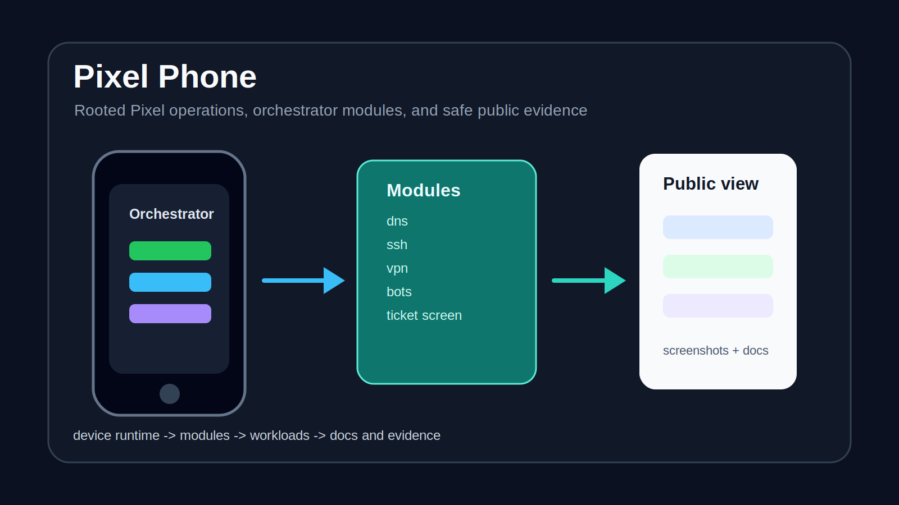

# Pixel Phone



Pixel Phone is a public-safe operations monorepo for a rooted Pixel runtime, its orchestrator, and the workload services managed around it.

## What It Does

- Organizes the Pixel-root orchestrator, runtime scripts, module registry, and module manifests.
- Keeps workload services together, including train bot and site notification modules.
- Carries automation, observability, evidence, onboarding, and runbook material.
- Defines shared schemas and templates for module health and operational events.
- Provides deployment and validation scripts for repeatable operator workflows.

## Highlights

- **Manifest-driven operations:** modules describe health, redeploy behavior, runtime type, and evidence roots.
- **Operator-ready docs:** runbooks and onboarding files make the repository navigable after a scrubbed public handoff.
- **Real visual evidence:** public-safe screenshots are included where available.
- **Shared contracts:** schemas and templates help keep module behavior consistent.

## Screenshots


## Quick Start

Review the startup guide:

```text
docs/START.md
```

Common validation and deploy paths are documented in the runbooks. Representative commands from the public copy include:

```bash
./tools/pixel/redeploy.sh
./tools/observability/validate_evidence.sh
./tools/docs/check_links.sh
```

## Project Map

| Path | Purpose |
| --- | --- |
| `orchestrator/` | Android orchestrator app, runtime scripts, templates, configs, and module registry |
| `workloads/` | Runtime workloads managed by the orchestrator |
| `automation/` | External scheduled automation |
| `docs/` | Runbooks, onboarding, architecture, and references |
| `standards/` | Shared schemas and templates |
| `tools/` | Import, observability, docs, and deploy helpers |

## Testing

Representative public checks include:

```bash
cd orchestrator/android-orchestrator && ./gradlew test
cd workloads/train-bot && go test ./...
cd automation/task-executor && ./scripts/drain_runner_smoke_test.sh
```

Use the docs checks and evidence validation scripts when reviewing operational changes.

## Notes

This public copy is scrubbed for presentation. It is meant to show the shape, contracts, docs, and safe visuals of the Pixel operations workspace without exposing private runtime material.

