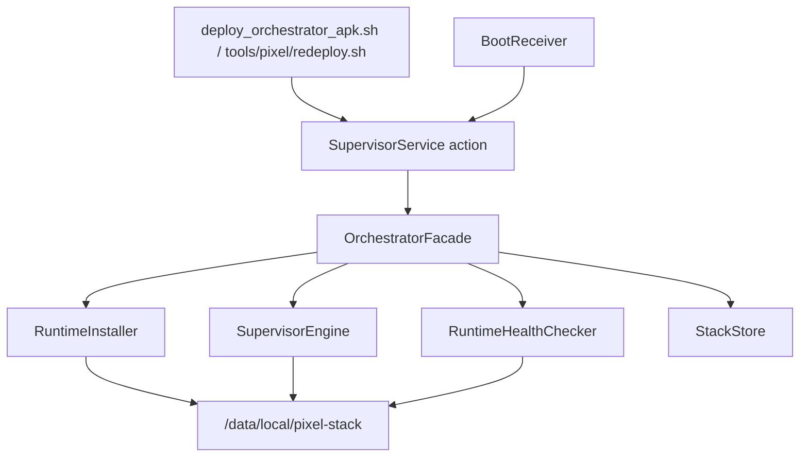
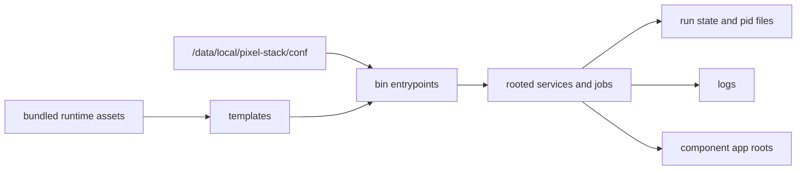

# Pixel Stack Architecture

This is the canonical architecture map for the Pixel/orchestrator stack. Keep operational proof, dated measurements, and investigation details in `ops/evidence/` or `ops/reports/`; keep the stable system shape here. Use [ROOT_OPERATIONS](../runbooks/ROOT_OPERATIONS.md) for hands-on operations.

## 1. System Purpose And Boundaries

The stack turns a rooted Pixel into a managed runtime host for local services, public endpoints, remote management, and workload automation. The Android orchestrator owns installation, lifecycle, health, and runtime asset sync. Workloads own their app logic and release artifacts.

In scope:

- Android app control plane under `orchestrator/android-orchestrator`.
- Rooted runtime under `/data/local/pixel-stack`.
- Component registry, module manifests, and redeploy ownership.
- Workload runtimes under `workloads/`.
- Evidence and health outputs under `ops/` and `standards/schemas/`.

Out of scope:

- Independent legacy autostart mechanisms after cutover.
- Runtime mutations that bypass module ownership metadata.
- Treating reports as canonical architecture.

## 2. Control Plane

The control plane is the Android app plus its host-side deploy scripts.

Key roles:

- `SupervisorService` receives deploy, boot, start, stop, restart, health, and cleanup actions.
- `OrchestratorFacade` enforces component ownership, config writes, redeploy policy, and runtime mutation order.
- `RuntimeInstaller` syncs bundled runtime assets and installs component releases.
- `SupervisorEngine` starts, stops, restarts, and health-checks runtime components.
- `RuntimeHealthChecker` synthesizes component health from runtime probes.
- `StackStore` persists app-private config and state.

## 3. Runtime Plane

The rooted runtime root is `/data/local/pixel-stack`.

Primary paths:

- `/data/local/pixel-stack/bin`: component entrypoints such as `pixel-dns-start.sh`, `pixel-train-start.sh`, and `pixel-ticket-start.sh`.
- `/data/local/pixel-stack/templates`: rendered service loops, launchers, and helper templates.
- `/data/local/pixel-stack/conf`: config, env files, secrets, runtime manifests, and staged component releases.
- `/data/local/pixel-stack/run`: runtime state, pids, and action-result files.
- `/data/local/pixel-stack/logs`: component logs.
- `/data/local/pixel-stack/apps/*`: app-style workload roots with immutable releases where applicable.
- `/data/local/pixel-stack/chroots/adguardhome`: DNS/remote rootfs.

App-private persisted state stays in the Android app files directory under `stack-store/`.

## 4. Component Ownership

The module registry and module manifests are the source of truth for ownership. Each managed component declares its runtime type, health key, start/stop/health command, and redeploy mode.

| Component | Owner path | Runtime type | Redeploy mode | Notes |
| --- | --- | --- | --- | --- |
| `dns` | `orchestrator/android-orchestrator` | rooted service | `artifact_release` | Owns AdGuard Home rootfs and DNS listener. |
| `ssh` | `orchestrator/android-orchestrator` | rooted service | `artifact_release` | Owns Dropbear bundle and port 2222 management path. |
| `vpn` | `orchestrator/android-orchestrator` | rooted service | `artifact_release` | Owns Tailscale runtime and management connectivity. |
| `ddns` | `orchestrator/android-orchestrator` | job | `job` | Runs sync entrypoint and records last-sync state. |
| `remote` | `orchestrator/android-orchestrator` | synthetic health | `derived` from `dns` | Represents public remote endpoint health. |
| `management` | `orchestrator/android-orchestrator` | synthetic health | `derived` from `vpn` | Represents management reachability. |
| `train_bot` | `workloads/train-bot` | rooted service | `artifact_release` | Uses immutable releases under `/apps/train-bot/releases`. |
| `satiksme_bot` | `workloads/satiksme-bot` | rooted service | `artifact_release` | Uses immutable releases under `/apps/satiksme-bot/releases`. |
| `site_notifier` | `workloads/site-notifications` | rooted service | `artifact_release` | Uses immutable releases under `/apps/site-notifications/releases`. |
| `subscription_bot` | `workloads/subscription-bot` | rooted service | `artifact_release` | Uses immutable releases under `/apps/subscription-bot/releases`. |
| `ticket_screen` | `workloads/ticket-screen` | rooted service | `job` | Pixel-side ticket stream and tunnel entrypoints; durable auto-start is controlled by the Android ticket service toggle. |

Derived components must not be redeployed as if they were independent owners. New app-style services must own a dedicated runtime root and should use immutable releases with a `current` pointer.

## 5. Deployment And Update Model

Use the narrowest action that matches the intended mutation.

- `bootstrap`: clean-room install, first provision, or intentional shared-platform refresh.
- `redeploy_component`: day-2 update path for one service, job, or derived owner. It syncs only the target-owned runtime assets and verifies health according to redeploy metadata.
- `restart_component`: lifecycle control only. It must not publish a new release or repair stale runtime assets.
- `start_component` and `stop_component`: runtime control without release mutation.
- `health` and `health_component`: read-only validation paths.

`ticket_screen` has an extra Android-side reliability toggle. When off, the supervisor loop must not auto-start that component. When on, SupervisorService keeps the local ticket server and tunnel ready after app start, package replace, and phone reboot, while leaving ViVi and capture idle until a viewer requests the stream.

Release modes:

- `artifact_release`: a versioned artifact is staged and installed, usually into an immutable release root.
- `job`: sync config/assets and run or restart a command without an immutable release artifact.
- `derived`: health/update surface owned by another component.
- `asset_refresh`: component-owned asset refresh without a release artifact, if a future module declares it.

Operational details live in [ROOT_OPERATIONS](../runbooks/ROOT_OPERATIONS.md). Module-specific overlays live under `docs/runbooks/`.

## 6. Observability And Evidence Flow

The system uses `PIXEL_RUN_ID` to correlate host deploys, Android actions, component logs, and evidence outputs.

Canonical evidence locations:

- `ops/evidence/<module>/`: fresh runtime or deploy evidence for active investigations.
- `ops/reports/`: dated analysis and measurement reports.
- `standards/schemas/`: observability event and health schemas.
- `/data/local/pixel-stack/run/orchestrator-action-results`: on-device action result artifacts.
- `/data/local/pixel-stack/logs`: component logs.

Do not promote a measurement report into architecture by reference alone. If a report changes understanding of the stable design, update this architecture doc or the relevant subsystem doc and link the report as evidence.

## 7. Safety Boundaries And Do-Not-Weaken Invariants

These boundaries are architectural constraints:

- Keep root access behind orchestrator-owned commands and component entrypoints.
- Keep component redeploy ownership explicit in manifests and registry entries.
- Do not use `restart_component` as an update shortcut.
- Do not share mutable runtime roots between sibling app-style workloads.
- Do not weaken notification lockdown, secure-window handling, input safety, or tunnel access controls without updating the relevant architecture and runbook.
- Do not treat public and Pixel-local ticket surfaces as the same deploy target.
- Do not clear browser profiles, cookies, or stored auth state unless explicitly requested.

## Architecture Update Notes

Future agents should append short notes here only when a change affects the whole-stack architecture but does not yet fit a stable section above. Promote recurring notes into the main sections during cleanup.

- 2026-05-03: `ticket_screen` auto-start is now governed by a persisted Android toggle instead of generic supervisor auto-start. This keeps OFF truly stopped and ON ready after reboot without forcing ViVi or stream capture.
