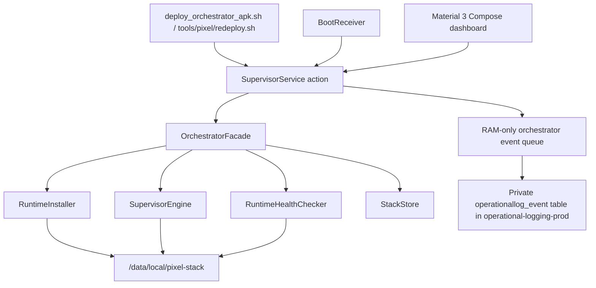
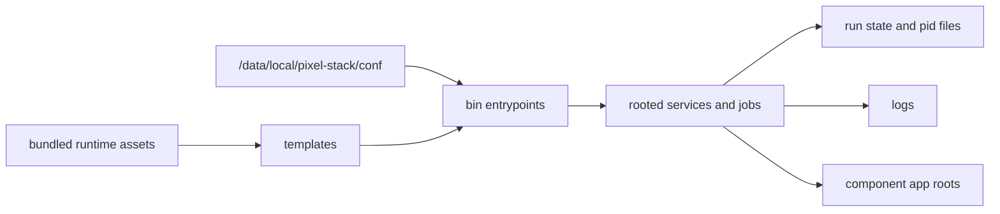

# Pixel Stack Architecture

This is the canonical architecture map for the Pixel/orchestrator stack. Keep operational proof, dated measurements, and investigation details in `ops/evidence/` or `ops/reports/`; keep the stable system shape here. Use [ROOT_OPERATIONS](../runbooks/ROOT_OPERATIONS.md) for hands-on operations.

## 1. System Purpose And Boundaries

The stack turns a rooted Pixel into a managed runtime host for local services, public endpoints, remote management, and workload automation. The Android orchestrator owns installation, lifecycle, health, and runtime asset sync. Workloads own their app logic and release artifacts.

In scope:

- Android app control plane under `orchestrator/android-orchestrator`.
- Rooted runtime under `/data/local/pixel-stack`.
- Component registry, module manifests, and redeploy ownership.
- Workload runtimes under `workloads/`.
- Evidence and health outputs under `ops/` and `standards/schemas/`.

Out of scope:

- Independent legacy autostart mechanisms after cutover.
- Runtime mutations that bypass module ownership metadata.
- Treating reports as canonical architecture.

## 2. Control Plane

The control plane is the Android app plus its host-side deploy scripts.

```mermaid
flowchart TD
  A["deploy_orchestrator_apk.sh / tools/pixel/redeploy.sh"] --> B["SupervisorService action"]
  C["BootReceiver"] --> B
  UI["Material 3 Compose dashboard"] --> B
  B --> D["OrchestratorFacade"]
  D --> E["RuntimeInstaller"]
  D --> F["SupervisorEngine"]
  D --> G["RuntimeHealthChecker"]
  D --> H["StackStore"]
  E --> I["/data/local/pixel-stack"]
  F --> I
  G --> I
  B --> O["RAM-only orchestrator event queue"]
  O --> P["Private operationallog_event table in operational-logging-prod"]
```

Key roles:

- `SupervisorService` receives deploy, boot, start, stop, restart, health, and cleanup actions.
- The phone UI is one lifecycle-aware Material 3 Compose scroll. It presents state through `DashboardUiState` and typed `DashboardAction` values, while operations that can outlive the Activity run in `SupervisorService` and report back through bounded action results.
- `OrchestratorFacade` enforces component ownership, config writes, redeploy policy, and runtime mutation order.
- `RuntimeInstaller` syncs bundled runtime assets and installs component releases.
- `SupervisorEngine` starts, stops, restarts, and health-checks runtime components.
- `RuntimeHealthChecker` synthesizes component health from runtime probes.
- `runtime_cleanup` is a scheduled/manual job component. It runs through the Android cleanup action, uses the runtime mutation lock, and reports health from cleanup reports.
- `StackStore` persists app-private config and state.

## 3. Runtime Plane

The rooted runtime root is `/data/local/pixel-stack`.

```mermaid
flowchart LR
  A["/data/local/pixel-stack/conf"] --> B["bin entrypoints"]
  C["bundled runtime assets"] --> D["templates"]
  D --> B
  B --> E["rooted services and jobs"]
  E --> F["run state and pid files"]
  E --> G["logs"]
  E --> H["component app roots"]
```

Primary paths:

- `/data/local/pixel-stack/bin`: component entrypoints such as `pixel-train-start.sh` and `pixel-ticket-start.sh`. Retired DNS entrypoints may remain only as inert migration residue until measured cleanup removes them.
- `/data/local/pixel-stack/templates`: rendered service loops, launchers, and helper templates.
- `/data/local/pixel-stack/conf`: config, env files, secrets, runtime manifests, and staged component releases.
- `/data/local/pixel-stack/run`: runtime state, pids, and action-result files.
- `/data/local/pixel-stack/logs`: component logs.
- `/data/local/pixel-stack/apps/*`: app-style workload roots with immutable releases where applicable.
- `/data/local/pixel-stack/chroots/adguardhome` and `/data/local/pixel-stack/chroots/pihole`: retired DNS/remote state. Neither is part of the active component registry or normal bootstrap. Their histories and duplicate archives were removed only after process, listener, open-file, manifest, and rollback-reference proof; the remaining extracted roots are inert compatibility state, not active services.

App-private persisted state stays in the Android app files directory under `stack-store/`.

## 4. Component Ownership

The module registry and module manifests are the source of truth for ownership. Each managed component declares its runtime type, health key, start/stop/health command, and redeploy mode.

| Component | Owner path | Runtime type | Redeploy mode | Notes |
| --- | --- | --- | --- | --- |
| `dns` | none (retired) | none | none | Remains visible as disabled historical state; normal bootstrap and the active component registry do not install or start it. |
| `ssh` | `orchestrator/android-orchestrator` | rooted service | `artifact_release` | Owns Dropbear bundle and port 2222 management path. |
| `vpn` | `orchestrator/android-orchestrator` | rooted service | `artifact_release` | Owns Tailscale runtime and management connectivity. |
| `ddns` | `orchestrator/android-orchestrator` | job | `job` | Runs sync entrypoint and records last-sync state. |
| `remote` | none (retired with DNS) | none | none | No longer aliases DNS release ownership. |
| `management` | `orchestrator/android-orchestrator` | synthetic health | `derived` from `vpn` | Represents management reachability. |
| `runtime_cleanup` | `orchestrator/android-orchestrator` | job | `job` | Weekly Monday 03:00 allowlisted cleanup; uses an approximate idle alarm when exact-alarm permission is unavailable. A separate narrow hourly guard enforces the root-command-history ceiling. |
| `train_bot` | `workloads/train-bot` | rooted service | `artifact_release` | Uses immutable releases under `/apps/train-bot/releases`. |
| `satiksme_bot` | `workloads/satiksme-bot` | rooted service | `artifact_release` | Uses immutable releases under `/apps/satiksme-bot/releases`. |
| `site_notifier` | `workloads/site-notifications` | rooted service | `artifact_release` | Uses immutable releases under `/apps/site-notifications/releases`. |
| `subscription_bot` | `workloads/subscription-bot` | rooted service | `artifact_release` | Uses immutable releases under `/apps/subscription-bot/releases`. |
| `ticket_screen` | `workloads/ticket-screen` | rooted service | `job` | Private Pixel-side Ticket health, session, and video interfaces; durable auto-start is controlled by the Android ticket service toggle. |

Derived components must not be redeployed as if they were independent owners. New app-style services must own a dedicated runtime root and should use immutable releases with a `current` pointer.

## 5. Deployment And Update Model

Use the narrowest action that matches the intended mutation.

- `bootstrap`: clean-room install, first provision, or intentional shared-platform refresh.
- `redeploy_component`: day-2 update path for one service, job, or derived owner. It syncs only the target-owned runtime assets and verifies health according to redeploy metadata.
- `restart_component`: lifecycle control only. It must not publish a new release or repair stale runtime assets.
- `start_component` and `stop_component`: runtime control without release mutation.
- `health` and `health_component`: read-only validation paths.
- `cleanup` and `start_component runtime_cleanup`: manual cleanup paths. The scheduled cleanup alarm runs the same action weekly on Monday at 03:00 device-local time.

Host-side deployment uses three explicit profiles:

- `fast`: the inner development lane. It defaults to orchestrator-only scope, reuses current APK and runtime artifacts when their content hashes match, performs local readiness checks, and records per-phase timings from a monotonic clock. A direct `redeploy_component ticket_screen` selects this profile when no profile was supplied, so the normal Ticket update path stays below its one-minute budget; other actions still default to `standard`. Timing telemetry contains only safe run metadata and is handed to the sibling deployment reporter asynchronously, so it cannot delay or change a deploy result; interrupted runs are marked `cancelled` while preserving their signal exit code. For `redeploy_component ticket_screen`, it keeps the mutation lock, target asset sync, runtime-input write, restart, and local `/api/v1/health` proof, but intentionally skips unrelated full-system/network probes; use `standard` or `full` when cross-component validation is required.
- `standard`: the normal targeted deployment lane. It builds and tests the changed scope, applies it, and checks the affected component without running every destructive or external probe.
- `full`: the release-assurance lane. It packages the complete selected runtime set, runs strict checks, and performs retention cleanup.

APK/runtime deployment and the local-first host mirror remain separate safety boundaries: a normal redeploy does not silently push pending secret or environment changes. A configuration-coupled APK change must run `mirror-audit`, explicitly stage it with `mirror-push`, verify the protected files, and then deploy the APK. During a filename migration, keep the old files beside the new files until the new APK proves its cloud write, then remove the legacy copies with a second audited mirror push. `deploy-config` recognizes Ticket and operational-logging environment/token changes and restarts `ticket_screen` so both the Ticket worker and process-only general telemetry reload their configuration.

Runtime start commands are idempotent. When installed inputs are current and the owned process plus local listener are healthy, they return without rewriting files or restarting the service. Independent health probes and deployment actions run with bounded timeouts, use owner-aware locks, and poll actual readiness instead of sleeping for a fixed delay. Slow public-network checks belong to deep/full health modes so a healthy local component does not wait on an unrelated external round trip.

The full deployment health result is configuration-aware. Root access, the supervisor heartbeat, and the local Ticket listener are always strict gates. Other components are gates only while enabled or explicitly required; a disabled DNS, DDNS, remote surface, train bot, Satiksme bot, site notifier, or subscription bot remains visible as `disabled` but is neutral to deployment success. Ticket remains strict even when its generic module auto-start flag is off, because the separate Android Ticket toggle owns that runtime. Management reachability remains strict while enabled. Authentication drift stays visible through `managementAuthHealthy`, module details, and warning evidence, but it blocks deployment only when `supervision.managementRequireAuthConsistency=true`.

`ticket_screen` has an extra Android-side reliability toggle. When off, the supervisor loop must not auto-start that component. When on, SupervisorService keeps the local ticket server and tunnel ready after app start, package replace, and phone reboot, while leaving ViVi and capture idle until a viewer requests the stream. A clean-device or recovery deployment may opt in with `deploy_orchestrator_apk.sh --action redeploy_component --component ticket_screen --enable-ticket-service`. The flag is rejected for every other action or component, defaults to no preference change, and persists the setting through the Android preferences store before the redeploy rather than editing app-owned XML from a root shell. If redeploy fails, a previously disabled setting is restored and readiness work is stopped; an already-enabled setting remains enabled.

Release modes:

- `artifact_release`: a versioned artifact is staged and installed, usually into an immutable release root.
- `job`: sync config/assets and run or restart a command without an immutable release artifact.
- `derived`: health/update surface owned by another component.
- `asset_refresh`: component-owned asset refresh without a release artifact, if a future module declares it.

Deployment payloads use one content-addressed device store at `/data/local/pixel-stack/conf/runtime/artifacts/sha256/<sha256>`. Runtime and component manifests reference that canonical path; a deploy transfers only a missing hash, verifies every hash before atomically activating the new manifest, and removes interrupted staging on exit. The active manifest and exactly one previous manifest protect the active and rollback source artifacts. The Android installer deletes its app-private staging copy in a `finally` path after success or failure. Retired DNS artifacts are excluded from normal runtime packaging and cannot be recreated by bootstrap.

Operational details live in [ROOT_OPERATIONS](../runbooks/ROOT_OPERATIONS.md). Module-specific overlays live under `docs/runbooks/`.

## 6. Observability And Evidence Flow

The system uses `PIXEL_RUN_ID` to correlate host deploys, Android actions, component logs, and evidence outputs.

Every orchestrator APK also carries immutable build provenance: release id, source commit, dirty-source flag, and UTC build time. `build_orchestrator_apk.sh` derives these values once and passes them into Android `BuildConfig`; every on-device orchestrator action result embeds the same provenance object. This lets an operator prove which source produced a result without relying on an APK filename, host shell history, or mutable deployment notes. A dirty or uncommitted build remains allowed for local iteration, but it is explicitly visible in the result and must not be described as a clean release.

Canonical evidence locations:

- `ops/evidence/<module>/`: fresh runtime or deploy evidence for active investigations.
- `ops/reports/`: dated analysis and measurement reports.
- `standards/schemas/`: observability event and health schemas.
- `/data/local/pixel-stack/run/orchestrator-action-results`: short-lived on-device action results. A confirmed consumer deletes them immediately; interrupted consumers have a 24-hour fallback.
- `/data/local/pixel-stack/logs`: unavoidable allowlisted service logs only. Each known process keeps one 1 MiB active file and one 1 MiB rotation, with a 32 MiB total stack ceiling.
- `/data/local/pixel-stack/logs/events/cleanup-*.json`: exactly one latest cleanup summary, containing counts and reclaimed bytes but no path lists.
- `operational-logging-prod.operationallog_event`: the single private operational-history data table for deployment, general Pixel, and Ticket diagnostic events. General Pixel events retain fixed enums/scalars and database-time 24-hour expiry. Ticket application/control state remains in `ticket-remote-prod-v3`; only bounded Ticket diagnostics use the shared logging table.

The Android observability sender reads `OPERATIONAL_LOGGING_HOST`, `OPERATIONAL_LOGGING_DATABASE`, and `OPERATIONAL_LOGGING_SERVICE_TOKEN_FILE` from `/data/local/pixel-stack/conf/apps/operational-logging.env`; its token remains in `/data/local/pixel-stack/conf/apps/operational-logging-token`. It owns a serialized, priority-aware queue only in process RAM. The queue is capped at 4 MiB and 24 hours, retries with backoff, exposes the newest 20 safe events to the dashboard, and is intentionally lost on app death or reboot. It never creates a queue file, database, cache entry, or backup. Durable phone state remains limited to settings, safe display/performance recovery, the latest cleanup summary, and a temporary in-progress cleanup checkpoint.

Support sharing creates one redacted ZIP in the app's internal cache and grants a receiving app read-only access through the restricted FileProvider. It includes no raw runtime logs and expires on share close, next launch/export, or within 24 hours.

Do not promote a measurement report into architecture by reference alone. If a report changes understanding of the stable design, update this architecture doc or the relevant subsystem doc and link the report as evidence.

## 7. Safety Boundaries And Do-Not-Weaken Invariants

These boundaries are architectural constraints:

- Keep root access behind orchestrator-owned commands and component entrypoints.
- Root command execution must drain stdout and stderr concurrently, enforce timeouts, and clean up timed-out shell process trees. Long-lived orphaned root helpers are treated as reliability bugs because they can heat the phone while no visible project work is happening.
- Keep component redeploy ownership explicit in manifests and registry entries.
- Do not use `restart_component` as an update shortcut.
- Do not share mutable runtime roots between sibling app-style workloads.
- Do not weaken notification lockdown, secure-window handling, input safety, or tunnel access controls without updating the relevant architecture and runbook.
- Do not treat public and Pixel-local ticket surfaces as the same deploy target.
- Do not clear browser profiles, cookies, or stored auth state unless explicitly requested.
- Runtime cleanup must remain allowlisted and protected-path driven. It must not delete active runtime artifacts, chroots, current releases, state, run, conf, ssh, vpn, `/data/app`, or Termux repo roots.
- Root-command history is inspected hourly and rotated above 32 MiB with root re-verification and rollback of interrupted moves. Cleanup never changes root authorization.
- Ticket hierarchy XML is transient only: known filenames are swept at Ticket startup and deleted on success, failure, timeout, or cancellation.
- When touch brightness is enabled, it is the sole owner of physical panel brightness, physical-touch timing, and power-button wake rebound. Ticket brightness guards and other screen guards must park instead of writing the panel.

## Architecture Update Notes

Future agents should append short notes here only when a change affects the whole-stack architecture but does not yet fit a stable section above. Promote recurring notes into the main sections during cleanup.

- 2026-05-03: `ticket_screen` auto-start is now governed by a persisted Android toggle instead of generic supervisor auto-start. This keeps OFF truly stopped and ON ready after reboot without forcing ViVi or stream capture.
- 2026-05-05: Root executor timeouts now clean up shell child process trees, and stable ticket readiness checks are throttled once the local server and tunnel are already ready. This prevents idle health probes from leaving CPU-burning orphan processes.
- 2026-05-07: Touch brightness panel sleep owns zero-panel-brightness behavior when enabled: Android stays awake, the panel is written to `0` after two minutes without physical touch, and ticket brightness guards must park.
- 2026-06-27: Runtime cleanup is now a first-class `runtime_cleanup` job component. The Android app schedules it weekly for Monday 03:00 local device time, keeps manual cleanup available, and limits automatic deletion to approved generated artifacts/logs older than 30 days with active runtime paths protected.
- 2026-07-09: Deploy, package, health, start, and stop scripts now share fast, standard, and full lanes. Healthy paths reuse content-addressed artifacts, validate local readiness first, batch bounded work, and expose phase timings; full validation remains the final release gate.
- 2026-07-10: Orchestrator builds now stamp release id, source commit, dirty-source state, and build time into the APK, and every action-result artifact reports that provenance for deployment and incident traceability.
- 2026-07-10: Full health and bootstrap deployment gates now ignore disabled optional or retired components, always require the local Ticket core, and treat management authentication drift as an observable warning unless strict auth consistency is explicitly enabled.
- 2026-07-11: The fast Ticket redeploy lane now proves the restarted local Ticket endpoint under a short bounded wait instead of holding a phone-side code update behind unrelated full-system and public-network checks. Standard and full lanes retain the full cross-component stability policy.
- 2026-07-11: Clean-device Ticket provisioning can explicitly enable reboot-persistent service reliability during the canonical `ticket_screen` redeploy. The opt-in is fail-closed outside that exact action and writes through the Android settings store instead of shell-editing app preferences.
- 2026-07-13: The orchestrator UI is now a single Material 3 Compose dashboard with dynamic Pixel color, lifecycle-aware state, background-service operations, protected sliders, confirmations, and safe recent activity. The XML fallback was removed.
- 2026-07-13: General orchestrator events gained fixed safe fields, RAM-only 4 MiB/24-hour phone buffering, and database-time 24-hour deletion. Support bundles and cleanup summaries no longer retain raw logs or path lists.
- 2026-07-22: Deployment, general Pixel, and Ticket diagnostic history now converge on the single private `operationallog_event` data table in `operational-logging-prod`. General Pixel configuration uses the `OPERATIONAL_LOGGING_*` keys and protected `operational-logging` env/token filenames; the in-memory dashboard recent-event view is unchanged. Ticket application state remains in its dedicated database.
- 2026-07-13: DNS and its old public-remote alias are retired on this Pixel. Normal bootstrap excludes DNS archives. When no DNS process exists, cleanup also removes the two known top-level AdGuard runtime/service-loop logs instead of retaining them as managed logs. Deployment artifacts use a verified content-addressed store with active-plus-one-rollback manifest protection; hourly root-history and bounded-log guards prevent the measured residue from returning.
- 2026-07-20: The ChatGPT phone worker, its Spacetime queue client, package query, clipboard bridge, local HTTP tombstone, and runtime-env generation were retired from new orchestrator builds. Ticket direct Spacetime handling and the protected Rīgas Satiksme automation paths remain unchanged; removing any already-deployed phone files is a separate deployment operation.
- 2026-07-13: The staged cleanup moved all six live non-DNS packages into the shared hash store, then removed only reverified action receipts, retired DNS/Pi-hole history, duplicate archives, app staging, excess root-command history, and oversized managed logs. Filesystem usage fell by 6.15 GB while root, SSH, VPN, management, Ticket, and active package references remained available. See [Pixel Orchestrator Polish And Cleanup](../../ops/reports/2026-07-13-pixel-orchestrator-polish-and-cleanup.md).
