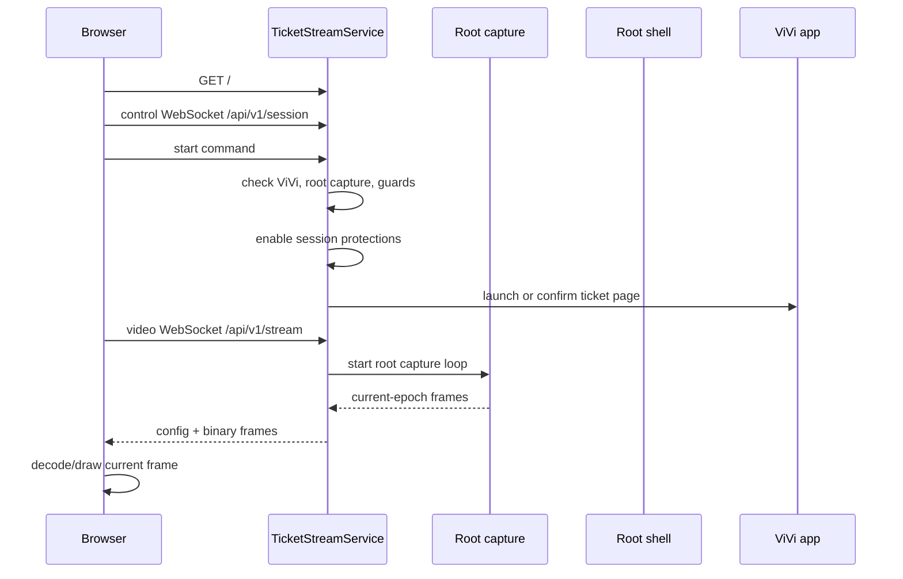

# Ticket Streaming Architecture

This is the canonical architecture map for the Pixel-side ticket streaming subsystem. The current measurement history lives in [ticket-streaming-responsiveness-analysis-20260502.md](../../ops/reports/ticket-streaming-responsiveness-analysis-20260502.md); keep stable flow and safety rules here. Use [Touch Brightness Architecture](./TOUCH_BRIGHTNESS_ARCHITECTURE.md) for panel-brightness ownership and [ROOT_OPERATIONS](../runbooks/ROOT_OPERATIONS.md) for general Pixel operations.

## Source Of Truth By Flow

| Flow | Success source | Failure source | Explicitly not a source |
| --- | --- | --- | --- |
| Public ViVi ticket stream | Pixel root H.264 health, fresh Pixel app-state proof, relay direct-stream freshness, and authenticated Brave visual proof for public close-out | Pixel root health, relay health, or authenticated Brave visual failure | RS Telegram result state or stale browser canvas state |
| ViVi control-code request | Pixel strict generated-state proof plus requester-browser freeze/capture of the rendered live stream frame | Pixel request/input failure, phone visual generated-state timeout, browser capture rejection/close, or cleanup state | Pixel/phone screenshot transfer, browser image upload, public tap/key control, root hierarchy-only result authority, broad code-like visual matches |
| RS Telegram monthly-ticket QR | Pixel RS direct tap flow plus bounded phone-side RS state proofs and one secure RS screenshot captured from the RS app | Pixel RS state-proof failure or broker deadline when no final Pixel result arrives | Brave visual proof, public relay video clients, ViVi cleanup success, black/blocked screenshot pixels |
| Cleanup/restoration | Root proof that ViVi returned to ticket detail plus fresh frame when the flow requires it | Cleanup completion event and attention state | Changing a result that was already delivered |

Fast paths may depend only on their owned root/source-of-truth inputs. No product path may wait on unrelated visual proof, fallback stream modes, cleanup success, or stale health summaries. Cross-path checks are allowed only after the product result has already been decided.

## 1. Startup To First Visible Frame

The Pixel serves the local ticket page on `127.0.0.1:9388`. `pixel-ticket-start.sh` starts the Android supervisor and ticket service, writes runtime inputs, and starts the ticket tunnel loop when configured.

The Android orchestrator owns a durable `ticket_service_enabled` toggle. The default is off. When it is on, SupervisorService starts and keeps checking the `ticket_screen` component after service start, package replace, and phone boot until the local ticket server and tunnel loop are ready. This readiness path only starts the service and tunnel; it must not open ViVi or start screen capture until an authenticated viewer asks for a stream. When the toggle is off, the ticket component is not auto-started by the supervisor loop and the stop script is run to keep the server and tunnel stopped. Once readiness is proven stable, periodic rechecks are throttled so the idle phone does not repeatedly spawn root pid/cmdline probes just to confirm an unchanged healthy tunnel.

The browser marks the stream visible only after a real decoded frame is drawn. Health updates must not overwrite that visible state back to waiting.

The browser records the broad loading path as separate phases: HTML ready, health ready, control socket open, video socket open, active session observed, stream config received, and first live frame drawn. Loading over two seconds is logged with the current blocking phase so public Cloudflare/auth delay can be separated from Pixel stream delay. The operational target for authenticated `ticket.jolkins.id.lv` is a live ViVi ticket frame in 5 seconds or less, with stream delay measured from Pixel/relay frame age and kept within the live freshness threshold.

The public relay may retain a short startup-only viewer lease while serving the authenticated index shell. If the root request already carries a valid server-session cookie, the relay starts this prewarm before state rendering so phone wake overlaps the remaining page work. That prewarm hold matches the 5-second public load budget so the phone session is not dropped between HTML/auth startup and the browser's first control/video sockets. The hold is a bridge for first paint, not a background viewer; once the real sockets attach or the hold expires, normal viewer presence owns ticket priority.

The service sends no-store headers for all ticket HTTP responses, but `Clear-Site-Data: "cache"` is reserved for the root HTML response. API, health, and client-log calls must not repeatedly clear browser site cache while the page is reconnecting. On boot, the ticket page asynchronously unregisters legacy service workers and Cache API entries for the ticket origin while preserving cookies, local storage, and Cloudflare Access state.

The page also performs a no-store bootstrap/version check against `/api/v1/bootstrap`. If the running page version differs from the server version, the browser replaces the URL with a versioned root URL and fetches fresh HTML. A separate no-store `/api/v1/cache-cleanup` path carries the same cache-clearing policy for legacy cleanup. Both routes are additive diagnostics and must preserve auth-bearing storage.

## 2. Browser Control And Video WebSocket Lifecycle

The browser uses two sockets:

- Control socket: `/api/v1/session`, for start, stop, keepalive, health, recovery commands, and private control-code request updates. Browser pages do not send arbitrary phone taps or keys.
- Video socket: `/api/v1/stream`, for stream config and binary video frames.

Each browser page includes internal viewer/page identity query parameters. The service uses them for diagnostics, but it also enforces a single current control socket and a single current video socket for the ticket stream. New sockets replace older sockets of the same kind, including legacy/no-identity sockets, so reloads and reconnects do not accumulate duplicate clients.

Control and video socket identity includes the browser page version. Health exposes active client identity/page-version diagnostics so public verification can prove the current Brave tab is running the latest served page rather than a stale cached shell.

Reconnect behavior:

- Page reload and ordinary tab close are reconnect-friendly and should not stop the phone session.
- Explicit Stop is deterministic: stop capture, close clients, disable protections, and prevent old browser sockets from auto-starting the stream again.
- A visible, focused browser page is allowed to recover a phone/backend stream that was killed by inactivity or relay loss. Hidden or unfocused pages must not resurrect the stream on their own.
- Slow video clients are isolated from frame production. Stale delta frames may be dropped for that client so the newest frame path stays fresh.

Legacy clients without viewer/page identity should still connect, but they do not get same-viewer replacement.

## 3. Pixel Capture, Root Frames, And Browser Draw

The accepted production public capture path is root-only hardware H.264 over the existing authenticated video WebSocket:

- Pixel output format: H.264 Annex B access units from the rooted hardware `MediaCodec` input-surface encoder, reported as `captureMode=root_hardware_h264`, `transport=h264-annexb-websocket`, and the exact `avc1.*` codec string when SPS is observed.
- Arbuzas output format: `ticket_remote` forwards the single private Pixel H.264 stream to authenticated viewers over `/api/v1/stream` without decoding or re-encoding.
- Default quality profile: 720px-wide root hardware H.264 at about 1.2 Mbps, cropped to the same browser-visible ticket view as before.
- Runtime: Pixel owns root capture start/stop, hardware keyframes, stream epoch, frame sequence, and adaptive capture cadence. `ticket_remote` is a latest-frame fanout, not a media processor.
- Cadence: the encoder is configured for an 8 FPS burst profile. The helper loop runs at 8 FPS during startup, viewer joins, decoder/keyframe recovery, and control-code activity, then drops to a 4 FPS steady target after a six-second burst hold without restarting the encoder.
- Keyframes: the normal hardware GOP is one second. Explicit keyframe requests are still used for viewer join, decoder recovery, generated-result marker delivery, and cleanup verification.
- Browser draw: the public page receives `tsf2` H.264 frames, decodes them with WebCodecs, and draws the newest decoded frame to the stream canvas.
- Sent ViVi ticket media excludes the top cropped strip from the phone display. The Pixel reports the crop in stream config/health and maps browser taps back to the full phone coordinate space by adding the cropped strip.

The normal public stream path must not depend on Android MediaProjection, Android screen-recording permission UI, WebRTC, AV1, H.265, PNG frame streaming, FFmpeg H.264, software stream fallback, or accessibility fallback. If the rooted hardware H.264 path cannot run, the public page shows a clear unavailable/attention state rather than silently changing capture modes.

Earlier measured paths are documented for context only. Root-fed AV1 was too slow for production. Root FFmpeg H.264 improved capture cost with the native helper but had authenticated-browser decode failures. Root PNG was clear but full-resolution capture was too slow and CPU-heavy for the requested freshness target. WebRTC was removed from the current production path in favor of the simpler H.264 WebSocket pipeline.

Frame freshness:

- The current frame envelope is `tsf2`: stream epoch, frame sequence, frame timestamp, and keyframe flag precede the encoded video payload.
- Stream epoch changes on capture config changes, capture restarts, and stop/start boundaries.
- The browser and public relay drop frames from old epochs, duplicate or lower frame sequences, and legacy frames once `tsf2` has been negotiated.
- Per-client queues are flushed on reconnect, reload, config change, stream epoch change, and decoder reset so old frames cannot leak into a new view.

Fresh-frame behavior:

- Browser/reload/control-code transitions request a fresh current-epoch hardware keyframe from the running Pixel encoder.
- Keyframe requests during startup must not restart the encoder while it is already waking or preparing.
- A duplicate `/api/v1/session/start` during root hardware startup must return the existing `starting` state while wake/root proof is still pending. It must not mark the session `live`, start/restart the encoder, or emit `session_start_already_active` until wake proof has verified ViVi ticket detail and hardware frames have been allowed.
- Recent config can be sent to new viewers immediately. Recent keyframes can be reused only when they are from the current stream epoch and inside the freshness window. Old cached keyframes must never be drawn.
- If no fresh same-epoch keyframe exists, the relay/browser requests a new hardware keyframe instead of replaying old video.
- `ticket_remote` keeps at most the newest pending frame per video client. A queued keyframe may be kept ahead of a newer delta frame, but stale queued deltas are dropped so slow viewers cannot delay the current view for everyone else.
- During a control-code request, `ticket_remote` keeps the normal shared stream live. Other authenticated viewers may briefly see the real phone open ViVi's control-code UI, but no viewer receives private phone control or a separate control video stream.
- Restart reasons, suppressed restart requests, keyframe requests, frame sequence, and Pixel ticket events are exposed in health.
- Stop/cleanup stops the active root hardware capture path, clears the current stream epoch/cache, and leaves the ticket service ready for the next authenticated viewer.

Browser decode behavior:

- The browser decodes H.264 from the video WebSocket with WebCodecs and renders the latest accepted frame to the stream canvas.
- On stream epoch changes, the browser resets decoder state and rejects old frames. When decode falls behind, stale delta frames are skipped and a keyframe is requested.
- Watchdogs can request a keyframe when the visible frame is quiet or static without leaving the streaming state.
- Video socket failures reconnect the affected browser video path. They should not restart the shared phone stream while the Pixel relay is connected and the hardware encoder is waking or already running.
- Control and video socket open timeouts are intentionally short so the page leaves long connecting states quickly. A two-second loading budget triggers video recovery, then escalates if the stream still does not produce a live frame.

## 4. Request Contracts And Safety Gates

### Public ViVi Control-Code Contract

The public browser no longer claims phone control. It can only submit a numeric control-code request:

- The public page opens a local dialog, accepts only 2-8 digits, and posts the request to `ticket_remote`.
- `ticket_remote` authorizes the requester through ticket membership, applies the two-requests-per-60-seconds limit, queues requests, and runs only one phone job at a time.
- The phone receives `generate_control_code` with `owner="ticket"`, `app="vivi"`, `flow="control_code"`, a request id, and digits. The browser never sends tap coordinates, keyboard events, ADB commands, or direct phone-control messages. Pixel rejects missing, stale, or wrong-owner control-code commands before any phone input starts.
- Before a queued request is sent to the Pixel, `ticket_remote` owns relay readiness and phone ownership. It retains a temporary relay viewer, acquires a phone-broker ticket lease for the request, asks both phone sockets to reconnect, and starts the Pixel phone session through the direct HTTP start endpoint as a fallback. The request waits for either an accepted phone-session start plus socket connection or an already-connected relay within the bounded readiness window, rather than failing after the short ordinary socket wait. The phone-broker lease stays held until Pixel reports cleanup, so RS jobs and other broker-owned flows cannot switch apps while ViVi is holding or returning from a generated result.
- A control-code request must start or join the Pixel ticket session before it evaluates the remote-input gate. The relay's normal startup `start` command may be delayed or deferred while a control-code job is active, so `generate_control_code` owns this readiness step and must not fail with the recoverable cold-start `no_active_control` race.
- Before opening the popup, the request path also clears an in-progress control-code exit cleanup, foregrounds ViVi if a foreground violation is cached, and gives known recoverable ViVi states (`TICKET_LIST_WITH_CARD`, empty/list tabs, stale popup/result surfaces) a bounded ticket-detail recovery attempt. Only after that does it surface `control_code_request_unsafe_state:*` as a real request failure.
- The Pixel is the source of truth for app state. It emits `ticket_state_event` messages for raw ticket, popup open, generated result visible, returning to raw, raw return complete, and attention-needed states. Each event carries the request id when relevant plus stream epoch, frame sequence, and phone timing.
- The Pixel opens or reuses ViVi's control-code popup through a bounded root-only state controller, focuses the code field, clears/types the digits, recalculates the OK target from the current popup state, and physically taps OK. Submit targeting must prefer the visible popup after digits are entered, using keyboard-open geometry only when the live popup read is unavailable.
- After OK, the Pixel immediately requests a stream burst and asks the running rooted H.264 helper for a strict visual state: `control_popup`, `raw_ticket`, `generated`, or `unknown`. There is no fixed happy-path post-OK hold. Only `generated` or a bounded root confirmation of the generated-result surface can become a successful product proof; `control_popup`, `raw_ticket`, and `unknown` keep waiting until the normal request timeout or fallback state path.
- On the normal success path, Pixel sends only generated-state proof and frame watermark metadata. It must not send `resultProof="phone_root_image"`, `imageMime`, `imageBase64`, or any ViVi control-code screenshot bytes for the user-facing result.
- `ticket_remote` treats Pixel image results as disabled for ViVi control-code. A requester result becomes complete only after the requester browser has rendered a stable generated frame at or after Pixel's marker and accepted the browser-local freeze/capture proof.
- The requesting browser freezes the exact proven live stream frame, rejects entry-popup, dim-overlay, keyboard, and fade/ghost frames, captures a stream-resolution result image locally, posts only proof metadata to `/api/v1/control-code/capture`, and displays that requester-only browser image. The public API still never uploads browser image bytes.
- Cleanup keeps the public control-code queue blocked until browser capture is acknowledged, and raw ticket plus a fresh raw-ticket hardware frame are confirmed. Cleanup failure after accepted browser capture records attention-needed state but does not revoke an already accepted result.

### RS Telegram Monthly-Ticket Contract

Rīgas Satiksme Telegram QR jobs use the same Pixel control socket but require explicit `owner="rigassatiksme"`, `app="rigas_satiksme"`, and `flow="monthly_ticket"`, so they remain separate from ticket.jolkins ViVi control-code requests. The broker keeps the public `POST /api/v1/qr/jobs` API compatible, but groups waiting RS jobs after a 250 ms burst window and sends the phone one `generate_rigassatiksme_qr_batch` command, including for a single RS request. The batch payload carries `batchId`, `jobs[{requestId,digits,createdAt}]`, owner/app/flow, and the current ticket-priority state. Pixel emits one `rigassatiksme_qr_result` per request id; the broker completes each job independently, accepts out-of-order results, reconnects and resends only unfinished batch jobs when the phone socket drops before deadline, and uses RS-specific batch health for disconnected final reconciliation. The shared ViVi `controlCodeRequest` health bucket is ViVi-only and must not finalize, retry, or rename RS jobs. The Pixel RS path is a direct state-gated tap lane with bounded phone-side state proofs. Pixel launches `com.flutter.rspassenger`, waits briefly for foreground, and takes an RS app `uiautomator` state proof before touching the app and after each meaningful transition. The classifier recognizes both English and Latvian RS monthly-ticket screens, including `30 dienu biļete`, `KONTROLES KODS`, `Reģistrēt braucienu`, `Ievadīt kodu manuāli`, `Ievadi kontroles kodu`, `Atcelt`, and `OK`. If the first state is unknown, Pixel performs exactly one bounded force-stop/relaunch without clearing RS app data, rechecks state, and stops before code entry with `rs_app_attention_required` if the app is still unknown. Old control-ticket screens must be closed and rechecked before registration can start; if Back does not clear the old control-ticket screen, Pixel does one no-data-clear RS relaunch and rechecks before deciding app attention. Registration, manual-entry, typed digits, and final submit must each be proven before the next action; visible node centers are preferred for safe taps, with fixed coordinates only as guarded fallbacks after state is known. Final unknown proof after submit becomes `rs_app_attention_required` after one recheck. This shape is used because live RS verification showed screenshot pixels can be black/blocked and full semantic loops are too slow when every action waits for a 2.5-second `uiautomator` dump, while blind middle-section tapping can leave RS showing the previous QR. The final Telegram image remains a separate secure RS screenshot capture after state proof. Normal RS generation must not depend on public viewer state, Brave, public relay clients, or ViVi cleanup success.

The success authority is an RS app shell-state proof: a control-ticket screen whose RS node text includes English or Latvian control-code markers (`TICKET FOR CONTROL`/`KONTROLES KODS`), QR text, a monthly marker such as `1 MONTH` or `30 dienu biļete`, and the submitted digits. Every request in a batch is freshly re-registered; an already-visible matching QR is treated as stale state at request start, not as success. After the requested digits are visibly proven in the manual-entry field and OK has been tapped, a nonmatching control ticket is a fail-fast `rs_monthly_ticket_stale_code`: broker and bot must not hide it with a retry, and the bot must not send a stale image. Returning to the manual-entry/manual-choice/register-trip/home surface after submit becomes `code_rejected_by_rs`; direct wrong-code text is also reported as `code_rejected_by_rs`. Missing app fields, launch/foreground failures, missing monthly tickets, authentication blocks, stale final proof, and app-attention failures remain distinct reasons and must not be collapsed to `phone_timeout`; `rs_monthly_ticket_unknown_state` is a legacy fallback, while new persistent unknown RS app states should report `rs_app_attention_required`. The returned Telegram artifact is the secure Pixel-captured monthly-ticket screenshot, captured at a bounded readable width for speed (currently 720 px maximum) and trimmed only at the shared broker delivery boundary by cropping 5% of the source screenshot height from the top and 5% from the bottom; it does not use the ViVi control-code graphic crop, a QR-only crop, a bot-side second crop, or an Android-side top/bottom delivery crop. Missing, blank, or invalid secure capture fails quickly with `rs_monthly_ticket_image_capture_failed`. Successful and final-failed RS jobs send their result to the broker immediately. Pixel returns to ViVi only after the batch is empty, ticket priority interrupts, or the phone enters an unrecoverable state; non-critical cleanup is outside the user-visible RS result timer. Public ticket viewer presence and ticket leases are hard higher-priority ownership signals for their full active duration, not bounded grace windows; they may preempt/retry unfinished RS work without burning an RS attempt budget, and while active the phone should remain on ViVi/ticket work. The measurement target is every request in a three-code burst receiving a final RS image or named final failure within 15 seconds of broker enqueue, including the burst wait. Because cleanup is after user delivery and production ViVi root dumps can take several seconds, RS return-to-ViVi keeps the dedicated 45 s budget with six focused recovery actions so a slow ticket-list/card reload can still reach `TICKET_DETAIL` without changing the normal fast ticket wake limits. A successful RS return refreshes the Pixel's recent `TICKET_DETAIL` proof so the next authenticated public viewer can use the fast ViVi foreground path instead of paying a long recovery cycle.

RS Telegram delivery is not a public-viewer decision. Brave screenshots, public canvas state, public relay video-client presence, and public ticket verification cannot turn a valid Pixel RS proof/capture into failure, and they cannot turn a missing RS proof/capture into success. If the broker receives no final Pixel result before its deadline, it may report `phone_timeout`; if Pixel sends a phase-specific RS failure, broker/bot messaging must preserve that reason.

### Result Vs Cleanup

The product result and cleanup are separate decisions. RS image delivery is final once the broker accepts a `rigassatiksme_qr_result` with valid RS app image bytes and the expected source/flow. ViVi control-code delivery is final once `ticket_remote` accepts requester-browser capture proof for the active request. Cleanup is allowed only after browser proof, explicit close acknowledgement, or a named browser-capture failure. Pixel runs the long generation job off the control WebSocket reader so browser-capture acknowledgements can be received while the generated screen is held. `ticket_remote` keeps delivering the browser-capture acknowledgement until Pixel reports cleanup, because a successful socket write is not treated as phone receipt. Cleanup failure after accepted browser capture records attention-needed state instead of delaying, revoking, or renaming the already accepted request. If Pixel's post-submit visual proof shows ViVi already returned to the raw ticket (`phone_visual_raw_ticket_after_submit`), cleanup must complete as already-clean without sending a result-close tap; close taps are reserved for actual generated-result surfaces.

Safety gates:

- The Pixel normalizes known ViVi states before automation. An already-open control-code popup is a valid submit state. A generated Aztec/result screen is never an idle-ready state; it is closed through the same root-only return-to-raw routine before a new request starts.
- The Pixel refuses only when root cannot inspect/control ViVi or raw-ticket return cannot be confirmed within the bounded routine. The old recoverable “refreshing ticket view, try again” path must not be used for known popup/result states.
- Duplicate request ids replay the cached result and do not execute the phone flow twice.
- Control-code automation is serialized by a Pixel-side mutex as well as the public queue, so overlapping requests cannot interleave physical phone actions.
- During the popup/result transition, foreground/page guards may observe and record state but must not force-stop ViVi, navigate back to Orchestrator, or run fresh reset.
- Cleanup failure records attention-needed and keeps public browser input blocked rather than exposing direct control or starting a new request.
- Active ticket sessions hold the Pixel screen awake and request a wake only if the display is non-interactive, unless touch brightness is enabled. When the screen is already interactive, public stream startup skips the wake key and relies on the wake lock, avoiding a repeated 1-2 second wake command on ordinary stopped-stream reloads. When touch brightness is enabled, touch brightness owns the screen hold and panel writes. Input remains blocked while the display is not interactive; the wake path is used to restore the live stream instead of launching recovery loops against a black/dozing screen. When all viewers detach or the stream stops, the ticket service releases this bright wake lock immediately; the brightness guard may keep the panel dim only when touch brightness is disabled.

Control-code request health reports the last request id, digit count, command owner/app/flow, last rejected command owner/app/flow/reason, status, reason, phase timings, root-observation time, phone visual state/proof time, browser-capture acknowledgement time, result-delivery time, total duration, duplicate replay count, cleanup status, and completion age. Public bridge health also reports the latest control-code relay-preparation result and duration plus browser capture fields such as capture-required, capture acknowledgement/rejection, candidate frame epoch/sequence, generated-chip proof, popup-frame rejection, and result-window-closed reason. Do not restore Pixel/phone screenshot delivery for ViVi control-code, public tap/key forwarding, browser image upload, root-hierarchy-only generated-result authority, accessibility-driven ticket automation, software stream fallback, or weaken protected-edge blocking, foreground checks, notification lockdown, secure-window handling, or control-code cleanup verification without updating this document and the relevant tests.

## 5. Stop, Cleanup, Reconnect, And Tunnel Behavior

Stop paths:

- Explicit browser Stop calls the session stop endpoint with `explicit=true`.
- Service stop clears stream state, stops active capture/encoding, closes clients, disables notification lockdown, disables secure-window bypass, and clears active control-code request state. With the durable ticket service still enabled, browser Stop keeps the local service and tunnel ready but does not start ViVi or capture again until a viewer asks.
- During streaming and after a session ends while the durable ticket service remains enabled, the ticket brightness guard enforces safe dim panel brightness only when touch brightness is disabled. When touch brightness is enabled, the ticket guard parks, reports that touch brightness owns panel brightness, and does not write or restore panel brightness. Saved ticket brightness is restored only when ticket service is turned off, touch brightness is not owning the panel, or the phone is intentionally handed back to physical use.
- After explicit Stop, health should report inactive stream, zero clients, no active control-code request, and no active app-owned capture process.
- A stopped or idle stream must actively close any leftover control/video sockets before accepting a fresh start request, and `/api/v1/session/start` must return within a bounded timeout instead of hanging behind stale cleanup.
- Stopping capture clears old frame counters, frame ages, dimensions, bitrate, and helper state that would otherwise make inactive health look like it is still sending frames.
- Viewer inactivity timeout is also a non-destructive stop. It may stop capture, close clients, and block browser auto-start until a fresh viewer request arrives, but it must not schedule fresh ticket recovery, force-stop ViVi, or navigate back to Orchestrator.

Reconnect paths:

- Page reload should replace same-viewer public sockets without interrupting the shared phone stream.
- If all Pixel-side relay clients disconnect or the public relay goes idle, the service parks capture: it records detach state, stops the root hardware H.264 helper, disables protections, keeps ViVi available, and enforces dim brightness only when touch brightness is disabled. It must not run ViVi recovery loops while no viewer is present.
- Reload should replace same-viewer sockets and reach a visible frame from the active stream quickly.

Control-code cleanup paths:

- Public `ticket_remote` does not send `control_exit`, `reset_ticket`, or user tap/key commands for the request flow.
- The Pixel treats popup/result close as one mandatory root-only return-to-raw path. It must not use `FRESH_RESET`, `am force-stop`, navigation back to Orchestrator, accessibility clicks, accessibility text entry, or software/screenshot fallbacks for normal request completion.
- The cleanup path distinguishes raw ticket detail, the keyboard/input popup, generated control-code Aztec/result screen, and other known ViVi states from fresh root hierarchy reads. It uses the small generated-result close target for generated screens, never the top-right ticket-exit cross.
- Every success, failure, explicit close/expiry cancellation, and prepare/submit normalization path runs the same return-to-raw routine. For generated ViVi control-code success, that routine starts only after `ticket_remote` acknowledges requester-browser capture of the generated stream frame. Pixel-image acknowledgement is not a ViVi control-code path. A successful cleanup emits `ticket_state_event(raw_ticket)` only after root confirms raw ticket and the hardware stream has produced a fresh raw-ticket frame. A failed cleanup records attention-needed while keeping the stream available and public input blocked.

Tunnel behavior:

- `pixel-ticket-start.sh` starts or reuses the ticket tunnel loop.
- The durable orchestrator toggle controls whether `ticket_screen` may auto-start. Browser explicit Stop stops the stream session but does not turn this orchestrator toggle off.
- Healthy existing tunnel loops should be reused rather than killed on every ticket start.
- Repeated ticket starts should reconcile duplicate tunnel-loop and `cloudflared` processes while preserving the healthy pid-file loop and its current `cloudflared` child.
- Tunnel health is observed through local metrics and component health. Public access may be Cloudflare Access protected, so unauthenticated public health probes are not authoritative stream timing checks. Root pid/cmdline checks used for tunnel readiness must be time-bounded, and root command execution must clean up timed-out shell children so a bad probe cannot leave an orphaned process burning CPU.
- Root hierarchy reads use a guarded `uiautomator dump` wrapper rather than bare `uiautomator` calls: dumps share a device-side non-blocking `flock`, use a shell-level timeout shorter than the Kotlin coroutine timeout, reserve lock-held cleanup/settle time before the outer timeout can fire, refuse too-small dump budgets, and clear stale `com.android.commands.uiautomator`/`uiautomator` processes before and after the read. Service-owned semantic reads are also routed through the wake-root executor lane, including active guards, wake prep, and recovery autopilot hierarchy reads, while touch/input macros and RS visual taps stay on the input lane. Non-touch wake/recovery input macros keep the panel dark with temporary brightness-clamp sidecars; those sidecars must be stopped cooperatively by creating the stop file and waiting for them to exit, not by killing the background clamp shells, so the parent command preserves the real tap/wake result instead of reporting a false `ok=false`. Active foreground guard first uses the cheap in-process visible-node snapshot for ViVi state; foreground guard stays deferred for the whole extended wake-recovery budget while startup is still proving ViVi, not just the short nominal wake budget. A current cheap snapshot that proves ticket detail may skip the slow root `uiautomator` check, but an empty cheap snapshot is explicitly inconclusive: it records fresh `UNKNOWN_VIVI`, cannot refresh or reuse stale `TICKET_DETAIL`, and must proceed to root proof or active soft recovery unless the control-code fast path also has fresh rooted H.264 frames plus a recent raw-ticket Pixel marker. The active public-health root proof uses the longer guarded hierarchy timeout, because the wrapper reserves cleanup/settle time inside the outer timeout and the short default leaves too little real `uiautomator` time on the Pixel. Reusing an already-active rooted H.264 stream for a new viewer is marker/freshness driven: if hardware capture is verified, frames are fresh, and Pixel has a recent ticket-detail proof, the service returns the active stream immediately and leaves heavier page revalidation to background health/recovery paths. If frames are stale, the phone is visibly off-ticket, or a control-code recovery path needs proof, the guarded root observation lane is used. Wake fast-readiness and autopilot memory-fast paths may trust the 10-minute `TICKET_DETAIL` memory horizon only when ViVi is still the focused app and the latest observed definitive ViVi state is not newer non-detail evidence such as route home, empty tickets, cart, or another ViVi tab. Recent `UNKNOWN_VIVI`/blank samples remain inconclusive and do not refresh stale detail, but older non-detail observations must not poison a fresher RS-return or public-stream `TICKET_DETAIL` proof. This keeps stopped-stream authenticated public loads on the fast path when the phone is still visibly in ViVi ticket detail instead of relaunching ViVi after every 30-second pause. If a public viewer arrives while RS or another app is foreground and recent ticket-detail memory is still valid, the wake path launches ViVi first, then performs a short post-launch focus-plus-memory fast-readiness check before spending the slow root proof budget; this keeps the page on ViVi while preventing RS-to-ticket preemption from exceeding the 5-second public load target. After a direct wake launch of ViVi, root proof uses the extended 60-second wake-recovery budget so the forced-home path can spend its bounded tickets-tab, time-ticket-tab, ticket-card, and relaunch actions even when root dumps and input wrappers are slow after a long pause. Only when there is no recent ticket-detail proof does the foreground guard escalate to the wake-root semantic dump. Any unavailable root hierarchy is inconclusive and backs off for 30 seconds instead of hammering `uiautomator` every foreground tick. This makes the architecture avoid Android's singleton `UiAutomationService already registered` class of errors instead of depending on broker retries or failed concurrent probes.
- Public `ticket_remote` must restart its phone reconnect loop whenever a new authenticated video viewer arrives and the relay is desired but not actively reconnecting. A stale desired state after phone reboot must not leave the public page waiting forever for the phone bridge.
- `ticket_phone_bridge` must not expose stale ADB forwards after reboot. It waits for `sys.boot_completed=1`, proves Pixel `/api/v1/health` over the forwarded port, and kills/recreates the local proxy when health probes fail or turn into EOF.
- `ticket_remote` clears cached config and cached frame state when the phone bridge disconnects. A newly opened browser video socket must not receive an old pre-reboot config unless the phone is currently connected and the config is fresh.
- The public server serves the current ticket app HTML for any non-reserved GET path. `/api/...`, `/static/...`, and `/admin...` remain strict/reserved.

The ticket component still follows the stack-wide operation model in [Pixel Stack Architecture](./PIXEL_STACK_ARCHITECTURE.md): `redeploy_component ticket_screen` refreshes the Pixel-side ticket surface, while public bridge/page deploys are separate.

For the public `ticket.jolkins.id.lv` path, Cloudflare Access terminates in front of `ticket_remote`. The browser talks to `ticket_remote`; `ticket_remote` relays video and queued control-code jobs privately to the Pixel through `ticket_phone_bridge`. Public socket identity should be visible in `ticket_remote` health, and the relay identity/page version should also be visible in Pixel `streamPipeline` health.

All authenticated linked viewers may receive the live video stream at the same time. There is no public private-control mode: viewers cannot claim the phone, tap the stream, or type into ViVi directly. A control-code requester receives only their private generated result, while other viewers continue seeing the shared raw ticket stream and may briefly see the real phone automate the request. A viewer reload or decoder reset must not restart or starve the shared phone stream for other authenticated viewers.

ViVi recovery launches `com.pv.vivi/.MainActivity` through the normal app intent and a root `am start` fallback. The fallback is required for post-reboot recovery because Android may leave Messages, Orchestrator, or another app in foreground while the ticket service is already ready.

ViVi authorization is a recoverable state only for the known existing-account login surface: email field, `Parole` field, `IEIET`, and `TURPINĀT BEZ AUTORIZĀCIJAS`. When that surface appears, Pixel reads credentials from `/data/local/pixel-stack/conf/apps/ticket-screen-vivi-login.env`, which must be outside git and mode `600`, with `VIVI_LOGIN_EMAIL` and `VIVI_LOGIN_PASSWORD`. The service enters the email only if the visible email differs, types the password directly into the password field, refreshes the `IEIET` target after the keyboard shifts the screen, taps `IEIET`, then waits for the login surface to disappear before resuming normal ticket-list recovery. Registration/profile/contact-detail surfaces and ViVi account/device-link mismatch dialogs after authorization are attention-needed states; the automation must not continue through them, dismiss them, or guess user details. The password must never be included in logs, health, screenshots metadata, fixtures, or support bundles; public health exposes only whether credentials were configured plus redacted login status/reason.

ViVi ticket-list recovery is date-aware. It parses visible time-ticket cards, ignores expired cards, prefers a card valid on the current date with the latest end date, and only chooses the soonest upcoming card when no current card exists. Upcoming-card selection is surfaced as a warning-style recovery action (`open_upcoming_time_ticket_card`) in health events. The old first-visible-card rule is not valid for time tickets, because an expired cached card can appear above the fresh purchased ticket.

Public ticket verification is a public-viewer-only root-sourced health contract, not a screenshot-only check and not an RS Telegram acceptance gate. A pass requires both an authenticated Brave page drawing the live ticket and matching Pixel/relay health within a 15-second, 500 ms poll budget. Pixel must report `sessionState=live`, `streamActive=true`, `streamVerdict=live`, `ticketState.state=live`, `viviState.state=TICKET_DETAIL`, `visibleFrame.lastFrameAgoMillis<=1500`, and active rooted hardware H.264 capture. The public relay must report the phone connected, at least one active video client, a configured current stream, and `directStream.lastFrameAgoMillis<=1500`. Browser canvas evidence proves what the user saw, but it never overrides Pixel root state. If the canvas shows a ticket while Pixel or relay health is degraded, the result is `public_ticket_split_brain`, not success.

## 6. Health Counters, Events, And Measurement Caveats

The ticket session state machine uses bounded user-visible states: `starting`, `live`, `control_transition`, `control_exit`, `soft_recovery`, `needs_attention`, and `stopped`. Public pages should present control-code request progress separately from the stream state as `queued`, `running`, `succeeded`, `failed`, `expired`, or `closed`. Active transition states have a one-second budget. If the stream is active, recovery is not running, and ViVi is already on ticket detail, health reports `live` rather than staying stuck in `recovering`.

Important health surfaces:

- `serviceReadiness`: durable ticket-service toggle state, last ensure result and age, local ticket server reachability, tunnel readiness, and component status.
- `streamPipeline`: clients, configured/running state, frame envelope, stream epoch, frame sequence, quality profile, configured size/bitrate, recent frame/keyframe byte sizes, estimated send bitrate, encoded/sent/keyframe counts, dropped frames, slow writes, closed slow clients, replaced clients, and secure-window bypass state.
- `streamVerdict` and `visibleFrame`: the fast public-health verdict and recent rooted frame age; public verification requires `streamVerdict=live` and `visibleFrame.lastFrameAgoMillis<=1500`.
- `rootCapture`: support, active state, size, bitrate, current adaptive FPS target, frame counts, restart counts, restart reasons, last restart age, and suppressed restart requests. The legacy `ffmpeg` health object, if present, reports removed/unavailable only.
- `hardwareH264`: root capture availability and active state for the current production capture path. Public verification requires `hardwareH264.active=true` and `hardwareH264.state=active`.
- `brightnessGuard`: active state, safe target percent, current display/panel values, last enforcement age, failure count, last reason, and message. A parked message means touch brightness currently owns panel brightness.
- `controlCodeRequest`: active state, last request id, digit count, command owner/app/flow, last rejected command envelope/reason, status, reason, total duration, phone phase timings, root-observation time, visual-marker time, result-delivery time, marker delivery state, duplicate result replay count, cleanup state, and completion age.
- `rigasSatiksmeBatch`: current or last RS batch id, status, active request id, job count, completed count, last per-request result id/status/reason, cancel reason, phase timings, and completion age. This is the RS reconciliation health surface; ViVi `controlCodeRequest` is not RS truth.
- Public `controlCodeRelayPreparation`: latest relay preparation result, duration, direct phone-session start status, socket-connected status, timeout, and completion age for public bridge control-code dispatch.
- `pixelTicketStateEvent`: latest Pixel-authoritative ticket state event, event sequence, request id, stream epoch, frame sequence, minimum frame sequence, reason, and age. Public/database/browser state should mirror this event stream and ignore stale lower-sequence events.
- `ticketState`: current bounded state, state age, last reason, over-one-second transition detail, and ViVi hard-reset count/reason.
- `viviState`: fresh Pixel app-state proof with state, source, reason, and observation age. Public verification requires `TICKET_DETAIL`; stale memory or inconclusive `UNKNOWN_VIVI` is not a public success source.
- `automation`: root-only automation mode, root-readiness result/age, and redacted ViVi login recovery status. It may report that login credentials are configured and the last login status/reason; it must not expose the login email or password.
- `loading`: most recent browser loading completion and over-budget phase/duration.
- `page`: latest HTML version, cache policy, last root/bootstrap/cache-cleanup request age, and last client page version.
- `recentEvents`: server-side lifecycle, recovery, client, and input events.
- `recentClientTelemetry`: browser-side startup, media decode, visible-frame, watchdog, and socket events.
- Public relay `/api/v1/health.controlKeyframes`: historical keyframe-pulse counters plus sent cached keyframes, phone keyframe requests, and last pulse age. New control-code requests must not reintroduce controller-only video ownership.
- Browser `window.ticketStreamDebug.controlCodeCapture`: latest control-code frame-proof state, including marker age, candidate frame epoch/sequence, accepted or rejected reason, and keyframe retry count. This is requester-side display evidence and the normal ViVi result authority after Pixel's generated-state marker.
- Public relay `/api/v1/health.spacetime`: ticket-only SpacetimeDB call counts, errors, slow calls, snapshot/member cache hits and misses, presence throttling, compact phone-health writes, skipped stable phone-health writes, and the latest phone-health compaction result.
- Public relay `/api/v1/health.telemetry`: client-log counts, server-side suppression counts, aggregate log counts, state-broadcast counts, and state-broadcast suppressions. These counters prove whether public UI diagnostics are calm without removing important error/input/loading events.

SpacetimeDB is the source of truth for ticket membership and current compact phone state. The old public control-ownership flow is not part of the browser UX. `ticket_remote` keeps a short in-process read cache for non-mutating paths such as client telemetry, ordinary socket setup, health, and browser heartbeat responses. It owns the short-lived control-code request queue, rate-limit window, requester-only result delivery, and request cleanup timers. Only the control socket owns viewer presence; video sockets do not write presence rows. Pixel health is stored in SpacetimeDB as a compact material summary and is written only when that summary changes or a keepalive interval passes; the full current phone diagnostics stay in `ticket_remote` process health for operations. Compact phone health must preserve the root-derived fields needed by public verification: `streamVerdict`, `visibleFrame`, `ticketState`, `viviState`, and `hardwareH264`.

Public status UI should be calm. The scroll-menu status line is a derived presentation state, not a raw health log: repeated equivalent states are debounced, lower-priority phone/health messages do not overwrite the current live stream or active code-request state, and the browser counts down the private result locally instead of requiring per-second server state broadcasts. Noisy browser telemetry such as frame received/drawn and repeated loading phases should be sampled or summarized; page boot, over-budget loading, decode errors, code-request changes, and hard failures remain immediate.

When Cloudflare Access asks for authentication during ticket verification, future agents should keep the existing Brave Work profile and preserve cookies, local storage, session storage, and IndexedDB. Request the Access code for `ticket@jolkins.id.lv` only if needed, read only the newest Cloudflare code from the macOS notification or Apple Mail, submit it in Brave, and then verify the live ticket from the real authenticated Brave page.

Known caveats:

- The current public production path is rooted hardware `MediaCodec` H.264 from the phone, carried to browsers as latest-frame H.264 over the authenticated `ticket_remote` video WebSocket.
- WebRTC, PNG streaming, AV1, FFmpeg software paths, browser image upload, Pixel/phone ViVi control-code screenshot transfer, and accessibility-driven ticket automation are historical or diagnostic-only. RS Telegram screenshot capture remains separate and must not be reused as ViVi control-code result delivery without a new explicit cutover.
- Public Cloudflare timing requires authenticated access; unauthenticated redirects are only tunnel reachability evidence.
- Reports can preserve dated measurements, but architecture updates should describe the stable behavior after changes land.

## Architecture Update Notes

Future agents should add short notes here when changing ticket stream flow, capture behavior, browser socket lifecycle, input safety, health counters, tunnel behavior, or cleanup semantics. Link dated measurements to `ops/reports/` and then fold stable behavior into the sections above.

- 2026-05-25: RS direct-tap durability now treats an unknown first RS app state as an app-attention problem instead of a tap target. The phone does one force-stop/relaunch reset without clearing RS data, reclassifies the foreground app, and only then enters the code if the state is known safe. Latvian RS labels such as `30 dienu biļete`, `KONTROLES KODS`, `Reģistrēt braucienu`, `Ievadīt kodu manuāli`, `Ievadi kontroles kodu`, `Atcelt`, and `OK` are part of the production classifier. Persistent unknown states report `rs_app_attention_required`, are not blindly retried by the broker, and tell Telegram users to open RS once and retry.
- 2026-05-26: RS direct tap is now state-gated through the middle of the operation, not only at the start and end. The phone must prove stale control-ticket screens are closed, prove the register/manual-entry transition, prove requested digits are visible before OK, and then classify final proof. Live Telegram evidence showed RS can ignore Back on an old control-ticket screen, so the stale-screen clear now has one no-data-clear relaunch before app attention. A stale final control-ticket proof after verified submit is fail-fast `rs_monthly_ticket_stale_code`; the broker does not retry it and the Telegram bot explains that RS kept showing the previous QR and no stale image was sent.
- 2026-05-24: The Pixel-root-image ViVi control-code path from earlier today is superseded. Normal ViVi control-code delivery is again browser-local freeze/capture: Pixel enters the code, recalculates OK from the current popup after typing, emits generated-state proof plus frame watermark metadata, waits for `control_code_browser_capture`, and only then cleans ViVi back to the live ticket. Pixel must not send ViVi control-code `imageBase64`, `imageMime`, or `phone_root_image` result payloads. The public page also claims the early video WebSocket opened by the HTML head instead of closing it and opening a second startup socket.
- 2026-05-25: ViVi browser capture now requires a stable generated frame instead of the first post-marker frame. The public page rejects entry-popup, keyboard, dim-overlay, and fade/ghost frames before freezing, then produces a stream-resolution browser-local PNG from the exact frozen frame. Pixel now accepts strict H.264 `control_popup` visual proof after the popup-open tap to begin typing before the slower root target loop, while keeping root fallback and current-popup OK targeting.
- 2026-05-24: ViVi ticket recovery now treats the authorization page as `LOGIN_REQUIRED`, reads credentials only from the Pixel runtime secret file at `/data/local/pixel-stack/conf/apps/ticket-screen-vivi-login.env`, reports only redacted login health, and resumes ticket recovery after the login surface disappears. Time-ticket selection now parses visible validity ranges, ignores expired cards such as `23.04.2026 - 22.05.2026`, prefers a card valid today with the latest end date, and marks future-only selection through `open_upcoming_time_ticket_card` rather than using the old first-card-only rule.
- 2026-05-23: RS monthly-ticket processing is now batch-only from broker to phone. The broker keeps the public job API unchanged, groups waiting RS requests after 250 ms, sends `generate_rigassatiksme_qr_batch` for both single and burst work, completes each `rigassatiksme_qr_result` by request id, and reconciles only from RS-specific batch health. Pixel re-registers every requested code, treats post-submit mismatched tickets as transient until bounded proof expires, treats post-submit unknown visual frames as transient inside the bounded proof loop instead of relaunching RS, sends each result before ViVi cleanup, and returns to ViVi only after the batch is empty or ticket priority interrupts. RS secure screenshot capture now keeps the secure screen source but encodes the final artifact at a bounded readable width so QR success does not consume the whole batch budget. The final live rehaul check delivered a three-code burst in 3.99 s, 7.76 s, and 14.06 s, with a fresh authenticated public ticket closeout at 0.660 s initial / 0.427 s reload and fresh frames at 239 ms / 230 ms. Evidence is summarized in [RS Batch Rehaul Verification - 2026-05-23](../../ops/reports/2026-05-23-rs-batch-rehaul-verification.md).
- 2026-05-23: Operational verification after the RS/ticket-priority pass measured clean authenticated public loads at 0.663 s/0.441 s, 0.944 s/0.426 s, and a final close-out check at 2.899 s/0.403 s, stream visual age at 14-272 ms, RS final outcomes at roughly 2.30-10.58 s once allowed to run, and a priority-held RS job waiting with zero attempts while the public viewer owned the phone. ViVi control-code browser capture succeeded through the public page and cleanup recognized the already-raw-ticket proof without sending a close tap. Evidence is summarized in [RS/Ticket Priority Operational Verification - 2026-05-23](../../ops/reports/2026-05-23-rs-ticket-priority-operational-verification.md).
- 2026-05-23: Authenticated public ticket cold-start verification found a stopped-stream load could spend about 9.7 seconds relaunching ViVi even though the phone was already on the ViVi ticket screen. Wake fast-readiness now keeps the 10-minute ticket-detail memory horizon for a focused ViVi app, persists that recent proof across ticket-service restarts, and invalidates it only when newer definitive non-ticket evidence exists, so the 5-second public load target can use the same fast foreground path after ordinary viewer gaps and deploy restarts. Follow-up live checks found ticket preemption from RS still waited on slow root proof after launching ViVi and ordinary reloads still sent a wake key to an already-interactive screen; startup now performs a bounded post-launch fast-readiness check from focused ViVi plus recent ticket-detail memory before using slow proof, and skips the wake key when the screen is already interactive.
- 2026-05-23: RS monthly-ticket generation now uses a phone-side visual tap/pixel driver. The Pixel launches RS, captures fast plain RS screenshots, downscales them for navigation/proof classification, drives fixed RS app targets through the isolated RS root input gateway, reads the final ticket code from the bottom control-ticket pixels, and compares that visual code to the submitted digits before accepting success. RS visual input intentionally uses a lightweight RS-only command path so rejected/manual-return paths do not pay the ViVi public-control screen-sleep wrapper cost. A matching already-visible QR is backed out and re-registered; stale/nonmatching tickets after submit are rechecked only inside the bounded proof loop before `rs_monthly_ticket_stale_code`; explicit wrong-code pixels after confirmed submit become `code_rejected_by_rs`; unknown visual states become `rs_monthly_ticket_unknown_state`. The final user artifact is still the secure RS app screenshot, captured only after visual proof. The older accessibility/semantic RS driver is diagnostic history and is not the production RS success authority.
- 2026-05-24: RS visual-driver rejection investigation found false `code_rejected_by_rs` outcomes from three visual-control mistakes: the confirm tap landed above the green button while the numeric keyboard was open, app-rotation startup briefly supplied landscape display dimensions for portrait screenshots, and the scan/home classifier could confuse the bottom route card or scan screen with the next navigation state. RS visual taps now use screenshot dimensions, confirm hits the visible green button center, landscape startup frames classify as unknown until portrait settles, home requires the green register button before it wins over manual-choice detection, and pre-input navigation can retry bounded home/scan transitions before failing.
- 2026-05-24: RS visual submission is now proof-split. The phone first enters digits, captures the RS manual-entry screen, and verifies the submitted digits are visible; only then does it tap confirm. If the proof capture cannot see the submitted digits after one retry, the request fails as `rs_manual_code_entry_unverified`. If confirm leaves the phone on entry-like screens without fresh wrong-code proof, the request fails as `rs_submit_not_confirmed`. `code_rejected_by_rs` is reserved for visible RS wrong-code proof after submit, so missed taps and stale red error text can no longer masquerade as RS business rejection.
- 2026-05-24: Live post-deploy RS verification showed plain `screencap` can return only a black secure-window frame for the phone app, causing fast repeated `rs_monthly_ticket_unknown_state` failures. RS visual navigation now uses the same secure root display-capture helper as the final artifact path, but at the small visual-classification width, so state detection sees the real RS pixels while the final Telegram screenshot remains a separate result capture.
- 2026-05-24: Follow-up live RS verification showed the secure visual capture path was still too slow and still did not expose usable RS pixels: the phone was actually on a `Trip is registered` modal while the visual driver kept seeing `unknown`. A first shell-semantic replacement proved accurate but too slow because `uiautomator` dumps take about 2.5 seconds on this phone. Production RS driving is now a direct tap lane with bounded state proofs: one dump for reset, fixed RS taps for register/manual/code/confirm/modal, and one or two final dumps for proof. Secure capture is kept only for the final Telegram image. The visual tap/pixel and full semantic-loop drivers remain diagnostic history, not the production RS authority.
- 2026-05-24: Live direct-tap verification found that RS can return to the registration-capable home screen after a submitted code. That state was previously misreported as `rs_monthly_ticket_unknown_state`. It is now treated as a named `code_rejected_by_rs` final outcome, and the direct driver has a regression test so this app-level rejection does not fall back to vague unknown-state handling.
- 2026-05-23: RS monthly-ticket generation previously used a phone-side semantic automation fast path. That path was superseded the same day by the visual tap/pixel driver after live Telegram batches showed accessibility state and Flutter labels could still report misleading or stale app state.
- 2026-05-22: Public browser generated-result proof now scans the lower ViVi result-strip band instead of checking one fixed y-coordinate. Live generated-code frames place the dark submitted-code strip lower than the previous detector, so marker delivery could succeed while the requester page waited forever and Pixel held the generated screen until cleanup timeout. The browser proof now reports the selected strip y/score and code-area score in `ticketStreamDebug.controlCodeCapture`, then freezes the canvas and acknowledges Pixel only after that scanned generated-frame proof passes.
- 2026-05-22: Control-code result marking is now state-classified instead of timer-only. Pixel no longer emits the generated marker after a fixed post-OK delay. The rooted H.264 helper classifies the live phone frame as `control_popup`, `raw_ticket`, `generated`, or `unknown`; only `generated` sends the `phone_visual` marker. The public browser still performs the second proof and now rejects the centered ViVi entry dialog and orange OK-button geometry before it can snapshot. This closes the failure where the typed-code popup or the raw ticket Aztec behind it was frozen as the private result.
- 2026-05-22: Pixel/public automation alignment now has one phone owner contract. `ticket_remote` acquires a phone-broker ticket lease for public viewers and holds a request-scoped `control-code:<requestId>` lease until Pixel cleanup completes. The broker blocks and preempts RS QR work while a ticket lease is active, then releases the phone after success, failure, timeout, or cleanup. All Pixel-mutating QR commands now carry an explicit owner/app/flow envelope: public ViVi uses `ticket/vivi/control_code`, RS uses `rigassatiksme/rigas_satiksme/monthly_ticket`, and Pixel rejects missing or wrong-owner envelopes before any tap/type/cleanup command runs. Browser result capture now also rejects pre-request and popup frames after a marker; it snapshots only a post-marker frame with the generated dark control-code chip on the ticket. This prevents stale public/RS commands from stealing the phone and prevents the typed-code popup or raw ticket from being frozen as the private result.
- 2026-05-22: Control-code generated-result delivery now has one durable post-submit path. After the root input macro submits the digits, Pixel waits for strict phone-side generated visual state, emits a `phone_visual` marker, and waits for `ticket_remote` to acknowledge the requester browser's generated-frame proof. The public browser proves that it rendered a frame at or after that marker with the generated-chip shape, captures the canvas locally, and sends metadata acknowledgement. `ticket_remote` responds to the browser as soon as it accepts that proof, then repeatedly delivers the same phone acknowledgement until Pixel reports cleanup. Pixel keeps the generated screen open until that acknowledgement or an explicit requester close arrives; public read paths do not expire or locally close a capture-pending result, and the 60-second result countdown begins only after browser proof is accepted.
- 2026-05-22: Live verification showed post-submit root polling delayed ViVi's generated result: a 7-second root wait found the result only during cleanup around 11 seconds, and an 18-second root-poll wait pushed that cleanup observation to around 23 seconds. Root hierarchy polling is therefore removed from the ViVi control-code result decision. The only normal post-submit phone proof is the running H.264 helper's strict generated-state classifier; broad code-like visual matches are not enough. Root remains responsible for popup/input and cleanup proof only.
- 2026-05-22: Pixel control-code generation no longer runs inline on the control WebSocket reader. The reader launches the generation job and immediately returns to reading control messages, which keeps browser-capture acknowledgements, keyframe requests, keepalives, and close messages on a live control lane while the phone automation lane is waiting for browser proof.
- 2026-05-22: Control-code speed/reliability refactor tightened ownership boundaries. Public `ticket_remote` now owns relay preparation for control-code jobs by retaining the relay, reconnecting sockets, and running the direct phone-session start fallback before dispatch. Pixel active rooted H.264 reuse is now frame/proof based: fresh verified H.264 frames plus recent ticket-detail proof return the active stream immediately, while heavy root page revalidation moves to recovery/background paths. The control-code fast start also trusts fresh live rooted H.264 frames plus a recent raw-ticket Pixel marker when the latest cheap page observation is merely empty/unknown, so an inconclusive fast guard cannot force a full wake recovery before tapping the known control-code button. The normal control-code submit path uses one fast root macro plus cached keyboard-open popup geometry instead of separate root command launches and a sub-second root dump. Generated-result success is two-stage: Pixel sends the private marker only after strict generated-state visual proof, the requester browser proves the generated frame, and cleanup waits for that acknowledgement. Health now exposes relay preparation and the Pixel timing slices needed to verify these lanes.
- 2026-05-22: Public ticket verification is now strict and root-sourced. Authenticated Brave must draw the live ticket, and Pixel/relay health must also prove rooted H.264 capture, fresh rooted frames, `TICKET_DETAIL`, and a live relay frame within the fast 15-second verification budget. Screenshot-only success is no longer enough; visual success with degraded root/relay health is reported as `public_ticket_split_brain`.
- 2026-05-22: Active public viewer health now gives the root `TICKET_DETAIL` proof the longer guarded hierarchy timeout. The short default left only about 1.5 seconds of inner `uiautomator` time after wrapper cleanup/settle reserve, which could produce false `UNKNOWN_VIVI` and `public_ticket_split_brain` while rooted H.264 video was live.
- 2026-05-22: Architecture and implementation were reorganized around ownership boundaries. RS Telegram delivery, public ViVi viewing, cleanup, and verification are separate contracts with separate success authorities; RS success is Pixel root proof plus RS secure capture, while public viewer close-out remains authenticated Brave plus root/relay health.
- 2026-05-22: RS monthly-ticket generation is now a single fail-fast root operation. Pixel runs the measured RS coordinate flow, takes one guarded root semantic proof, captures the RS app screenshot once, and returns one success or one clear failure reason. The request path no longer performs the cheap RS fast-hierarchy pre-proof, repeated root proof retries, in-app RS recovery re-drive, or capture retry loop. Successful delivery still happens before delayed ViVi cleanup, and failed delivery still reports before cleanup.
- 2026-05-22: Post-deploy RS live smoke proved the earlier coordinate correction was incomplete: the `REGISTER A TRIP` root hierarchy bounds were misleading for real tap behavior, and `540,438` missed the button. The fast operation now uses the live-proved RS path: `REGISTER A TRIP` at `540,555`, `ENTER THE CODE MANUALLY`, RS code entry, `CONFIRM`, modal `Ok`, and the final `TICKET FOR CONTROL` proof with the submitted digits.
- 2026-05-21: Active foreground guard now remains deferred for the whole extended wake-recovery budget, then uses a cheap ViVi visible-node snapshot before any root hierarchy dump. If that snapshot is empty while the stream is otherwise live on very recent wake-ready proof, or on a current `TICKET_DETAIL` proof that is only a few seconds old, it trusts the live proof and skips root `uiautomator`; it must not trust the older 10-minute ticket-detail memory after an empty snapshot, because that masks forced-home/route screens after long pauses. Root H.264 session startup now also waits until wake/recovery has confirmed the ViVi ticket-detail screen before starting the encoder, so long-pause locked/home starts do not prewarm the helper against a blank/protected surface and poison hardware reliability with startup exit-137 loops. ViVi wake recovery recognizes Latvian settings screens, uses a top-right close fallback for stale/partial cart hierarchies, and treats the route-planning home as an `open_tickets_tab` state before checking generic dismissible-blocker/cart heuristics; route-home announcements containing words such as `Pasažieri` and the small cart badge must not be mistaken for a blocker close target or cart checkout. It can still use a bounded route-home Tickets-tab coordinate fallback when the route planner is visible but the bottom tab lacks an accessibility label. If a root hierarchy is still needed and comes back unavailable, it arms a 30-second inconclusive backoff. This keeps healthy live streams calm and avoids creating the same singleton UiAutomation failure repeatedly while still allowing explicit foreground violations, known non-ticket states, and request cleanup paths to recover normally.
- 2026-05-21: Service-owned semantic hierarchy reads now use a single wake-root executor lane: active guards, wake prep, RS semantic proof, and recovery autopilot dumps are queued on that lane while touch/input macros remain on the input lane. Even wake/active recovery taps and back presses are input-lane work, not wake-root hierarchy work, so they do not queue behind or inherit failures from guarded `uiautomator` reads. This reduces broker-visible retries by avoiding Android's singleton `UiAutomationService already registered` race instead of letting parallel probes fail and hoping broker retries recover.
- 2026-05-21: Ticket/RS root hierarchy dumping now goes through `TicketUiautomatorDump`, which serializes dumps with a non-blocking `/data/local/tmp/pixel-ticket-uiautomator.lock`, runs Android `uiautomator dump` under a shorter shell `timeout`, reserves the wrapper's failure cleanup/unregister settle inside the outer timeout, refuses sub-second dump budgets that cannot safely hold the lock through cleanup, and clears stale `com.android.commands.uiautomator`/`uiautomator` processes before and after each dump. This addresses production incidents where Android's singleton `UiAutomationService already registered` crash made ViVi recovery report `UNKNOWN_VIVI`/`capture_blocked` and made RS monthly-ticket jobs reach the generated screen without delivering an image; the non-blocking lock prevents concurrent probes from simply waiting until their outer Kotlin timeout. The same incident also taught the RS monthly-ticket flow to treat a semantically verified `rs_monthly_ticket_control_screen` as success even if the tap shell exits non-zero, so Android captures and sends the app image instead of emitting a failed/generated status with no PNG.

- 2026-05-20: RS Telegram QR result images remain RS app-generated screenshots, not ViVi control-code graphic crops. At that time the shared RS generated screenshot artifact stored by `phone_broker` was cropped symmetrically by 5% of the source screenshot height from the top and 5% from the bottom while preserving full width, and `rigassatiksme_qr_bot` sent those stored artifact bytes without applying an additional crop. The current bounded-width capture behavior is documented in the 2026-05-23 RS batch note above.
- 2026-05-20: RS monthly-ticket failed `rigassatiksme_qr_result` messages are delivered to the active broker connection but are not cached for reconnect replay. Only accepted RS image results with non-empty app-captured screenshots remain replayable, so broker retries that reuse the same request id must re-drive the RS app instead of receiving an old `qr_image_missing` failure.
- 2026-05-19: Long-pause ticket opening keeps the fast root-H.264 startup path, but the phone wake detector now has two bounded reliability escalations before reporting `phone_not_ready`: settings/profile ViVi screens with a bottom Tickets tab are treated as recoverable `open_tickets_tab` states, and blank/outside/unknown wake observations get one direct root ViVi relaunch with a distinct `wake_recovery_relaunch` event. This preserves the common fast path while giving cold/idle ViVi launches one stronger chance to reach ticket detail.
- 2026-05-19: Rīgas Satiksme Telegram QR jobs now do one bounded in-app RS recovery and semantic recheck before falling back to broker retry/ViVi cleanup. Generic intermediate RS screens are no longer labeled `rs_monthly_ticket_missing`; that reason is reserved for an explicitly inspected empty monthly-ticket list.
- 2026-05-19: RS Passenger 2.1.0 pressure tests showed the old first home tap sat on the edge between `REGISTER A TRIP` and `TICKET FOR CONTROL`, intermittently leaving jobs on the RS home screen with `rs_monthly_ticket_control_missing`. The fast path and recovery now read live `TICKET FOR CONTROL` bounds from the RS hierarchy for the home-screen tap, then keep the measured coordinate path for deeper Flutter-only screens.
- 2026-05-19: RS monthly-ticket latency pressure work moved successful result delivery ahead of ViVi cleanup, schedules return-to-ViVi after a short idle delay, cancels that cleanup for queued RS work, uses a warm previous-QR hint to skip repeated RS home discovery, and replaces repeated RS fast-hierarchy polling with one cheap snapshot plus bounded root fallback. Two 8-request pressure batches completed cleanly with average broker processing time around 11.2 seconds while preserving RS monthly QR artifact validation.
- 2026-05-19: Mixed-code RS bot pressure found that reopening `TICKET FOR CONTROL` from RS home could show the previous trip's QR even though a different vehicle code had been requested. Fresh RS monthly-ticket requests now prefer `REGISTER A TRIP` when both home actions are present, recovery backs out of an already-open QR before retrying, and verification requires the visible control code to OCR-match the requested digits. A 30-minute bot-equivalent pressure run completed 58 varied-code requests (`68803`/`69570`) with zero final failures and zero OCR mismatches.
- 2026-05-18: Control-code submit keeps the typed-code popup on the immediate OK path, then gives the post-OK Aztec/result marker about 750 ms to render. This older phone visual/root result-proof path has since been replaced by the 2026-05-22 browser-generated-frame proof so result delivery does not depend on post-submit phone inspection.
- 2026-05-09: Control-code request architecture removed public phone control. The public page now collects 2-8 digits locally, `ticket_remote` authorizes/rate-limits/queues one request at a time, the Pixel executes `generate_control_code` automation, captures the generated result, cleans ViVi back to ticket detail, and `ticket_remote` privately shows the requester the result for 60 seconds.
- 2026-05-10: Fast control-code delivery made the Pixel request path root-macro-first: fresh root hierarchy for ViVi targets, direct input tap/type, direct yellow OK tap before any result wait, screenshot-first private delivery, then independent cleanup back to raw ticket detail.
- 2026-05-10: ViVi ticket media now crops the top 200 source pixels before leaving the phone so the visible phone status strip is removed with extra margin. The crop applies to both live stream frames and private control-code result images, with stream size/config/health and browser-to-phone tap mapping adjusted to match the cropped media.
- 2026-05-11: Pixel-aligned stream rebuild made the Pixel the authoritative ticket-state source with ordered `ticket_state_event` messages, kept one production rooted hardware H.264 WebSocket path, changed `ticket_remote` to latest-frame fanout, made browser decode skip stale deltas, and completed the control-code result model as browser-local freeze plus metadata confirmation only. Production no longer uses phone result screenshots, browser image upload, software stream fallback, WebRTC fallback, or accessibility ticket automation.
- 2026-05-02: Public authenticated loading pass v21 reserved browser cache clearing for root HTML, added origin-local service-worker/cache cleanup that preserves auth state, extended active-session no-client recovery grace for public reloads, and made repeated ticket starts reconcile duplicate tunnel processes while preserving the healthy loop.
- 2026-05-02: Public authenticated loading pass v22 added no-store bootstrap/cache-cleanup routes, page-version socket diagnostics, and health fields that prove whether Brave is running the latest Pixel-served page.
- 2026-05-02: Authenticated public pass v7 confirmed `ticket.jolkins.id.lv` is served by `ticket_remote`, added public no-store bootstrap/cache-cleanup/version proof, same-session browser socket replacement, relay identity passthrough to Pixel health, cached-keyframe fast joins, non-blocking browser video delivery, and static-frame keyframe retries that avoid visible loading for quiet screens.
- 2026-05-02: Fresh-keyframe balanced pass v25/v9 moved the stream to a `tsf2` epoch/sequence/timestamp frame envelope, limited cached keyframes to fresh same-epoch frames, raised balanced root capture to 720 pixels at about 3 Mbps, exposed quality/freshness counters, and made public video visible to all authenticated viewers while preserving private input control.
- 2026-05-03: Durable ticket service pass added the default-off orchestrator toggle, post-reboot service/tunnel readiness supervision without opening ViVi or capture, strict fresh ViVi foreground checks before every remote tap, and controller-only one-second cached keyframe pulses in `ticket_remote`.
- 2026-05-03: Live durable deployment added root ViVi launch fallback and fixed `ticket_remote` phone reconnect-loop restart after phone reboot; verified reboot readiness, public authenticated open, foreground tap blocking, explicit Stop cleanup, toggle OFF, and final toggle ON service-ready state.
- 2026-05-03: Control-mode stability pass replaced normal control release/expiry resets with soft control exits, added `inputId`/`input_result` tap acknowledgements with phase timings, added a short latest-tap queue for control-code startup/reconnect, gave the known control-code button zone transition grace, blocked stale post-tap checks from re-entering control after release, and made foreground/page guards observe-only during control-code transitions.
- 2026-05-03: The follow-up 10-minute watch found `viewer_inactivity_timeout` still caused one hard ViVi reset in v34. v35 changed viewer inactivity into a non-destructive stop only: stop stream/capture, close clients, keep the durable service ready, and never force-stop ViVi or return to Orchestrator for inactivity.
- 2026-05-03: AV1 clarity and burn-in-safe brightness pass made MediaProjection hardware AV1 the normal public ticket stream path, kept root H.264 as emergency-only, added root-assisted capture-permission provisioning, raised the clarity profile to full-width/about 8 Mbps/10 FPS/1-second keyframes, added one-second static-frame repeat for fresh current-epoch keyframes, stopped consumed MediaProjection instances instead of reusing them, pre-arms fresh permission after Stop/viewer idle while the durable service remains on, and added a ticket brightness guard that keeps the panel dim after sessions while the service remains enabled.
- 2026-05-03: Reboot recovery/root-only clarity pass changed the normal public stream to root-only lossless PNG screencap (`codec=png`, `transport=root-screencap-png`, `captureMode=root_screencap_png`), removed MediaProjection permission from the public path, made every PNG frame a current-epoch keyframe, capped browser startup stream reinitializations, cleared stale relay config/frame caches on phone disconnect, made the bridge recreate stale ADB forwards after EOF/bad health, and made arbitrary non-reserved public paths serve the latest no-store ticket app shell.
- 2026-05-03: Control input reliability pass changed browser control input from fire-and-forget to ordered/acknowledged FIFO delivery, preserved the initial Kontroles kods tap while the control claim is in flight, added Pixel-side duplicate `inputId` result replay, and made normal control exit close control-code popup/result states back to ticket detail with a fresh root PNG frame request.
- 2026-05-03: Clean control exit pass made the generated control-code Aztec/result screen a first-class ViVi state, made normal release/expiry/controller departure/close attempts verify ticket detail after closing popup or result states, added control-exit cleanup health fields, made accepted popup/result close input release public control immediately, and made cleanup use fresh/accessibility-visible hierarchy, a guarded Back-close, and a non-destructive soft fallback before reporting `needs_attention`.
- 2026-05-04: Root-fed AV1 prototype added a strict root-only AV1 capture mode and public relay/browser AV1 diagnostics, but live local measurement found it too slow for production: first frame about `5.9-6.3s`, then about `0.5-0.7 FPS`, with the bottleneck in root screencap plus CPU RGB-to-YUV conversion.
- 2026-05-04: FFmpeg quality hard-cutover changed the accepted production path to root-only FFmpeg H.264 (`captureMode=root_ffmpeg_h264`, `transport=ffmpeg-h264-annexb`, `qualityProfile=ffmpeg_h264_clarity`) from the Pixel Stack arm64 chroot, with all-intra 8 FPS full-resolution frames, no MediaProjection/screenrecord/automatic PNG fallback, sharper browser canvas drawing, FFmpeg health fields, and cleanup for FFmpeg plus the root frame feeder.
- 2026-05-09: Fresh-stream repair tightened stopped-stream cleanup: stale clients are closed before bounded session starts, inactive health no longer reports ancient FFmpeg frames as active, and stopped/idled sessions clear stale capture counters so the next public viewer receives a genuinely fresh stream.
- 2026-05-09: Foreground recovery pass made visible/focused ticket browsers responsible for restarting a phone/backend stream after inactivity or relay disconnect, while hidden/unfocused pages stay quiet. Public `ticket_remote` recovery now accepts control-socket recovery requests and can restart the relay even when the old phone sockets are already gone.
- 2026-05-04: Native capture speed pass replaced the slow root `screencap` feeder with a persistent root `app_process` screen-capture helper (`captureSource=root_surface_capture`, `captureMethod=app_process_screen_capture`) feeding FFmpeg. Live v65 measurement promoted a 900px-wide clarity profile after full resolution proved too heavy, fixed the helper argument handoff, fixed expected pipe-close cleanup, kept the public H.264/WebCodecs contract unchanged, and verified the service/tunnel ready state with capture idle after cleanup.
- 2026-05-04: Public deployment recovery v70 restored the production public stream to root-only lossless PNG after authenticated Brave rejected the promoted FFmpeg H.264 stream with WebCodecs decode errors. The relay/browser kept the decoder-recovery fixes, the phone serves `captureMode=root_screencap_png`, `codec=png`, `transport=root-screencap-png`, and the authenticated Brave page was verified from the user side with live ticket frames. Active guard success now clears stale `needs_attention` state once ViVi is confirmed on ticket detail.
- 2026-05-06: WebRTC edge cutover changed the public production path to root `screenrecord` H.264 from the phone and WebRTC RTP fanout inside the existing `ticket_remote` service. The browser now receives a WebRTC video track, while taps/control still use the existing authenticated control socket. No extra Arbuzas ticket service, TURN service, public ADB, or Docker control was added.
- 2026-05-05: Ticket-only SpacetimeDB efficiency pass added per-procedure Spacetime diagnostics, moved client telemetry/socket/heartbeat reads onto short relay-side caches, made only control sockets write presence, compacted phone-health storage to material fields with a 30-second stable keepalive, removed duplicate Go-side audit writes for mutations already audited inside the Spacetime module, and added module-side audit counters plus bounded cleanup of old audit/control-session runtime history.
- 2026-05-05: Scroll status stability and compute quieting pass made the public scroll-menu status line debounced and priority-based, kept the control countdown browser-local, sampled noisy browser telemetry, slowed healthy-live health polling, throttled cached state broadcasts, added `/api/v1/health.telemetry`, and documented the Brave Work plus Apple Mail Cloudflare Access code workflow for authenticated ticket verification.
- 2026-05-05: Pixel heat fix pass hardened root command timeouts so timed-out root probes kill their shell children, bounded ticket tunnel pid/cmdline probes with `timeout`, throttled stable ticket-service readiness rechecks to a two-minute window, and made idle ticket detach paths release the bright screen wake lock immediately while keeping safe dim brightness enforcement.
- 2026-05-06: Root PNG cadence pass changed the steady production PNG stream target from about 2 FPS to 6 FPS while keeping the existing 10 FPS startup/fresh-frame burst, full-resolution PNG readability, and the current public relay/browser transport contract.
- 2026-05-07: Generated-code cleanup alignment made the inline generated control-code bar dirty until both hierarchy and visible SurfaceControl evidence agree it is gone. Pixel health now records the cleanup detector source and surface-probe result with the existing control-exit cleanup fields.
- 2026-05-07: Touch brightness ownership alignment parks the ticket brightness guard whenever touch brightness is enabled. Ticket streaming must not write, restore, or wake-hold the panel in that mode; touch brightness owns zero panel sleep and power-button wake rebound.
- 2026-05-13: Marker-driven control-code pass removed the browser freeze/confirmation loop. The Pixel now sends generated-result markers, `ticket_remote` trusts those markers as the private result, and the phone starts return-to-raw cleanup immediately after marker delivery. The rooted hardware H.264 profile was also lightened to 720 px wide at about 1.2 Mbps with a smaller/less frequent visibility probe and no full-surface black clear before each encoder draw.
- 2026-05-14: Capture cleanup and speed pass removed the phone PNG result helper plus FFmpeg/raw production capture wiring, made generated-result completion a single `ticket_state_event` marker, moved hardware H.264 to a one-second GOP, and added adaptive 8 FPS burst / 4 FPS steady capture with a six-second burst hold. Browser result UI is numeric-only and carries no image/base64 path.
