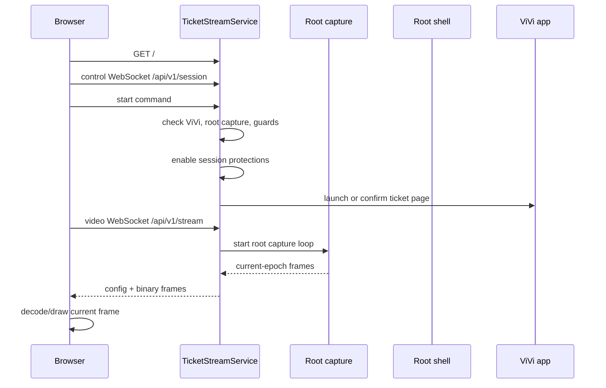

# Ticket Streaming Architecture

This is the canonical architecture map for the Pixel-side ticket streaming subsystem. The current measurement history lives in [ticket-streaming-responsiveness-analysis-20260502.md](../../ops/reports/ticket-streaming-responsiveness-analysis-20260502.md); keep stable flow and safety rules here. Use [Touch Brightness Architecture](./TOUCH_BRIGHTNESS_ARCHITECTURE.md) for panel-brightness ownership and [ROOT_OPERATIONS](../runbooks/ROOT_OPERATIONS.md) for general Pixel operations.

## 1. Startup To First Visible Frame

The Pixel serves the local ticket page on `127.0.0.1:9388`. `pixel-ticket-start.sh` starts the Android supervisor and ticket service, writes runtime inputs, and starts the ticket tunnel loop when configured.

The Android orchestrator owns a durable `ticket_service_enabled` toggle. The default is off. When it is on, SupervisorService starts and keeps checking the `ticket_screen` component after service start, package replace, and phone boot until the local ticket server and tunnel loop are ready. This readiness path only starts the service and tunnel; it must not open ViVi or start screen capture until an authenticated viewer asks for a stream. When the toggle is off, the ticket component is not auto-started by the supervisor loop and the stop script is run to keep the server and tunnel stopped. Once readiness is proven stable, periodic rechecks are throttled so the idle phone does not repeatedly spawn root pid/cmdline probes just to confirm an unchanged healthy tunnel.

The browser marks the stream visible only after a real decoded frame is drawn. Health updates must not overwrite that visible state back to waiting.

The browser records the broad loading path as separate phases: HTML ready, health ready, control socket open, video socket open, active session observed, stream config received, and first live frame drawn. Loading over two seconds is logged with the current blocking phase so public Cloudflare/auth delay can be separated from Pixel stream delay.

The service sends no-store headers for all ticket HTTP responses, but `Clear-Site-Data: "cache"` is reserved for the root HTML response. API, health, and client-log calls must not repeatedly clear browser site cache while the page is reconnecting. On boot, the ticket page asynchronously unregisters legacy service workers and Cache API entries for the ticket origin while preserving cookies, local storage, and Cloudflare Access state.

The page also performs a no-store bootstrap/version check against `/api/v1/bootstrap`. If the running page version differs from the server version, the browser replaces the URL with a versioned root URL and fetches fresh HTML. A separate no-store `/api/v1/cache-cleanup` path carries the same cache-clearing policy for legacy cleanup. Both routes are additive diagnostics and must preserve auth-bearing storage.

## 2. Browser Control And Video WebSocket Lifecycle

The browser uses two sockets:

- Control socket: `/api/v1/session`, for start, stop, keepalive, health, recovery commands, and private control-code request updates. Browser pages do not send arbitrary phone taps or keys.
- Video socket: `/api/v1/stream`, for stream config and binary video frames.

Each browser page includes internal viewer/page identity query parameters. The service uses them for diagnostics, but it also enforces a single current control socket and a single current video socket for the ticket stream. New sockets replace older sockets of the same kind, including legacy/no-identity sockets, so reloads and reconnects do not accumulate duplicate clients.

Control and video socket identity includes the browser page version. Health exposes active client identity/page-version diagnostics so public verification can prove the current Brave tab is running the latest served page rather than a stale cached shell.

Reconnect behavior:

- Page reload and ordinary tab close are reconnect-friendly and should not stop the phone session.
- Explicit Stop is deterministic: stop capture, close clients, disable protections, and prevent old browser sockets from auto-starting the stream again.
- A visible, focused browser page is allowed to recover a phone/backend stream that was killed by inactivity or relay loss. Hidden or unfocused pages must not resurrect the stream on their own.
- Slow video clients are isolated from frame production. Stale delta frames may be dropped for that client so the newest frame path stays fresh.

Legacy clients without viewer/page identity should still connect, but they do not get same-viewer replacement.

## 3. Pixel Capture, Root Frames, And Browser Draw

The accepted production public capture path is root-only hardware H.264 over the existing authenticated video WebSocket:

- Pixel output format: H.264 Annex B access units from the rooted hardware `MediaCodec` input-surface encoder, reported as `captureMode=root_hardware_h264`, `transport=h264-annexb-websocket`, and the exact `avc1.*` codec string when SPS is observed.
- Arbuzas output format: `ticket_remote` forwards the single private Pixel H.264 stream to authenticated viewers over `/api/v1/stream` without decoding or re-encoding.
- Default quality profile: 720px-wide root hardware H.264 at about 1.2 Mbps, cropped to the same browser-visible ticket view as before.
- Runtime: Pixel owns root capture start/stop, hardware keyframes, stream epoch, frame sequence, and adaptive capture cadence. `ticket_remote` is a latest-frame fanout, not a media processor.
- Cadence: the encoder is configured for an 8 FPS burst profile. The helper loop runs at 8 FPS during startup, viewer joins, decoder/keyframe recovery, and control-code activity, then drops to a 4 FPS steady target after a six-second burst hold without restarting the encoder.
- Keyframes: the normal hardware GOP is one second. Explicit keyframe requests are still used for viewer join, decoder recovery, generated-result marker delivery, and cleanup verification.
- Browser draw: the public page receives `tsf2` H.264 frames, decodes them with WebCodecs, and draws the newest decoded frame to the stream canvas.
- Sent ViVi ticket media excludes the top cropped strip from the phone display. The Pixel reports the crop in stream config/health and maps browser taps back to the full phone coordinate space by adding the cropped strip.

The normal public path must not depend on Android MediaProjection, Android screen-recording permission UI, WebRTC, AV1, H.265, PNG frame streaming, FFmpeg H.264, software stream fallback, phone PNG result capture, or accessibility fallback. If the rooted hardware H.264 path cannot run, the public page shows a clear unavailable/attention state rather than silently changing capture modes.

Earlier measured paths are documented for context only. Root-fed AV1 was too slow for production. Root FFmpeg H.264 improved capture cost with the native helper but had authenticated-browser decode failures. Root PNG was clear but full-resolution capture was too slow and CPU-heavy for the requested freshness target. WebRTC was removed from the current production path in favor of the simpler H.264 WebSocket pipeline.

Frame freshness:

- The current frame envelope is `tsf2`: stream epoch, frame sequence, frame timestamp, and keyframe flag precede the encoded video payload.
- Stream epoch changes on capture config changes, capture restarts, and stop/start boundaries.
- The browser and public relay drop frames from old epochs, duplicate or lower frame sequences, and legacy frames once `tsf2` has been negotiated.
- Per-client queues are flushed on reconnect, reload, config change, stream epoch change, and decoder reset so old frames cannot leak into a new view.

Fresh-frame behavior:

- Browser/reload/control-code transitions request a fresh current-epoch hardware keyframe from the running Pixel encoder.
- Keyframe requests during startup must not restart the encoder while it is already waking or preparing.
- Recent config can be sent to new viewers immediately. Recent keyframes can be reused only when they are from the current stream epoch and inside the freshness window. Old cached keyframes must never be drawn.
- If no fresh same-epoch keyframe exists, the relay/browser requests a new hardware keyframe instead of replaying old video.
- `ticket_remote` keeps at most the newest pending frame per video client. A queued keyframe may be kept ahead of a newer delta frame, but stale queued deltas are dropped so slow viewers cannot delay the current view for everyone else.
- During a control-code request, `ticket_remote` keeps the normal shared stream live. Other authenticated viewers may briefly see the real phone open ViVi's control-code UI, but no viewer receives private phone control or a separate control video stream.
- Restart reasons, suppressed restart requests, keyframe requests, frame sequence, and Pixel ticket events are exposed in health.
- Stop/cleanup stops the active root hardware capture path, clears the current stream epoch/cache, and leaves the ticket service ready for the next authenticated viewer.

Browser decode behavior:

- The browser decodes H.264 from the video WebSocket with WebCodecs and renders the latest accepted frame to the stream canvas.
- On stream epoch changes, the browser resets decoder state and rejects old frames. When decode falls behind, stale delta frames are skipped and a keyframe is requested.
- Watchdogs can request a keyframe when the visible frame is quiet or static without leaving the streaming state.
- Video socket failures reconnect the affected browser video path. They should not restart the shared phone stream while the Pixel relay is connected and the hardware encoder is waking or already running.
- Control and video socket open timeouts are intentionally short so the page leaves long connecting states quickly. A two-second loading budget triggers video recovery, then escalates if the stream still does not produce a live frame.

## 4. Control-Code Requests And Safety Gates

The public browser no longer claims phone control. It can only submit a numeric control-code request:

- The public page opens a local dialog, accepts only 2-9 digits, and posts the request to `ticket_remote`.
- `ticket_remote` authorizes the requester through ticket membership, applies the two-requests-per-60-seconds limit, queues requests, and runs only one phone job at a time.
- The phone receives `generate_control_code` with a request id and digits. The browser never sends tap coordinates, keyboard events, ADB commands, or direct phone-control messages.
- A control-code request must start or join the Pixel ticket session before it evaluates the remote-input gate. The relay's normal startup `start` command may be delayed or deferred while a control-code job is active, so `generate_control_code` owns this readiness step and must not fail with the recoverable cold-start `no_active_control` race.
- Before opening the popup, the request path also clears an in-progress control-code exit cleanup, foregrounds ViVi if a foreground violation is cached, and gives known recoverable ViVi states (`TICKET_LIST_WITH_CARD`, empty/list tabs, stale popup/result surfaces) a bounded ticket-detail recovery attempt. Only after that does it surface `control_code_request_unsafe_state:*` as a real request failure.
- The Pixel is the source of truth for app state. It emits `ticket_state_event` messages for raw ticket, popup open, generated result visible, returning to raw, raw return complete, and attention-needed states. Each event carries the request id when relevant plus stream epoch, frame sequence, and phone timing.
- The Pixel opens or reuses ViVi's control-code popup through a bounded root-only state controller, types with root input, physically taps OK after the short input settle, gives the post-OK Aztec/result marker about 750 ms to render, accepts the post-OK hardware H.264 visual marker before the slower root hierarchy fallback, requests a fresh hardware frame, and sends one generated-result marker: `ticket_state_event(ticketState="generated_result")` with the matching request id, value, stream epoch, frame sequence, and minimum frame sequence.
- The phone does not capture result PNGs in production, and the browser does not freeze or upload local canvas copies. The generated-result marker is the only success handoff.
- `ticket_remote` marks the private result as successful directly from the Pixel marker, stores no image bytes for marker results, sanitizes generated-result state broadcasts for non-requesters, and notifies only the requesting signed-in session. It does not send a browser-capture confirmation back to the Pixel.
- After the marker is sent, the Pixel immediately closes the generated result with the small close near the generated digits and returns to the raw ticket state. Cleanup keeps the queue blocked until raw ticket plus a fresh raw-ticket hardware frame are confirmed.

Rīgas Satiksme Telegram QR jobs use the same Pixel control socket but require an explicit `app="rigas_satiksme"` and `flow="monthly_ticket"`, so they remain separate from ticket.jolkins ViVi control-code requests. The Pixel drives the RS app with a measured fast path. Cold or unknown starts read the live RS hierarchy and tap the current `TICKET FOR CONTROL` home-button bounds before using measured coordinates for deeper Flutter screens. Queued warm starts where Android just canceled a pending RS cleanup can skip that slow home discovery: they close the previous RS generated QR and use the measured RS 2.1.0 `TICKET FOR CONTROL` button-center fallback, while still preserving hierarchy-derived cold-start/recovery paths. After the coordinate flow, Pixel does one cheap RS fast-hierarchy semantic attempt and then goes directly to the bounded root hierarchy fallback because production RS Flutter snapshots are usually empty; the root/semantic check must still validate `TICKET FOR CONTROL`, QR semantics, monthly-ticket markers, and the submitted code before capturing the app-rendered image. A validated `rs_monthly_ticket_control_screen` hierarchy is the success authority even if the shell tap script exits non-zero after a benign late tap/status miss; the next step must capture and send the RS image rather than reporting failed/generated with no PNG. The returned Telegram artifact is the RS app-generated screenshot, kept full width and trimmed only at the shared broker delivery boundary by cropping 5% of the source screenshot height from the top and 5% from the bottom; it does not use the ViVi control-code graphic crop, a QR-only crop, a bot-side second crop, or an Android-side top/bottom delivery crop. If the semantic check lands on a transient/intermediate RS screen, Pixel runs one bounded in-app recovery tap sequence and rechecks before reporting failure or starting the slower ViVi cleanup path. Stale-code recovery may start on an already-open RS QR, so it trusts the authoritative stale classification, backs out before any in-script hierarchy probe, then uses the fresh registration/manual-code path with an explicit 8 s recovery cushion and final semantic recheck. Recovery also handles the live RS home screen by re-tapping the hierarchy-derived `TICKET FOR CONTROL` button. Generic intermediate screens must be reported as recoverable control/navigation failures, not as `rs_monthly_ticket_missing`; `rs_monthly_ticket_missing` is reserved for an explicitly inspected empty monthly-ticket list. Successful RS jobs send the image result immediately, schedule return-to-ViVi after a short idle delay, and cancel that pending cleanup if another queued RS job arrives; final-failed RS jobs still report before slower cleanup and return the phone to the ViVi ticket afterward. Because cleanup is after user delivery and production ViVi root dumps can take several seconds, RS return-to-ViVi has a dedicated 45 s budget with six focused recovery actions so a slow ticket-list/card reload can still reach `TICKET_DETAIL` without changing the normal fast ticket wake limits.

Safety gates:

- The Pixel normalizes known ViVi states before automation. An already-open control-code popup is a valid submit state. A generated Aztec/result screen is never an idle-ready state; it is closed through the same root-only return-to-raw routine before a new request starts.
- The Pixel refuses only when root cannot inspect/control ViVi or raw-ticket return cannot be confirmed within the bounded routine. The old recoverable “refreshing ticket view, try again” path must not be used for known popup/result states.
- Duplicate request ids replay the cached result and do not execute the phone flow twice.
- Control-code automation is serialized by a Pixel-side mutex as well as the public queue, so overlapping requests cannot interleave physical phone actions.
- During the popup/result transition, foreground/page guards may observe and record state but must not force-stop ViVi, navigate back to Orchestrator, or run fresh reset.
- Cleanup failure records attention-needed and keeps public browser input blocked rather than exposing direct control or starting a new request.
- Active ticket sessions hold the Pixel screen awake and request a wake if the display becomes non-interactive, unless touch brightness is enabled. When touch brightness is enabled, touch brightness owns the screen hold and panel writes. Input remains blocked while the display is not interactive; the wake path is used to restore the live stream instead of launching recovery loops against a black/dozing screen. When all viewers detach or the stream stops, the ticket service releases this bright wake lock immediately; the brightness guard may keep the panel dim only when touch brightness is disabled.

Control-code request health reports the last request id, digit count, status, reason, phase timings, total duration, duplicate replay count, capture status, cleanup status, and completion age. Do not restore public tap/key forwarding, phone screenshot result capture, browser image upload, accessibility-driven ticket automation, software stream fallback, or weaken protected-edge blocking, foreground checks, notification lockdown, secure-window handling, or control-code cleanup verification without updating this document and the relevant tests.

## 5. Stop, Cleanup, Reconnect, And Tunnel Behavior

Stop paths:

- Explicit browser Stop calls the session stop endpoint with `explicit=true`.
- Service stop clears stream state, stops active capture/encoding, closes clients, disables notification lockdown, disables secure-window bypass, and clears active control-code request state. With the durable ticket service still enabled, browser Stop keeps the local service and tunnel ready but does not start ViVi or capture again until a viewer asks.
- During streaming and after a session ends while the durable ticket service remains enabled, the ticket brightness guard enforces safe dim panel brightness only when touch brightness is disabled. When touch brightness is enabled, the ticket guard parks, reports that touch brightness owns panel brightness, and does not write or restore panel brightness. Saved ticket brightness is restored only when ticket service is turned off, touch brightness is not owning the panel, or the phone is intentionally handed back to physical use.
- After explicit Stop, health should report inactive stream, zero clients, no active control-code request, and no active app-owned capture process.
- A stopped or idle stream must actively close any leftover control/video sockets before accepting a fresh start request, and `/api/v1/session/start` must return within a bounded timeout instead of hanging behind stale cleanup.
- Stopping capture clears old frame counters, frame ages, dimensions, bitrate, and helper state that would otherwise make inactive health look like it is still sending frames.
- Viewer inactivity timeout is also a non-destructive stop. It may stop capture, close clients, and block browser auto-start until a fresh viewer request arrives, but it must not schedule fresh ticket recovery, force-stop ViVi, or navigate back to Orchestrator.

Reconnect paths:

- Page reload should replace same-viewer public sockets without interrupting the shared phone stream.
- If all Pixel-side relay clients disconnect or the public relay goes idle, the service parks capture: it records detach state, stops the root hardware H.264 helper, disables protections, keeps ViVi available, and enforces dim brightness only when touch brightness is disabled. It must not run ViVi recovery loops while no viewer is present.
- Reload should replace same-viewer sockets and reach a visible frame from the active stream quickly.

Control-code cleanup paths:

- Public `ticket_remote` does not send `control_exit`, `reset_ticket`, or user tap/key commands for the request flow.
- The Pixel treats popup/result close as one mandatory root-only return-to-raw path. It must not use `FRESH_RESET`, `am force-stop`, navigation back to Orchestrator, accessibility clicks, accessibility text entry, or software/screenshot fallbacks for normal request completion.
- The cleanup path distinguishes raw ticket detail, the keyboard/input popup, generated control-code Aztec/result screen, and other known ViVi states from fresh root hierarchy reads. It uses the small generated-result close target for generated screens, never the top-right ticket-exit cross.
- Every success, failure, timeout, browser disconnect, cancel, and prepare/submit normalization path runs the same return-to-raw routine. A successful cleanup emits `ticket_state_event(raw_ticket)` only after root confirms raw ticket and the hardware stream has produced a fresh raw-ticket frame. A failed cleanup records attention-needed while keeping the stream available and public input blocked.

Tunnel behavior:

- `pixel-ticket-start.sh` starts or reuses the ticket tunnel loop.
- The durable orchestrator toggle controls whether `ticket_screen` may auto-start. Browser explicit Stop stops the stream session but does not turn this orchestrator toggle off.
- Healthy existing tunnel loops should be reused rather than killed on every ticket start.
- Repeated ticket starts should reconcile duplicate tunnel-loop and `cloudflared` processes while preserving the healthy pid-file loop and its current `cloudflared` child.
- Tunnel health is observed through local metrics and component health. Public access may be Cloudflare Access protected, so unauthenticated public health probes are not authoritative stream timing checks. Root pid/cmdline checks used for tunnel readiness must be time-bounded, and root command execution must clean up timed-out shell children so a bad probe cannot leave an orphaned process burning CPU.
- Root hierarchy reads use a guarded `uiautomator dump` wrapper rather than bare `uiautomator` calls: dumps share a device-side non-blocking `flock`, use a shell-level timeout shorter than the Kotlin coroutine timeout, reserve lock-held cleanup/settle time before the outer timeout can fire, refuse too-small dump budgets, and clear stale `com.android.commands.uiautomator`/`uiautomator` processes before and after the read. Service-owned semantic reads are also routed through the wake-root executor lane, including active guards, wake prep, RS semantic proof, RS in-app recovery, and recovery autopilot hierarchy reads, while touch/input macros stay on the input lane. Active foreground guard first uses the cheap in-process visible-node snapshot for ViVi state; foreground guard stays deferred for the whole extended wake-recovery budget while startup is still proving ViVi, not just the short nominal wake budget. If the guard later runs and the cheap snapshot is empty while the stream is otherwise live on a recent wake-ready proof or a recently proved ticket detail, it trusts that live proof and skips root `uiautomator`. Only when there is no recent ticket-detail proof does it escalate to the wake-root semantic dump. Any unavailable root hierarchy is inconclusive and backs off for 30 seconds instead of hammering `uiautomator` every foreground tick. This makes the architecture avoid Android's singleton `UiAutomationService already registered` class of errors instead of depending on broker retries or failed concurrent probes.
- Public `ticket_remote` must restart its phone reconnect loop whenever a new authenticated video viewer arrives and the relay is desired but not actively reconnecting. A stale desired state after phone reboot must not leave the public page waiting forever for the phone bridge.
- `ticket_phone_bridge` must not expose stale ADB forwards after reboot. It waits for `sys.boot_completed=1`, proves Pixel `/api/v1/health` over the forwarded port, and kills/recreates the local proxy when health probes fail or turn into EOF.
- `ticket_remote` clears cached config and cached frame state when the phone bridge disconnects. A newly opened browser video socket must not receive an old pre-reboot config unless the phone is currently connected and the config is fresh.
- The public server serves the current ticket app HTML for any non-reserved GET path. `/api/...`, `/static/...`, and `/admin...` remain strict/reserved.

The ticket component still follows the stack-wide operation model in [Pixel Stack Architecture](./PIXEL_STACK_ARCHITECTURE.md): `redeploy_component ticket_screen` refreshes the Pixel-side ticket surface, while public bridge/page deploys are separate.

For the public `ticket.jolkins.id.lv` path, Cloudflare Access terminates in front of `ticket_remote`. The browser talks to `ticket_remote`; `ticket_remote` relays video and queued control-code jobs privately to the Pixel through `ticket_phone_bridge`. Public socket identity should be visible in `ticket_remote` health, and the relay identity/page version should also be visible in Pixel `streamPipeline` health.

All authenticated linked viewers may receive the live video stream at the same time. There is no public private-control mode: viewers cannot claim the phone, tap the stream, or type into ViVi directly. A control-code requester receives only their private generated result, while other viewers continue seeing the shared raw ticket stream and may briefly see the real phone automate the request. A viewer reload or decoder reset must not restart or starve the shared phone stream for other authenticated viewers.

ViVi recovery launches `com.pv.vivi/.MainActivity` through the normal app intent and a root `am start` fallback. The fallback is required for post-reboot recovery because Android may leave Messages, Orchestrator, or another app in foreground while the ticket service is already ready.

## 6. Health Counters, Events, And Measurement Caveats

The ticket session state machine uses bounded user-visible states: `starting`, `live`, `control_transition`, `control_exit`, `soft_recovery`, `needs_attention`, and `stopped`. Public pages should present control-code request progress separately from the stream state as `queued`, `running`, `succeeded`, `failed`, `expired`, or `closed`. Active transition states have a one-second budget. If the stream is active, recovery is not running, and ViVi is already on ticket detail, health reports `live` rather than staying stuck in `recovering`.

Important health surfaces:

- `serviceReadiness`: durable ticket-service toggle state, last ensure result and age, local ticket server reachability, tunnel readiness, and component status.
- `streamPipeline`: clients, configured/running state, frame envelope, stream epoch, frame sequence, quality profile, configured size/bitrate, recent frame/keyframe byte sizes, estimated send bitrate, encoded/sent/keyframe counts, dropped frames, slow writes, closed slow clients, replaced clients, and secure-window bypass state.
- `rootCapture`: support, active state, size, bitrate, current adaptive FPS target, frame counts, restart counts, restart reasons, last restart age, and suppressed restart requests. The legacy `ffmpeg` health object, if present, reports removed/unavailable only.
- `brightnessGuard`: active state, safe target percent, current display/panel values, last enforcement age, failure count, last reason, and message. A parked message means touch brightness currently owns panel brightness.
- `controlCodeRequest`: active state, last request id, digit count, status, reason, total duration, phone phase timings, marker delivery state, duplicate result replay count, cleanup state, and completion age.
- `pixelTicketStateEvent`: latest Pixel-authoritative ticket state event, event sequence, request id, stream epoch, frame sequence, minimum frame sequence, reason, and age. Public/database/browser state should mirror this event stream and ignore stale lower-sequence events.
- `ticketState`: current bounded state, state age, last reason, over-one-second transition detail, and ViVi hard-reset count/reason.
- `loading`: most recent browser loading completion and over-budget phase/duration.
- `page`: latest HTML version, cache policy, last root/bootstrap/cache-cleanup request age, and last client page version.
- `recentEvents`: server-side lifecycle, recovery, client, and input events.
- `recentClientTelemetry`: browser-side startup, media decode, visible-frame, watchdog, and socket events.
- Public relay `/api/v1/health.controlKeyframes`: historical keyframe-pulse counters plus sent cached keyframes, phone keyframe requests, and last pulse age. New control-code requests must not reintroduce controller-only video ownership.
- Public relay `/api/v1/health.spacetime`: ticket-only SpacetimeDB call counts, errors, slow calls, snapshot/member cache hits and misses, presence throttling, compact phone-health writes, skipped stable phone-health writes, and the latest phone-health compaction result.
- Public relay `/api/v1/health.telemetry`: client-log counts, server-side suppression counts, aggregate log counts, state-broadcast counts, and state-broadcast suppressions. These counters prove whether public UI diagnostics are calm without removing important error/input/loading events.

SpacetimeDB is the source of truth for ticket membership and current compact phone state. The old public control-ownership flow is not part of the browser UX. `ticket_remote` keeps a short in-process read cache for non-mutating paths such as client telemetry, ordinary socket setup, health, and browser heartbeat responses. It owns the short-lived control-code request queue, rate-limit window, requester-only result delivery, and request cleanup timers. Only the control socket owns viewer presence; video sockets do not write presence rows. Pixel health is stored in SpacetimeDB as a compact material summary and is written only when that summary changes or a keepalive interval passes; the full current phone diagnostics stay in `ticket_remote` process health for operations.

Public status UI should be calm. The scroll-menu status line is a derived presentation state, not a raw health log: repeated equivalent states are debounced, lower-priority phone/health messages do not overwrite the current live stream or active code-request state, and the browser counts down the private result locally instead of requiring per-second server state broadcasts. Noisy browser telemetry such as frame received/drawn and repeated loading phases should be sampled or summarized; page boot, over-budget loading, decode errors, code-request changes, and hard failures remain immediate.

When Cloudflare Access asks for authentication during ticket verification, future agents should keep the existing Brave Work profile and preserve cookies, local storage, session storage, and IndexedDB. Request the Access code for `ticket@jolkins.id.lv` only if needed, read only the newest Cloudflare code from the macOS notification or Apple Mail, submit it in Brave, and then verify the live ticket from the real authenticated Brave page.

Known caveats:

- The current public production path is rooted hardware `MediaCodec` H.264 from the phone, carried to browsers as latest-frame H.264 over the authenticated `ticket_remote` video WebSocket.
- WebRTC, PNG streaming, AV1, FFmpeg software paths, phone PNG result capture, browser image upload, and accessibility-driven ticket automation are historical or diagnostic-only. They must not return to the public production path without a new explicit cutover.
- Public Cloudflare timing requires authenticated access; unauthenticated redirects are only tunnel reachability evidence.
- Reports can preserve dated measurements, but architecture updates should describe the stable behavior after changes land.

## Architecture Update Notes

Future agents should add short notes here when changing ticket stream flow, capture behavior, browser socket lifecycle, input safety, health counters, tunnel behavior, or cleanup semantics. Link dated measurements to `ops/reports/` and then fold stable behavior into the sections above.

- 2026-05-21: Active foreground guard now remains deferred for the whole extended wake-recovery budget, then uses a cheap ViVi visible-node snapshot before any root hierarchy dump. If that snapshot is empty while the stream is otherwise live on very recent wake-ready proof, or on a current `TICKET_DETAIL` proof that is only a few seconds old, it trusts the live proof and skips root `uiautomator`; it must not trust the older 10-minute ticket-detail memory after an empty snapshot, because that masks forced-home/route screens after long pauses. Root H.264 session startup now also waits until wake/recovery has confirmed the ViVi ticket-detail screen before starting the encoder, so long-pause locked/home starts do not prewarm the helper against a blank/protected surface and poison hardware reliability with startup exit-137 loops. ViVi wake recovery recognizes Latvian settings screens, uses a top-right close fallback for stale/partial cart hierarchies, and can use a bounded route-home Tickets-tab coordinate fallback when the route planner is visible but the bottom tab lacks an accessibility label. If a root hierarchy is still needed and comes back unavailable, it arms a 30-second inconclusive backoff. This keeps healthy live streams calm and avoids creating the same singleton UiAutomation failure repeatedly while still allowing explicit foreground violations, known non-ticket states, and request cleanup paths to recover normally.
- 2026-05-21: Service-owned semantic hierarchy reads now use a single wake-root executor lane: active guards, wake prep, RS semantic proof, RS in-app recovery, and recovery autopilot dumps are queued on that lane while touch/input macros remain on the input lane. Even wake/active recovery taps and back presses are input-lane work, not wake-root hierarchy work, so they do not queue behind or inherit failures from guarded `uiautomator` reads. This reduces broker-visible retries by avoiding Android's singleton `UiAutomationService already registered` race instead of letting parallel probes fail and hoping broker retries recover.
- 2026-05-21: Ticket/RS root hierarchy dumping now goes through `TicketUiautomatorDump`, which serializes dumps with a non-blocking `/data/local/tmp/pixel-ticket-uiautomator.lock`, runs Android `uiautomator dump` under a shorter shell `timeout`, reserves the wrapper's failure cleanup/unregister settle inside the outer timeout, refuses sub-second dump budgets that cannot safely hold the lock through cleanup, and clears stale `com.android.commands.uiautomator`/`uiautomator` processes before and after each dump. This addresses production incidents where Android's singleton `UiAutomationService already registered` crash made ViVi recovery report `UNKNOWN_VIVI`/`capture_blocked` and made RS monthly-ticket jobs reach the generated screen without delivering an image; the non-blocking lock prevents concurrent probes from simply waiting until their outer Kotlin timeout. The same incident also taught the RS monthly-ticket flow to treat a semantically verified `rs_monthly_ticket_control_screen` as success even if the tap shell exits non-zero, so Android captures and sends the app image instead of emitting a failed/generated status with no PNG.

- 2026-05-20: RS Telegram QR result images remain RS app-generated screenshots, not ViVi control-code graphic crops. The shared RS generated screenshot artifact stored by `phone_broker` is cropped symmetrically by 5% of the source screenshot height from the top and 5% from the bottom while preserving full width; `rigassatiksme_qr_bot` sends those stored artifact bytes without applying an additional crop. Android capture leaves the RS screenshot uncropped except for explicitly disabling the ViVi graphic crop.
- 2026-05-20: RS monthly-ticket failed `rigassatiksme_qr_result` messages are delivered to the active broker connection but are not cached for reconnect replay. Only accepted RS image results with non-empty app-captured screenshots remain replayable, so broker retries that reuse the same request id must re-drive the RS app instead of receiving an old `qr_image_missing` failure.
- 2026-05-19: Long-pause ticket opening keeps the fast root-H.264 startup path, but the phone wake detector now has two bounded reliability escalations before reporting `phone_not_ready`: settings/profile ViVi screens with a bottom Tickets tab are treated as recoverable `open_tickets_tab` states, and blank/outside/unknown wake observations get one direct root ViVi relaunch with a distinct `wake_recovery_relaunch` event. This preserves the common fast path while giving cold/idle ViVi launches one stronger chance to reach ticket detail.
- 2026-05-19: Rīgas Satiksme Telegram QR jobs now do one bounded in-app RS recovery and semantic recheck before falling back to broker retry/ViVi cleanup. Generic intermediate RS screens are no longer labeled `rs_monthly_ticket_missing`; that reason is reserved for an explicitly inspected empty monthly-ticket list.
- 2026-05-19: RS Passenger 2.1.0 pressure tests showed the old first home tap sat on the edge between `REGISTER A TRIP` and `TICKET FOR CONTROL`, intermittently leaving jobs on the RS home screen with `rs_monthly_ticket_control_missing`. The fast path and recovery now read live `TICKET FOR CONTROL` bounds from the RS hierarchy for the home-screen tap, then keep the measured coordinate path for deeper Flutter-only screens.
- 2026-05-19: RS monthly-ticket latency pressure work moved successful result delivery ahead of ViVi cleanup, schedules return-to-ViVi after a short idle delay, cancels that cleanup for queued RS work, uses a warm previous-QR hint to skip repeated RS home discovery, and replaces repeated RS fast-hierarchy polling with one cheap snapshot plus bounded root fallback. Two 8-request pressure batches completed cleanly with average broker processing time around 11.2 seconds while preserving RS monthly QR artifact validation.
- 2026-05-19: Mixed-code RS bot pressure found that reopening `TICKET FOR CONTROL` from RS home could show the previous trip's QR even though a different vehicle code had been requested. Fresh RS monthly-ticket requests now prefer `REGISTER A TRIP` when both home actions are present, recovery backs out of an already-open QR before retrying, and verification requires the visible control code to OCR-match the requested digits. A 30-minute bot-equivalent pressure run completed 58 varied-code requests (`68803`/`69570`) with zero final failures and zero OCR mismatches.
- 2026-05-18: Control-code submit keeps the typed-code popup on the immediate OK path, then gives the post-OK Aztec/result marker about 750 ms to render. Marker delivery now accepts the post-OK hardware H.264 visual marker before the slower root hierarchy fallback so the browser freeze target stays under about two seconds once the generated Aztec is visible.
- 2026-05-09: Control-code request architecture removed public phone control. The public page now collects 2-9 digits locally, `ticket_remote` authorizes/rate-limits/queues one request at a time, the Pixel executes `generate_control_code` automation, captures the generated result, cleans ViVi back to ticket detail, and `ticket_remote` privately shows the requester the result for 60 seconds.
- 2026-05-10: Fast control-code delivery made the Pixel request path root-macro-first: fresh root hierarchy for ViVi targets, direct input tap/type, direct yellow OK tap before any result wait, screenshot-first private delivery, then independent cleanup back to raw ticket detail.
- 2026-05-10: ViVi ticket media now crops the top 200 source pixels before leaving the phone so the visible phone status strip is removed with extra margin. The crop applies to both live stream frames and private control-code result images, with stream size/config/health and browser-to-phone tap mapping adjusted to match the cropped media.
- 2026-05-11: Pixel-aligned stream rebuild made the Pixel the authoritative ticket-state source with ordered `ticket_state_event` messages, kept one production rooted hardware H.264 WebSocket path, changed `ticket_remote` to latest-frame fanout, made browser decode skip stale deltas, and completed the control-code result model as browser-local freeze plus metadata confirmation only. Production no longer uses phone result screenshots, browser image upload, software stream fallback, WebRTC fallback, or accessibility ticket automation.
- 2026-05-02: Public authenticated loading pass v21 reserved browser cache clearing for root HTML, added origin-local service-worker/cache cleanup that preserves auth state, extended active-session no-client recovery grace for public reloads, and made repeated ticket starts reconcile duplicate tunnel processes while preserving the healthy loop.
- 2026-05-02: Public authenticated loading pass v22 added no-store bootstrap/cache-cleanup routes, page-version socket diagnostics, and health fields that prove whether Brave is running the latest Pixel-served page.
- 2026-05-02: Authenticated public pass v7 confirmed `ticket.jolkins.id.lv` is served by `ticket_remote`, added public no-store bootstrap/cache-cleanup/version proof, same-session browser socket replacement, relay identity passthrough to Pixel health, cached-keyframe fast joins, non-blocking browser video delivery, and static-frame keyframe retries that avoid visible loading for quiet screens.
- 2026-05-02: Fresh-keyframe balanced pass v25/v9 moved the stream to a `tsf2` epoch/sequence/timestamp frame envelope, limited cached keyframes to fresh same-epoch frames, raised balanced root capture to 720 pixels at about 3 Mbps, exposed quality/freshness counters, and made public video visible to all authenticated viewers while preserving private input control.
- 2026-05-03: Durable ticket service pass added the default-off orchestrator toggle, post-reboot service/tunnel readiness supervision without opening ViVi or capture, strict fresh ViVi foreground checks before every remote tap, and controller-only one-second cached keyframe pulses in `ticket_remote`.
- 2026-05-03: Live durable deployment added root ViVi launch fallback and fixed `ticket_remote` phone reconnect-loop restart after phone reboot; verified reboot readiness, public authenticated open, foreground tap blocking, explicit Stop cleanup, toggle OFF, and final toggle ON service-ready state.
- 2026-05-03: Control-mode stability pass replaced normal control release/expiry resets with soft control exits, added `inputId`/`input_result` tap acknowledgements with phase timings, added a short latest-tap queue for control-code startup/reconnect, gave the known control-code button zone transition grace, blocked stale post-tap checks from re-entering control after release, and made foreground/page guards observe-only during control-code transitions.
- 2026-05-03: The follow-up 10-minute watch found `viewer_inactivity_timeout` still caused one hard ViVi reset in v34. v35 changed viewer inactivity into a non-destructive stop only: stop stream/capture, close clients, keep the durable service ready, and never force-stop ViVi or return to Orchestrator for inactivity.
- 2026-05-03: AV1 clarity and burn-in-safe brightness pass made MediaProjection hardware AV1 the normal public ticket stream path, kept root H.264 as emergency-only, added root-assisted capture-permission provisioning, raised the clarity profile to full-width/about 8 Mbps/10 FPS/1-second keyframes, added one-second static-frame repeat for fresh current-epoch keyframes, stopped consumed MediaProjection instances instead of reusing them, pre-arms fresh permission after Stop/viewer idle while the durable service remains on, and added a ticket brightness guard that keeps the panel dim after sessions while the service remains enabled.
- 2026-05-03: Reboot recovery/root-only clarity pass changed the normal public stream to root-only lossless PNG screencap (`codec=png`, `transport=root-screencap-png`, `captureMode=root_screencap_png`), removed MediaProjection permission from the public path, made every PNG frame a current-epoch keyframe, capped browser startup stream reinitializations, cleared stale relay config/frame caches on phone disconnect, made the bridge recreate stale ADB forwards after EOF/bad health, and made arbitrary non-reserved public paths serve the latest no-store ticket app shell.
- 2026-05-03: Control input reliability pass changed browser control input from fire-and-forget to ordered/acknowledged FIFO delivery, preserved the initial Kontroles kods tap while the control claim is in flight, added Pixel-side duplicate `inputId` result replay, and made normal control exit close control-code popup/result states back to ticket detail with a fresh root PNG frame request.
- 2026-05-03: Clean control exit pass made the generated control-code Aztec/result screen a first-class ViVi state, made normal release/expiry/controller departure/close attempts verify ticket detail after closing popup or result states, added control-exit cleanup health fields, made accepted popup/result close input release public control immediately, and made cleanup use fresh/accessibility-visible hierarchy, a guarded Back-close, and a non-destructive soft fallback before reporting `needs_attention`.
- 2026-05-04: Root-fed AV1 prototype added a strict root-only AV1 capture mode and public relay/browser AV1 diagnostics, but live local measurement found it too slow for production: first frame about `5.9-6.3s`, then about `0.5-0.7 FPS`, with the bottleneck in root screencap plus CPU RGB-to-YUV conversion.
- 2026-05-04: FFmpeg quality hard-cutover changed the accepted production path to root-only FFmpeg H.264 (`captureMode=root_ffmpeg_h264`, `transport=ffmpeg-h264-annexb`, `qualityProfile=ffmpeg_h264_clarity`) from the Pixel Stack arm64 chroot, with all-intra 8 FPS full-resolution frames, no MediaProjection/screenrecord/automatic PNG fallback, sharper browser canvas drawing, FFmpeg health fields, and cleanup for FFmpeg plus the root frame feeder.
- 2026-05-09: Fresh-stream repair tightened stopped-stream cleanup: stale clients are closed before bounded session starts, inactive health no longer reports ancient FFmpeg frames as active, and stopped/idled sessions clear stale capture counters so the next public viewer receives a genuinely fresh stream.
- 2026-05-09: Foreground recovery pass made visible/focused ticket browsers responsible for restarting a phone/backend stream after inactivity or relay disconnect, while hidden/unfocused pages stay quiet. Public `ticket_remote` recovery now accepts control-socket recovery requests and can restart the relay even when the old phone sockets are already gone.
- 2026-05-04: Native capture speed pass replaced the slow root `screencap` feeder with a persistent root `app_process` screen-capture helper (`captureSource=root_surface_capture`, `captureMethod=app_process_screen_capture`) feeding FFmpeg. Live v65 measurement promoted a 900px-wide clarity profile after full resolution proved too heavy, fixed the helper argument handoff, fixed expected pipe-close cleanup, kept the public H.264/WebCodecs contract unchanged, and verified the service/tunnel ready state with capture idle after cleanup.
- 2026-05-04: Public deployment recovery v70 restored the production public stream to root-only lossless PNG after authenticated Brave rejected the promoted FFmpeg H.264 stream with WebCodecs decode errors. The relay/browser kept the decoder-recovery fixes, the phone serves `captureMode=root_screencap_png`, `codec=png`, `transport=root-screencap-png`, and the authenticated Brave page was verified from the user side with live ticket frames. Active guard success now clears stale `needs_attention` state once ViVi is confirmed on ticket detail.
- 2026-05-06: WebRTC edge cutover changed the public production path to root `screenrecord` H.264 from the phone and WebRTC RTP fanout inside the existing `ticket_remote` service. The browser now receives a WebRTC video track, while taps/control still use the existing authenticated control socket. No extra Arbuzas ticket service, TURN service, public ADB, or Docker control was added.
- 2026-05-05: Ticket-only SpacetimeDB efficiency pass added per-procedure Spacetime diagnostics, moved client telemetry/socket/heartbeat reads onto short relay-side caches, made only control sockets write presence, compacted phone-health storage to material fields with a 30-second stable keepalive, removed duplicate Go-side audit writes for mutations already audited inside the Spacetime module, and added module-side audit counters plus bounded cleanup of old audit/control-session runtime history.
- 2026-05-05: Scroll status stability and compute quieting pass made the public scroll-menu status line debounced and priority-based, kept the control countdown browser-local, sampled noisy browser telemetry, slowed healthy-live health polling, throttled cached state broadcasts, added `/api/v1/health.telemetry`, and documented the Brave Work plus Apple Mail Cloudflare Access code workflow for authenticated ticket verification.
- 2026-05-05: Pixel heat fix pass hardened root command timeouts so timed-out root probes kill their shell children, bounded ticket tunnel pid/cmdline probes with `timeout`, throttled stable ticket-service readiness rechecks to a two-minute window, and made idle ticket detach paths release the bright screen wake lock immediately while keeping safe dim brightness enforcement.
- 2026-05-06: Root PNG cadence pass changed the steady production PNG stream target from about 2 FPS to 6 FPS while keeping the existing 10 FPS startup/fresh-frame burst, full-resolution PNG readability, and the current public relay/browser transport contract.
- 2026-05-07: Generated-code cleanup alignment made the inline generated control-code bar dirty until both hierarchy and visible SurfaceControl evidence agree it is gone. Pixel health now records the cleanup detector source and surface-probe result with the existing control-exit cleanup fields.
- 2026-05-07: Touch brightness ownership alignment parks the ticket brightness guard whenever touch brightness is enabled. Ticket streaming must not write, restore, or wake-hold the panel in that mode; touch brightness owns zero panel sleep and power-button wake rebound.
- 2026-05-13: Marker-driven control-code pass removed the browser freeze/confirmation loop. The Pixel now sends generated-result markers, `ticket_remote` trusts those markers as the private result, and the phone starts return-to-raw cleanup immediately after marker delivery. The rooted hardware H.264 profile was also lightened to 720 px wide at about 1.2 Mbps with a smaller/less frequent visibility probe and no full-surface black clear before each encoder draw.
- 2026-05-14: Capture cleanup and speed pass removed the phone PNG result helper plus FFmpeg/raw production capture wiring, made generated-result completion a single `ticket_state_event` marker, moved hardware H.264 to a one-second GOP, and added adaptive 8 FPS burst / 4 FPS steady capture with a six-second burst hold. Browser result UI is numeric-only and carries no image/base64 path.
