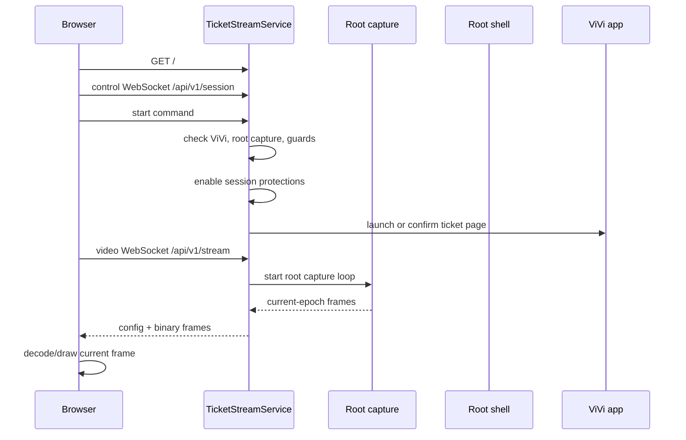

# Ticket Streaming Architecture

This is the canonical architecture map for the Pixel-side ticket streaming subsystem. The current measurement history lives in [ticket-streaming-responsiveness-analysis-20260502.md](../../ops/reports/ticket-streaming-responsiveness-analysis-20260502.md); keep stable flow and safety rules here. Use [ROOT_OPERATIONS](../runbooks/ROOT_OPERATIONS.md) for general Pixel operations.

## 1. Startup To First Visible Frame

The Pixel serves the local ticket page on `127.0.0.1:9388`. `pixel-ticket-start.sh` starts the Android supervisor and ticket service, writes runtime inputs, and starts the ticket tunnel loop when configured.

The Android orchestrator owns a durable `ticket_service_enabled` toggle. The default is off. When it is on, SupervisorService starts and keeps checking the `ticket_screen` component after service start, package replace, and phone boot until the local ticket server and tunnel loop are ready. This readiness path only starts the service and tunnel; it must not open ViVi or start screen capture until an authenticated viewer asks for a stream. When the toggle is off, the ticket component is not auto-started by the supervisor loop and the stop script is run to keep the server and tunnel stopped. Once readiness is proven stable, periodic rechecks are throttled so the idle phone does not repeatedly spawn root pid/cmdline probes just to confirm an unchanged healthy tunnel.

The browser marks the stream visible only after a real decoded frame is drawn. Health updates must not overwrite that visible state back to waiting.

The browser records the broad loading path as separate phases: HTML ready, health ready, control socket open, video socket open, active session observed, stream config received, and first live frame drawn. Loading over two seconds is logged with the current blocking phase so public Cloudflare/auth delay can be separated from Pixel stream delay.

The service sends no-store headers for all ticket HTTP responses, but `Clear-Site-Data: "cache"` is reserved for the root HTML response. API, health, and client-log calls must not repeatedly clear browser site cache while the page is reconnecting. On boot, the ticket page asynchronously unregisters legacy service workers and Cache API entries for the ticket origin while preserving cookies, local storage, and Cloudflare Access state.

The page also performs a no-store bootstrap/version check against `/api/v1/bootstrap`. If the running page version differs from the server version, the browser replaces the URL with a versioned root URL and fetches fresh HTML. A separate no-store `/api/v1/cache-cleanup` path carries the same cache-clearing policy for legacy cleanup. Both routes are additive diagnostics and must preserve auth-bearing storage.

## 2. Browser Control And Video WebSocket Lifecycle

The browser uses two sockets:

- Control socket: `/api/v1/session`, for start, stop, keepalive, taps, keys, health, and recovery commands.
- Video socket: `/api/v1/stream`, for stream config and binary video frames.

Each browser page includes internal viewer/page identity query parameters. The service uses them for diagnostics, but it also enforces a single current control socket and a single current video socket for the ticket stream. New sockets replace older sockets of the same kind, including legacy/no-identity sockets, so reloads and reconnects do not accumulate duplicate clients.

Control and video socket identity includes the browser page version. Health exposes active client identity/page-version diagnostics so public verification can prove the current Brave tab is running the latest served page rather than a stale cached shell.

Reconnect behavior:

- Page reload and ordinary tab close are reconnect-friendly and should not stop the phone session.
- Explicit Stop is deterministic: stop capture, close clients, disable protections, and prevent old browser sockets from auto-starting the stream again.
- Slow video clients are isolated from frame production. Stale delta frames may be dropped for that client so the newest frame path stays fresh.

Legacy clients without viewer/page identity should still connect, but they do not get same-viewer replacement.

## 3. Pixel Capture, Root Frames, And Browser Draw

The accepted production public capture path is currently root-only lossless PNG:

- Output format: PNG frames, reported as `codec=png`, `transport=root-screencap-png`, and `captureMode=root_screencap_png`.
- Default quality profile: `root_lossless_png`.
- Default dimensions: full Pixel display resolution, currently `1080x2424`.
- Default cadence: adaptive root PNG frames; every PNG frame is treated as a current-epoch keyframe.
- Runtime: the Android ticket service owns root screencap lifecycle, frame timing, epoch/freshness, relay fanout, and cleanup.
- Browser draw: the public page draws PNG frames directly to canvas with smoothing disabled. No WebCodecs decoder is used for the current production path.

The normal public path must not depend on Android MediaProjection, Android screen-recording permission, AV1, H.265, root `screenrecord`, or FFmpeg H.264 until that path has direct authenticated Brave proof. The FFmpeg H.264/native-helper implementation remains in the codebase as an explicit measured candidate, but it is not the current production public path because authenticated Brave rejected the promoted H.264 stream with decode errors during the 2026-05-04 deployment pass. The product was restored to root lossless PNG in v70 to keep the live site working.

Earlier measured paths are documented for context only. Root-fed AV1 was too slow for production. Root FFmpeg H.264 improved capture cost with the native helper but must not be promoted again until the public browser page, not only backend probes, proves stable first-frame and decoded-ticket behavior.

Frame freshness:

- The current frame envelope is `tsf2`: stream epoch, frame sequence, frame timestamp, and keyframe flag precede the encoded video payload.
- Stream epoch changes on capture config changes, capture restarts, and stop/start boundaries.
- The browser and public relay drop frames from old epochs, duplicate or lower frame sequences, and legacy frames once `tsf2` has been negotiated.
- Per-client queues are flushed on reconnect, reload, config change, stream epoch change, and decoder reset so old frames cannot leak into a new view.

Fresh-frame behavior:

- Browser/reload/control-code transitions request a fresh current-epoch keyframe through the video socket first.
- In the current root PNG public mode, every accepted frame is lossless and self-contained, so joins/reloads do not depend on an old video decoder state.
- FFmpeg public candidates should run all-intra or otherwise provide current-epoch clean decode points before promotion.
- Manual fallback H.264 paths that use root `screenrecord` cannot request an IDR frame directly. In those fallback modes, the service may restart root capture to force a new keyframe, but this is debounced with a wait window and cooldown.
- Recent keyframes can be cached and resent to reconnecting clients only when they are from the current stream epoch and younger than the freshness window, currently about 1.5 seconds. Old cached keyframes must never be drawn.
- If no fresh same-epoch keyframe exists, the relay/browser requests a new keyframe instead of replaying old video.
- While a private-control claim is active, `ticket_remote` sends an extra fresh cached keyframe once per second only to the active controller's video socket. Other authenticated viewers continue receiving the normal shared video stream and are not hidden or paused by private control.
- Restart reasons and suppressed restart requests are exposed in health.
- Stop/cleanup stops the active root capture path, clears the current stream epoch/cache, and leaves the ticket service ready for the next authenticated viewer. It does not pre-arm Android capture permission. Cleanup also kills stale app-owned FFmpeg/native-helper processes from explicit test paths and any explicit fallback `screenrecord` processes.

Browser decode behavior:

- The browser configures the stream from the server config. For `root-screencap-png`, it decodes each PNG frame through the browser image pipeline and draws it with smoothing disabled.
- WebCodecs H.264 is not required for the current production path. If a future FFmpeg H.264 path is promoted, unsupported or failing decode must show a clear unavailable state rather than silently changing codecs.
- Delta frames are ignored until a keyframe is available in encoded-video candidates; root PNG frames are already self-contained.
- Watchdogs can request a keyframe when the visible frame is quiet or static without leaving the streaming state. Longer no-frame outages can still trigger a soft video reconnect.
- Decoder failures reconnect the affected browser video path. They should not restart the shared phone stream unless Pixel health shows the stream itself is unhealthy.
- Control and video socket open timeouts are intentionally short so the page leaves long connecting states quickly. A two-second loading budget triggers video recovery, then escalates if the stream still does not produce a live frame.

## 4. Browser-To-Pixel Input And Safety Gates

The browser forwards only narrow input commands:

- Taps mapped from canvas coordinates to source display coordinates.
- Supported control-code keys only when the control-code popup is confirmed.
- Keepalive/activity signals.

Safety gates:

- The service blocks protected screen edges and unsafe coordinate regions.
- Normal safe taps use the fast cached ViVi sandbox path.
- Every remote tap performs a fresh ViVi foreground check with startup grace disabled before the tap command is sent. If ViVi foreground cannot be proven, the tap is blocked and recorded. This applies during control-code mode too.
- Browser tap and key messages may include an `inputId`. The Pixel returns an `input_result` for accepted and blocked input with the reason and phase timings, and the public relay forwards that result to the controller. Browser UI must treat the phone-side result as the outcome; "sent to phone" is not success.
- The controller browser keeps an ordered FIFO input queue for control-mode taps and keys. It sends only one input at a time, waits for the phone-side `input_result`, then sends the next item after a short spacing delay. This favors reliable rapid code entry over fire-and-forget burst speed.
- If the first tap is on the Kontroles kods button while no control claim is active, the browser claims control immediately and queues that exact tap. The tap is dispatched once the same browser owns control and the stream is configured.
- Queued inputs expire after a short freshness window. A missing acknowledgement may be retried once with the same `inputId`; explicit phone-side safety blocks are not retried.
- The Pixel caches recent `input_result` messages by `inputId`. If the same input arrives again after a reconnect/retry, it resends the cached result and does not execute a second physical tap/key.
- Riskier paths may inspect the foreground window, ViVi hierarchy, accessibility snapshots, or control-code popup state.
- Keyboard input stays restricted to the control-code popup.
- Post-tap foreground checks run after remote taps to detect unsafe app escape.
- The control-code button tap is treated as an expected in-app transition. The service keeps all input safety gates, and both confirmed hierarchy hits and the known control-code button coordinate zone get popup-transition grace so normal entry does not interrupt the stream.
- During control-code transition, an active control-code popup, or a pending queued control-code tap, foreground/page guards may observe and record state but must not tap, navigate, force-stop ViVi, or run fresh reset. Stale post-tap checks must not re-enter control mode after release/expiry has started.
- Active ticket sessions hold the Pixel screen awake and request a wake if the display becomes non-interactive. Input remains blocked while the display is not interactive; the wake path is used to restore the live stream instead of launching recovery loops against a black/dozing screen. When all viewers detach or the stream stops, the ticket service releases this bright wake lock immediately; the brightness guard may keep the panel dim, but it must not keep the display bright while idle.

Input health reports the last gate decision, reason, root command reason, command duration, last `input_result`, and tap/key phase timing. Do not remove or weaken protected-edge blocking, foreground checks, notification lockdown, secure-window handling, or control-code-only keyboard restrictions without updating this document and the relevant tests.

## 5. Stop, Cleanup, Reconnect, And Tunnel Behavior

Stop paths:

- Explicit browser Stop calls the session stop endpoint with `explicit=true`.
- Service stop clears stream state, stops active capture/encoding, closes clients, disables notification lockdown, disables secure-window bypass, and resets control-code mode. With the durable ticket service still enabled, browser Stop keeps the local service and tunnel ready but does not start ViVi or capture again until a viewer asks.
- During streaming and after a session ends while the durable ticket service remains enabled, the ticket brightness guard enforces safe dim panel brightness. The guard does not restore maximum brightness after browser Stop, viewer inactivity, control release, stream error, or ordinary service cleanup. Saved brightness is restored only when ticket service is turned off or the phone is intentionally handed back to physical use.
- After explicit Stop, health should report inactive stream, zero clients, inactive input gate, inactive control-code mode, and no active app-owned capture process.
- Viewer inactivity timeout is also a non-destructive stop. It may stop capture, close clients, and block browser auto-start until a fresh viewer request arrives, but it must not schedule fresh ticket recovery, force-stop ViVi, or navigate back to Orchestrator.

Reconnect paths:

- Page reload should replace same-viewer public sockets without interrupting the shared phone stream.
- If all Pixel-side relay clients disconnect or the public relay goes idle, the service parks capture: it records detach state, stops FFmpeg and the root feeder, disables protections, keeps ViVi available, and enforces dim brightness. It must not run ViVi recovery loops while no viewer is present.
- Reload should replace same-viewer sockets and reach a visible frame from the active stream quickly.

Control-mode exit paths:

- Public `ticket_remote` sends `control_exit` for normal `control_released` and `control_expired` events. It must not send `reset_ticket` for those normal exits.
- The Pixel handles normal control release, control expiry, controller departure, and control-code popup/result close as soft exits. These paths must not use `FRESH_RESET`, `am force-stop`, or navigation back to Orchestrator.
- The soft exit distinguishes ticket detail, the keyboard/input popup, and the generated control-code Aztec/result screen. It uses fresh state reads and prefers the accessibility-visible hierarchy, with root hierarchy as fallback, so it does not reuse a stale pre-tap ticket snapshot. It gets one bounded hierarchy-confirmed close attempt for popup/result states, may use the non-destructive ViVi detail autopilot as a final soft cleanup fallback, then verifies ticket detail. A successful close returns health to `live` and requests a fresh FFmpeg keyframe so the browser shows the normal ticket detail/self-updating Aztec state; a failed close records `needs_attention` while keeping the stream available and input safety-gated.
- If the active controller's control socket disconnects and does not reconnect within the relay grace window, `ticket_remote` releases control and sends `control_exit`. Fast same-session reloads must survive the grace window.

Tunnel behavior:

- `pixel-ticket-start.sh` starts or reuses the ticket tunnel loop.
- The durable orchestrator toggle controls whether `ticket_screen` may auto-start. Browser explicit Stop stops the stream session but does not turn this orchestrator toggle off.
- Healthy existing tunnel loops should be reused rather than killed on every ticket start.
- Repeated ticket starts should reconcile duplicate tunnel-loop and `cloudflared` processes while preserving the healthy pid-file loop and its current `cloudflared` child.
- Tunnel health is observed through local metrics and component health. Public access may be Cloudflare Access protected, so unauthenticated public health probes are not authoritative stream timing checks. Root pid/cmdline checks used for tunnel readiness must be time-bounded, and root command execution must clean up timed-out shell children so a bad probe cannot leave an orphaned process burning CPU.
- Public `ticket_remote` must restart its phone reconnect loop whenever a new authenticated video viewer arrives and the relay is desired but not actively reconnecting. A stale desired state after phone reboot must not leave the public page waiting forever for the phone bridge.
- `ticket_phone_bridge` must not expose stale ADB forwards after reboot. It waits for `sys.boot_completed=1`, proves Pixel `/api/v1/health` over the forwarded port, and kills/recreates the local proxy when health probes fail or turn into EOF.
- `ticket_remote` clears cached config and cached frame state when the phone bridge disconnects. A newly opened browser video socket must not receive an old pre-reboot config unless the phone is currently connected and the config is fresh.
- The public server serves the current ticket app HTML for any non-reserved GET path. `/api/...`, `/static/...`, and `/admin...` remain strict/reserved.

The ticket component still follows the stack-wide operation model in [Pixel Stack Architecture](./PIXEL_STACK_ARCHITECTURE.md): `redeploy_component ticket_screen` refreshes the Pixel-side ticket surface, while public bridge/page deploys are separate.

For the public `ticket.jolkins.id.lv` path, Cloudflare Access terminates in front of `ticket_remote`. The browser talks to `ticket_remote`; `ticket_remote` relays control/video privately to the Pixel through `ticket_phone_bridge`. Public socket identity should be visible in `ticket_remote` health, and the relay identity/page version should also be visible in Pixel `streamPipeline` health.

All authenticated linked viewers may receive the live video stream at the same time. Private-control mode gates only input: taps and keys still require the active control session, and control-code keyboard input remains restricted to a confirmed control-code popup. A viewer reload or decoder reset must not restart or starve the shared phone stream for other authenticated viewers.

ViVi recovery launches `com.pv.vivi/.MainActivity` through the normal app intent and a root `am start` fallback. The fallback is required for post-reboot recovery because Android may leave Messages, Orchestrator, or another app in foreground while the ticket service is already ready.

## 6. Health Counters, Events, And Measurement Caveats

The ticket session state machine uses bounded user-visible states: `starting`, `live`, `control_transition`, `control_active`, `control_exit`, `soft_recovery`, `needs_attention`, and `stopped`. Active transition states have a one-second budget. If the stream is active, recovery is not running, and ViVi is already on ticket detail, health reports `live` rather than staying stuck in `recovering`.

Important health surfaces:

- `serviceReadiness`: durable ticket-service toggle state, last ensure result and age, local ticket server reachability, tunnel readiness, and component status.
- `streamPipeline`: clients, configured/running state, frame envelope, stream epoch, frame sequence, quality profile, configured size/bitrate, recent frame/keyframe byte sizes, estimated send bitrate, encoded/sent/keyframe counts, dropped frames, slow writes, closed slow clients, replaced clients, and secure-window bypass state.
- `rootCapture`: support, active state, size, bitrate, frame counts, restart counts, restart reasons, last restart age, and suppressed restart requests.
- `brightnessGuard`: active state, safe target percent, current display/panel values, last enforcement age, failure count, last reason, and message.
- `inputGate`: active state, last decision, reason, last command reason, command duration, last input id, last input result reason, last phone-side input duration, duplicate input-result count, and last duplicate `inputId`.
- `ticketState`: current bounded state, state age, last reason, over-one-second transition detail, and ViVi hard-reset count/reason.
- `loading`: most recent browser loading completion and over-budget phase/duration.
- `page`: latest HTML version, cache policy, last root/bootstrap/cache-cleanup request age, and last client page version.
- `recentEvents`: server-side lifecycle, recovery, client, and input events.
- `recentClientTelemetry`: browser-side startup, decode, visible-frame, watchdog, and socket events.
- Public relay `/api/v1/health.controlKeyframes`: controller-only one-second keyframe pulse counters, sent cached keyframes, phone keyframe requests, and last pulse age.
- Public relay `/api/v1/health.spacetime`: ticket-only SpacetimeDB call counts, errors, slow calls, snapshot/member cache hits and misses, presence throttling, compact phone-health writes, skipped stable phone-health writes, and the latest phone-health compaction result.
- Public relay `/api/v1/health.telemetry`: client-log counts, server-side suppression counts, aggregate log counts, state-broadcast counts, and state-broadcast suppressions. These counters prove whether public UI diagnostics are calm without removing important error/input/loading events.

SpacetimeDB is the source of truth for ticket membership, control ownership, active control expiry, and current compact phone state. `ticket_remote` keeps a short in-process read cache for non-mutating paths such as client telemetry, ordinary socket setup, health, and browser heartbeat responses. Control/admin mutations still use fresh SpacetimeDB state before making decisions. Only the control socket owns viewer presence; video sockets do not write presence rows. Pixel health is stored in SpacetimeDB as a compact material summary and is written only when that summary changes or a keepalive interval passes; the full current phone diagnostics stay in `ticket_remote` process health for operations.

Public status UI should be calm. The scroll-menu status line is a derived presentation state, not a raw health log: repeated equivalent states are debounced, lower-priority phone/health messages do not overwrite a current live/control state, and the browser counts down active control locally from the server expiry time instead of requiring per-second server state broadcasts. Noisy browser telemetry such as frame received/drawn and repeated loading phases should be sampled or summarized; page boot, over-budget loading, decode errors, input results, control changes, and hard failures remain immediate.

When Cloudflare Access asks for authentication during ticket verification, future agents should keep the existing Brave Work profile and preserve cookies, local storage, session storage, and IndexedDB. Request the Access code for `ticket@jolkins.id.lv` only if needed, read only the newest Cloudflare code from the macOS notification or Apple Mail, submit it in Brave, and then verify the live ticket from the real authenticated Brave page.

Known caveats:

- The current root PNG production path favors correctness, clear Aztec detail, and reliable public recovery over bandwidth and smoothness. It is intentionally less efficient than the FFmpeg H.264 candidate.
- The FFmpeg H.264 clarity profile is not the current production public path. It should not be promoted again until the authenticated Brave page proves stable decode and visible live ticket behavior after deploy.
- Public Cloudflare timing requires authenticated access; unauthenticated redirects are only tunnel reachability evidence.
- Reports can preserve dated measurements, but architecture updates should describe the stable behavior after changes land.

## Architecture Update Notes

Future agents should add short notes here when changing ticket stream flow, capture behavior, browser socket lifecycle, input safety, health counters, tunnel behavior, or cleanup semantics. Link dated measurements to `ops/reports/` and then fold stable behavior into the sections above.

- 2026-05-02: Public authenticated loading pass v21 reserved browser cache clearing for root HTML, added origin-local service-worker/cache cleanup that preserves auth state, extended active-session no-client recovery grace for public reloads, and made repeated ticket starts reconcile duplicate tunnel processes while preserving the healthy loop.
- 2026-05-02: Public authenticated loading pass v22 added no-store bootstrap/cache-cleanup routes, page-version socket diagnostics, and health fields that prove whether Brave is running the latest Pixel-served page.
- 2026-05-02: Authenticated public pass v7 confirmed `ticket.jolkins.id.lv` is served by `ticket_remote`, added public no-store bootstrap/cache-cleanup/version proof, same-session browser socket replacement, relay identity passthrough to Pixel health, cached-keyframe fast joins, non-blocking browser video delivery, and static-frame keyframe retries that avoid visible loading for quiet screens.
- 2026-05-02: Fresh-keyframe balanced pass v25/v9 moved the stream to a `tsf2` epoch/sequence/timestamp frame envelope, limited cached keyframes to fresh same-epoch frames, raised balanced root capture to 720 pixels at about 3 Mbps, exposed quality/freshness counters, and made public video visible to all authenticated viewers while preserving private input control.
- 2026-05-03: Durable ticket service pass added the default-off orchestrator toggle, post-reboot service/tunnel readiness supervision without opening ViVi or capture, strict fresh ViVi foreground checks before every remote tap, and controller-only one-second cached keyframe pulses in `ticket_remote`.
- 2026-05-03: Live durable deployment added root ViVi launch fallback and fixed `ticket_remote` phone reconnect-loop restart after phone reboot; verified reboot readiness, public authenticated open, foreground tap blocking, explicit Stop cleanup, toggle OFF, and final toggle ON service-ready state.
- 2026-05-03: Control-mode stability pass replaced normal control release/expiry resets with soft control exits, added `inputId`/`input_result` tap acknowledgements with phase timings, added a short latest-tap queue for control-code startup/reconnect, gave the known control-code button zone transition grace, blocked stale post-tap checks from re-entering control after release, and made foreground/page guards observe-only during control-code transitions.
- 2026-05-03: The follow-up 10-minute watch found `viewer_inactivity_timeout` still caused one hard ViVi reset in v34. v35 changed viewer inactivity into a non-destructive stop only: stop stream/capture, close clients, keep the durable service ready, and never force-stop ViVi or return to Orchestrator for inactivity.
- 2026-05-03: AV1 clarity and burn-in-safe brightness pass made MediaProjection hardware AV1 the normal public ticket stream path, kept root H.264 as emergency-only, added root-assisted capture-permission provisioning, raised the clarity profile to full-width/about 8 Mbps/10 FPS/1-second keyframes, added one-second static-frame repeat for fresh current-epoch keyframes, stopped consumed MediaProjection instances instead of reusing them, pre-arms fresh permission after Stop/viewer idle while the durable service remains on, and added a ticket brightness guard that keeps the panel dim after sessions while the service remains enabled.
- 2026-05-03: Reboot recovery/root-only clarity pass changed the normal public stream to root-only lossless PNG screencap (`codec=png`, `transport=root-screencap-png`, `captureMode=root_screencap_png`), removed MediaProjection permission from the public path, made every PNG frame a current-epoch keyframe, capped browser startup stream reinitializations, cleared stale relay config/frame caches on phone disconnect, made the bridge recreate stale ADB forwards after EOF/bad health, and made arbitrary non-reserved public paths serve the latest no-store ticket app shell.
- 2026-05-03: Control input reliability pass changed browser control input from fire-and-forget to ordered/acknowledged FIFO delivery, preserved the initial Kontroles kods tap while the control claim is in flight, added Pixel-side duplicate `inputId` result replay, and made normal control exit close control-code popup/result states back to ticket detail with a fresh root PNG frame request.
- 2026-05-03: Clean control exit pass made the generated control-code Aztec/result screen a first-class ViVi state, made normal release/expiry/controller departure/close attempts verify ticket detail after closing popup or result states, added control-exit cleanup health fields, made accepted popup/result close input release public control immediately, and made cleanup use fresh/accessibility-visible hierarchy, a guarded Back-close, and a non-destructive soft fallback before reporting `needs_attention`.
- 2026-05-04: Root-fed AV1 prototype added a strict root-only AV1 capture mode and public relay/browser AV1 diagnostics, but live local measurement found it too slow for production: first frame about `5.9-6.3s`, then about `0.5-0.7 FPS`, with the bottleneck in root screencap plus CPU RGB-to-YUV conversion.
- 2026-05-04: FFmpeg quality hard-cutover changed the accepted production path to root-only FFmpeg H.264 (`captureMode=root_ffmpeg_h264`, `transport=ffmpeg-h264-annexb`, `qualityProfile=ffmpeg_h264_clarity`) from the Pixel Stack arm64 chroot, with all-intra 8 FPS full-resolution frames, no MediaProjection/screenrecord/automatic PNG fallback, sharper browser canvas drawing, FFmpeg health fields, and cleanup for FFmpeg plus the root frame feeder.
- 2026-05-04: Native capture speed pass replaced the slow root `screencap` feeder with a persistent root `app_process` screen-capture helper (`captureSource=root_surface_capture`, `captureMethod=app_process_screen_capture`) feeding FFmpeg. Live v65 measurement promoted a 900px-wide clarity profile after full resolution proved too heavy, fixed the helper argument handoff, fixed expected pipe-close cleanup, kept the public H.264/WebCodecs contract unchanged, and verified the service/tunnel ready state with capture idle after cleanup.
- 2026-05-04: Public deployment recovery v70 restored the production public stream to root-only lossless PNG after authenticated Brave rejected the promoted FFmpeg H.264 stream with WebCodecs decode errors. The relay/browser kept the decoder-recovery fixes, the phone serves `captureMode=root_screencap_png`, `codec=png`, `transport=root-screencap-png`, and the authenticated Brave page was verified from the user side with live ticket frames. Active guard success now clears stale `needs_attention` state once ViVi is confirmed on ticket detail.
- 2026-05-05: Ticket-only SpacetimeDB efficiency pass added per-procedure Spacetime diagnostics, moved client telemetry/socket/heartbeat reads onto short relay-side caches, made only control sockets write presence, compacted phone-health storage to material fields with a 30-second stable keepalive, removed duplicate Go-side audit writes for mutations already audited inside the Spacetime module, and added module-side audit counters plus bounded cleanup of old audit/control-session runtime history.
- 2026-05-05: Scroll status stability and compute quieting pass made the public scroll-menu status line debounced and priority-based, kept the control countdown browser-local, sampled noisy browser telemetry, slowed healthy-live health polling, throttled cached state broadcasts, added `/api/v1/health.telemetry`, and documented the Brave Work plus Apple Mail Cloudflare Access code workflow for authenticated ticket verification.
- 2026-05-05: Pixel heat fix pass hardened root command timeouts so timed-out root probes kill their shell children, bounded ticket tunnel pid/cmdline probes with `timeout`, throttled stable ticket-service readiness rechecks to a two-minute window, and made idle ticket detach paths release the bright screen wake lock immediately while keeping safe dim brightness enforcement.
