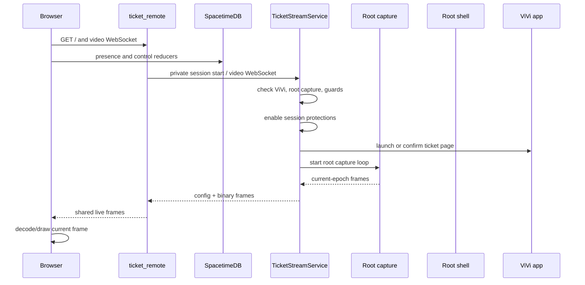

# Ticket Streaming Architecture

This is the deep Pixel stream and capture note. It is not the first Ticket document.

For live Ticket page work, start from the ops checkout `workloads/ticket-remote/CURRENT.md`. The current product is: open the signed-in page, get a live ticket picture, use one visual action engine to open or register tickets and switch briefly between the newest unactivated and recently activated views, and request a control code when needed. The browser oval is optional local authorization for the same `register_current` action as the button; it is not a second phone-control protocol.

Old Ticket pictures and proof packs now live in `archive/ticket/`. Do not start there.

The older measurement history lives in [ticket-streaming-responsiveness-analysis-20260502.md](../../ops/reports/ticket-streaming-responsiveness-analysis-20260502.md). Use [Touch Brightness Architecture](./TOUCH_BRIGHTNESS_ARCHITECTURE.md) for panel-brightness ownership and [ROOT_OPERATIONS](../runbooks/ROOT_OPERATIONS.md) for general Pixel operations.

## Source Of Truth By Flow

| Flow | Success source | Failure source | Explicitly not a source |
| --- | --- | --- | --- |
| Public ViVi ticket stream | Pixel root H.264 health, fresh Pixel app-state proof, relay direct-stream freshness, and authenticated Brave visual proof for public close-out | Pixel root health, relay health, or authenticated Brave visual failure | RS Telegram result state or stale browser canvas state |
| Unified Ticket action v3 | Two agreeing fresh rooted visual observations, a proven transition, the durable Pixel dispatch journal/checkpoint, and terminal `ticket_action_v3` projection | Visual ambiguity, login/blocker/design drift, expired command, or an uncertain physical registration checkpoint | Ticket text, hierarchy labels, browser coordinates, a command row by itself, or blind retry after an uncertain tap/drag |
| ViVi control-code request | Pixel strict generated-state proof plus requester-browser freeze/capture of the rendered live stream frame | Pixel request/input failure, phone visual generated-state timeout, browser capture rejection/close, or cleanup state | Pixel/phone screenshot transfer, browser image upload, public tap/key control, root hierarchy-only result authority, broad code-like visual matches |
| RS Telegram monthly-ticket QR | Pixel RS direct tap flow plus bounded phone-side RS state proofs and one secure RS screenshot captured from the RS app | Pixel RS state-proof failure or broker deadline when no final Pixel result arrives | Brave visual proof, public relay video clients, ViVi cleanup success, black/blocked screenshot pixels |
| Cleanup/restoration | Root proof that ViVi returned to `TICKET_DETAIL` with the Aztec graphic plus a fresh frame | Cleanup completion event and attention state | Ticket-list-only proof, the nested yellow `Reģistrēt biļeti` button, or changing a result that was already delivered |

Fast paths may depend only on their owned root/source-of-truth inputs. No product path may wait on unrelated visual proof, fallback stream modes, cleanup success, or stale health summaries. Cross-path checks are allowed only after the product result has already been decided.

## 1. Startup To First Visible Frame

```mermaid
sequenceDiagram
  participant Operator as Browser
  participant Public as ticket_remote
  participant DB as SpacetimeDB
  participant Service as TicketStreamService
  participant Capture as Root capture
  participant Root as Root shell
  participant Vivi as ViVi app

  Operator->>Public: GET / and video WebSocket
  Operator->>DB: presence and control reducers
  Public->>Service: private session start / video WebSocket
  Service->>Service: check ViVi, root capture, guards
  Service->>Service: enable session protections
  Service->>Vivi: launch or confirm ticket page
  Service->>Capture: start root capture loop
  Capture-->>Service: current-epoch frames
  Service-->>Public: config + binary frames
  Public-->>Operator: shared live frames
  Operator->>Operator: decode/draw current frame
```

The Pixel serves only private health, session start/recover/stop, H.264 video-stream, and retained RS broker interfaces on `127.0.0.1:9388`; it does not serve a browser page or a public Ticket control socket. The old Pixel-local page returns the reduced-release tombstone and the Pixel-owned Cloudflare tunnel is no longer shipped. `pixel-ticket-start.sh` starts the Android supervisor and ticket service. Kitty-gration's private `ticket_phone_bridge` is the only phone transport, and kitty-gration owns public ingress.

The Android orchestrator owns a durable `ticket_service_enabled` toggle. The default is off. When it is on, SupervisorService starts and keeps checking the `ticket_screen` component after service start, package replace, and phone boot until the local ticket server is ready. This readiness path must not open ViVi or start screen capture until an authenticated viewer asks for a stream. When the toggle is off, the ticket component is not auto-started by the supervisor loop and the stop script is run to keep the server stopped. Once readiness is proven stable, periodic rechecks are throttled so the idle phone does not repeatedly spawn root pid/cmdline probes just to confirm unchanged health.

The browser marks the stream visible only after a real decoded frame is drawn. Health updates must not overwrite that visible state back to waiting.

The public browser records the broad loading path as separate phases: HTML ready, health ready, Spacetime connected, public video socket open, active session observed, stream config received, and first live frame drawn. Loading over two seconds is logged with the current blocking phase so public Cloudflare/auth delay can be separated from Pixel stream delay. The operational target for authenticated `ticket.jolkins.id.lv` is a live ViVi ticket frame in 5 seconds or less, with stream delay measured from Pixel/relay frame age and kept within the live freshness threshold.

The public relay may retain a startup-only viewer lease while serving the authenticated index shell. If the root request already carries a valid server-session cookie, the relay starts this prewarm before state rendering so phone wake overlaps the remaining page work. The current prewarm hold is 30 seconds, and the no-viewer warm stop window is 90 seconds, so reloads, brief closes, and short reconnects keep the rooted H.264 stream hot without turning the ticket stream into an always-on background viewer. The hold is a bridge for first paint and quick return, not a permanent viewer; once the real sockets attach or the warm window expires, normal viewer presence owns ticket priority.

The public service sends no-store headers for Ticket HTTP responses. Browser cache cleanup belongs to that service; the Pixel has no page assets, bootstrap endpoint, cache lifecycle, or client-log endpoint.

## 2. Browser Control And Video Lifecycle

The browser uses direct Spacetime subscriptions/reducers for presence, stream intent, control-code work, and acknowledgements. Its only media socket is the public `/api/v1/stream` H.264 socket. `ticket_remote` multiplexes viewers over one private Pixel `/api/v1/stream` upstream and uses private HTTP session endpoints as a bounded readiness fallback. Pixel `/api/v1/session` is not part of the browser product; its remaining messages are restricted to the protected RS broker flow.

Each public page includes internal viewer/page identity for diagnostics. Reloads replace that page's public connections without stopping the shared phone stream, while the Pixel sees only the bridge-owned upstream video connection.

Cold private-relay video handshakes carry only the server-owned `startup_` correlation: an eight-hex one-way derivative of the in-memory startup trace, never the browser session, viewer, full trace identifier, or authentication material. Pixel validates that exact bounded shape and binds it before recording the bridge video-client open or starting the local ticket session. The same correlation remains optional on the durable Spacetime start command, so either side may roll forward independently and the durable command stays the fallback.

Control and video socket identity includes the browser page version. Health exposes active client identity/page-version diagnostics so public verification can prove the current Brave tab is running the latest served page rather than a stale cached shell.

The phone owns viewer inactivity truth and timeout enforcement, but the browser owns smooth countdown rendering. The phone sends an immediate inactivity update when activity changes, then broadcasts the steady countdown every five seconds until the final minute, where it returns to one-second updates. The browser fills the visible timer locally between those phone updates so passive ticket viewing does not keep the Pixel sending countdown rows/messages every second.

Reconnect behavior:

- Page reload and ordinary tab close are reconnect-friendly and should not stop the phone session.
- Explicit Stop is deterministic: stop capture, close clients, disable protections, and prevent old browser sockets from auto-starting the stream again.
- A visible, focused browser page is allowed to recover a phone/backend stream that was killed by inactivity or relay loss. Hidden or unfocused pages must not resurrect the stream on their own.
- A restored old/cached visible page opens the public video socket, reconnects Spacetime state, publishes focus, and requests the first keyframe immediately. It does not wait on the early-socket grace timer, stale reconnect timer, first-keyframe minimum interval, or a one-second activation retry before starting recovery.
- Slow video clients are isolated from frame production. Stale frames may be dropped for that client so the newest independent frame stays fresh.

Legacy clients without viewer/page identity should still connect, but they do not get same-viewer replacement.

## 3. Pixel Capture, Root Frames, And Browser Draw

The accepted production public capture path is root-only hardware H.264 over the existing authenticated video WebSocket:

- Pixel output format: H.264 Annex B access units from the rooted hardware `MediaCodec` input-surface encoder, reported as `captureMode=root_hardware_h264`, `transport=h264-annexb-websocket`, and the exact `avc1.*` codec string when SPS is observed.
- Arbuzas output format: `ticket_remote` forwards the single private Pixel H.264 stream to authenticated viewers over `/api/v1/stream` without decoding or re-encoding.
- Default quality profile: 994x2046 root hardware H.264 at about 8 Mbps, cropped to the same browser-visible ticket view as before. Capture is fixed at one frame per second and every emitted frame is independently decodable. H.264 pads that visible frame to 1008x2048, keeping both the coded-pixel and Level 4 macroblock allocations inside their established ceilings. Codec, crop, BT.709 limited SDR signalling, and the single-encoder contract remain fixed.
- Runtime: Pixel owns root capture start/stop, hardware keyframes, stream epoch, frame sequence, and fixed capture cadence. `ticket_remote` is a latest-frame fanout, not a media processor.
- Cadence: the helper uses an absolute monotonic one-frame-per-second scheduler and grants at most one capture per decision. The first explicit refresh after a periodic frame may produce one immediate independent frame; presenting it starts a new one-second period, so later requests in that period coalesce. The helper exposes no runtime cadence reconfiguration.
- Independent frames: `MediaCodec` is configured at one FPS with a zero-second I-frame interval, and the helper requests a sync frame for every input. Pixel advertises the exact contract as `fps=1`, `sourceFps=1`, `keyframeIntervalFrames=1`, and `frameDependencyMode=all_intra`. Any unexpected delta output is counted and dropped before fanout, then requests a coalesced sync refresh. Persistent absence of valid output remains owned by the existing liveness watchdog rather than a new delta-specific restart loop. Health reports encoder configuration, wall-clock frame age, independent-frame counts, unexpected deltas, and recovery requests without recording pixels.
- Browser draw: the public page receives `tsf2` H.264 frames, decodes them with WebCodecs, and draws the newest decoded frame to the stream canvas. Every accepted Pixel media frame is independently decodable, so the relay may keep only the newest current-epoch frame per browser and never lets one slow socket block the phone or another viewer. Startup tracing calls a frame forwarded only after one originating viewer's bounded writer has completed its WebSocket write; relay receipt remains a separate earlier phase, and browser decode/draw remain later phases. The browser sends cumulative epoch/sequence, decoder-queue, rendered-age, and visibility feedback; it does not control bitrate, resolution, color, or codec.
- Sent ViVi ticket media excludes the existing 200-source-pixel top strip. It crops four source pixels on the left and three on the right and bottom: the native display's one-pixel ring plus the live-proven filtered-sampling guard and one final polish pixel on each of those three edges. The guard prevents the filtered 1080-to-994 draw and H.264 4:2:0 chroma sampling from carrying the saturated source edge into encoded outer pixels. One explicit `4/200/3/3` source rectangle is scaled into the configured encoded dimensions and is shared by MediaCodec drawing, visibility probes, Ticket classification, control-code classification, and geometry detection. Pixel reports all four crop edges plus the visible source size in stream config/health. Every detected tap/drag target, including the slider, registration control, activated-status marker, Back, popup, Submit, and close targets, is mapped back through that same rectangle before phone input; browser slider geometry is normalized against the encoded cropped frame.

The normal public stream path must not depend on Android MediaProjection, Android screen-recording permission UI, WebRTC, AV1, H.265, PNG frame streaming, FFmpeg H.264, software stream fallback, or accessibility fallback. If the rooted hardware H.264 path cannot run, the public page shows a clear unavailable/attention state rather than silently changing capture modes.

Earlier measured paths are documented for context only. Root-fed AV1 was too slow for production. Root FFmpeg H.264 improved capture cost with the native helper but had authenticated-browser decode failures. Root PNG was clear but full-resolution capture was too slow and CPU-heavy for the requested freshness target. WebRTC was removed from the current production path in favor of the simpler H.264 WebSocket pipeline.

Frame freshness:

- The current frame envelope is `tsf2`: stream epoch, frame sequence, frame timestamp, and keyframe flag precede the encoded video payload. Under the current all-intra contract, every accepted media envelope has its keyframe flag set.
- Stream epoch changes on capture config changes, capture restarts, and stop/start boundaries.
- The browser and public relay drop frames from old epochs, duplicate or lower frame sequences, and legacy frames once `tsf2` has been negotiated.
- Per-client pending slots and write generations are cleared on reconnect, reload, config change, stream epoch change, and decoder reset so old frames cannot leak into a new view.

Fresh-frame behavior:

- Browser/reload/control-code transitions request one coalesced fresh current-epoch independent frame from the running Pixel encoder.
- Keyframe requests during startup must not restart the encoder while it is already waking or preparing.
- Keyframe requests that arrive while the Pixel stream is inactive are held as the pending startup keyframe for the next capture start instead of being treated as wasted recovery noise.
- A duplicate `/api/v1/session/start` during root hardware startup must return the existing `starting` state while wake/root proof is still pending. It must not mark the session `live`, start/restart the encoder, or emit `session_start_already_active` until wake proof has verified ViVi ticket detail and hardware frames have been allowed.
- Recent config can be sent to new viewers immediately. Recent independent frames can be reused only when they are from the current stream epoch and inside the freshness window. Old cached frames must never be drawn.
- If no fresh same-epoch frame exists, the relay/browser requests a coalesced hardware refresh instead of replaying old video.
- `ticket_remote` keeps at most the newest pending independent frame per video client, so slow viewers cannot delay the current view for everyone else.
- During a control-code request, `ticket_remote` keeps the normal shared stream live. Other authenticated viewers may briefly see the real phone open ViVi's control-code UI, but no viewer receives private phone control or a separate control video stream.
- Restart reasons, suppressed restart requests, keyframe requests, frame sequence, and Pixel ticket events are exposed in health.
- Stop/cleanup stops the active root hardware capture path, clears the current stream epoch/cache, and leaves the ticket service ready for the next authenticated viewer.

Browser decode behavior:

- The browser decodes H.264 from the video WebSocket with WebCodecs and renders the latest accepted frame to the stream canvas.
- On stream epoch changes, the browser resets decoder state and rejects old frames. When decode falls behind, stale frames are skipped and a refresh is requested.
- Watchdogs can request a coalesced independent refresh when the visible frame is stale without leaving the streaming state.
- Video socket failures reconnect the affected browser video path. They should not restart the shared phone stream while the Pixel relay is connected and the hardware encoder is waking or already running.
- Control and video socket open timeouts are intentionally short so the page leaves long connecting states quickly. A two-second loading budget triggers video recovery, then escalates if the stream still does not produce a live frame.

## 4. Request Contracts And Safety Gates

### Unified Visual Ticket Action Contract

An already-focused ViVi activity is not relaunched before the initial visual observation; a missing focus still gets one guarded launch, and registration rechecks ViVi focus again at its final dispatch boundary.

- The signed-in browser writes one durable `ticket_action_v3` command directly to SpacetimeDB. Its targets are `open_latest_unactivated`, `open_latest_and_register`, `register_current`, `show_recent_activated`, `return_to_latest_unactivated`, `redetect_latest`, and the non-mutating `prove_current`. The server remains the authentication and video relay boundary; it is not an immediate Ticket command hop.
- Ordinary non-registering v3 navigation, re-detection, and view-switch actions publish only the v3 action projection and acknowledgement. Pixel no longer reads or writes the retired ticket-interaction claim/progress row. Registration geometry travels only with the current v3 proof projection, while successful registration retains the dedicated activation checkpoint and commit path.
- The Pixel subscribes to every pending Ticket automation row and hands subscription and reconnect polling candidates to one dispatch ledger. Polling is recovery only. `ticket_action_v3` has a dedicated priority subscription consumer, so a keyframe waiting for stream startup cannot delay warm action observation; both consumers still claim the shared ledger before phone handling. After a terminal acknowledgement, the ledger retains a bounded 15-minute ownership tombstone (up to 1,024 entries), longer than the 10-minute command lifetime. A stale pending poll row therefore reuses and re-acknowledges the terminal result without re-entering the phone handler; a stale subscription delivery is read-only and cannot publish terminal state. Active or unacknowledged ownership is never pruned. A phone mutation is never repeated without reconciling its durable journal, activation checkpoint, and a fresh visual observation.
- Every mutating action holds the one phone-mutation lane and advances one proven transition at a time. It also acquires one action-scoped raw-panel-dark lease before any ViVi launch and retains it through visual waits, navigation, Accessibility registration, terminal proof, and final convergence. `prove_current` is the only read-only exception: it takes neither the mutation lane nor panel-dark lease, and is fenced by the V3 action generation, mutation generation, rooted physical-touch generation, capture epoch, and capture restart count. When an explicit V3 request arrives, its Spacetime reducer transaction terminalizes only pending/running `prove_current` rows and commands before applying the normal phone-lane admission; it never supersedes another mutation. Pixel then cancels and joins the running proof before entering the mutation lane. After a dispatched navigation tap, one bounded read-only convergence tail may continue observing the same journaled transition when the first proof window expires; it never repeats the tap. The helper writes panel brightness zero every 5 ms and an independent reader confirms zero every 250 ms. The required 2.5-second post-mutation convergence window begins at the latest possibly dispatched mutation, so terminal visual proof overlaps it and release waits only any remaining interval before the unchanged exact-zero and helper-shutdown proof. A root-confirmed physical touch cancels the lease immediately: before dispatch the action stops, while after a possible tap or drag it becomes attention-needed and is never replayed. `finally` releases the helper on success, failure, cancellation, timeout, and normal service replacement; the helper also exits when its exact Android owner PID/start time disappears, and startup removes marked helpers left by an abrupt prior process before Ticket command subscription begins.
- The rooted stream detector classifies activated detail, unactivated detail with slider bounds, ticket lists with card/action bounds, the ViVi route-planning home with a proved Tickets-tab target, the empty Single-use Tickets shell with a proved Time-tickets-tab target, control-code surfaces, login, blockers, and unknown layouts. Ticket-list chrome takes precedence over slider-like card geometry only after the separated selected-tab underline and wide red/orange route-card header bands are both proved; without that list proof, a slider also requires the ticket-detail graphic or its unique top-right close, otherwise the frame remains unknown. Route-home authority requires the full lower navigation separator, selected Home glyph, and separate neutral ticket-shaped Tickets glyph in two agreeing frames. The earlier route layout may additionally prove its wide orange action; the current root layout instead requires independent neutral Profile and three-line Menu glyphs and rejects any Tickets-tab underline. Empty Single-use authority additionally requires the left-only selected underline, both bounded tab-label silhouettes, the central empty-state silhouette, no ticket action/card color, and the selected bottom Tickets glyph. A mutating v3 navigation action journals exactly one proved tab tap before dispatch, re-observes, and continues only from a typed Tickets shell/list; unchanged Home or any ambiguous transition becomes attention-needed and is never replayed. The Time-tickets list is always an intermediate state: every card or status target used for input needs two fresh frames agreeing on both identity and geometry, and a successful terminal or retained result must match the target's activated/unactivated Aztec-detail view. `register_current` rejects both intermediate states, and non-mutating `prove_current` reports them without input. The lightweight visibility probe accepts a sparse dark ViVi page only when it still has sufficient luminance range, mean, dark coverage, and at least eight independent bright samples; uniform black and navigation-pill-only capture remain blocked. Ticket actions do not use UiAutomator or accessibility labels for state, navigation, card selection, registration, or control-code target geometry. Rīgas Satiksme keeps its separate automation authority.
- In the current ViVi monthly-ticket list, the separately detected orange registration control opens the unactivated slider for the next journey, while a dedicated compact registered-status target opens the most recently activated journey. Open, combined-register, return-to-unactivated, and re-detect use registration-control geometry. View-recent-activated and control-code preparation require the dedicated registered-status geometry; they never fall back to a generic dated card body. The transition is successful only after fresh activated detail with its Aztec graphic is proved, so a plain ticket list is never terminal success for activated-detail navigation.
- Ticket-list choice uses the bounded digit/date recognizer only on demand. Two distinct fresh frames must agree on a parseable, confident, uniquely eligible current-or-upcoming card. Conflicting, duplicated, expired, unreadable, rotated, overlaid, or redesigned layouts fail closed.
- Registration uses the visually detected slider bounds and exactly one uninterrupted 800 ms Accessibility stroke after a fresh unactivated-detail proof. The Accessibility service is made ready before that final proof is bound; if it disconnects afterward, the action fails before dispatch instead of waiting on a stale proof. ViVi must still own Android's focused accessibility window at the dispatch boundary. The full-display accessibility brightness shield is suspended for only that stroke because adding or updating it can trigger a WindowManager/display-policy transition while Flutter owns the drag; concurrent brightness reassertions retain their logical request but cannot re-add the window until the stroke is terminal. The independent action root clamp and one-pixel application shield keep the panel at zero, and the full-display shield converges to its latest requested state before visual reconciliation. A hide failure rejects the stroke before dispatch, and a restore failure is uncertain after dispatch. V3 has no segmented start/continuation handoff and never locally replays a stroke. Android cancellation or timeout is uncertain and is reconciled visually once; if that reconciliation proves activated, Pixel returns success so the normal Spacetime activation commit completes. A completed stroke that leaves the exact same unactivated detail records the durable phone stage `no_transition_proven` and reports `ticket_action_gesture_completed_no_transition`. Only Spacetime may admit one separately identified child command from that conclusive parent result; unknown, conflicting, preempted, or uncertain results never authorize it. The list-card identity and a separate phone-local salted signature of the stable lower route/date metadata band remain distinct throughout reconciliation; the upper crop boundary, rotating ticket-code graphic, and slider are excluded. `register_current` may refresh an idle frame/geometry proof only when two fresh detail frames still match that exact signature and helper epoch. A blank or changed signature fails closed with a privacy-safe identity-conflict reason, and a helper-restart signature fails closed instead of rebinding the action to another open ticket. On restart, `dispatching`, `no_transition_proven`, or uncertain state becomes attention-needed; `proven` or committed state is recovered and acknowledged without another drag.
- `prove_current` requires an already-running fresh capture, observes two distinct agreeing fixed-cadence frames with coalesced immediate refresh requests, and never launches ViVi, changes brightness, takes the phone lane, navigates, recognizes list dates, taps, or drags. An unactivated detail publishes a normal successful `latest_unactivated` action proof and the matching normalized slider bounds. Activated detail, list, login, blocker, and stable unknown states publish only their sanitized view/reason and never authorize registration. A mutation admission or rooted physical touch during observation invalidates the proof instead of delaying the explicit action.
- A successful activation stores only the opaque visual anchor needed for safe navigation; the phone does not calculate or persist the business switch window. SpacetimeDB owns the 15-minute switch policy and supplies its `policyRevision` and `switchExpiresAt` on each authorized switch action. Pixel requires that authority plus unambiguous recent-activated and newer-unactivated visual anchors, echoes the supplied deadline, and fails closed when authority or visual evidence is missing. Pixel's monotonic execution deadlines, command expiry checks, at-most-once dispatch journal, and activation checkpoint remain execution-safety mechanisms rather than product-policy timers.
- The public action projection is sanitized to action id, target, status, phase, current visual view, switch state/expiry, proof watermark, fixed safe reason, and timestamps. A separate short-lived slider row may expose only 0–10,000 basis-point bounds relative to that exact encoded frame, tied to proof action id, stream epoch, and frame sequence. The current service reducer atomically commits a terminal action plus its optional normalized region. During additive rollout Pixel falls back to the prior idempotent action-then-geometry reducers when an older module rejects that reducer; the safe normalized region remains in the terminal journal, so either retry repeats metadata only, never phone input. Dates, ticket text or numbers, glyph output, screenshots, raw pixels, raw device coordinates, and private diagnostic errors remain on the phone.

### Public ViVi Control-Code Contract

The public browser no longer claims phone control. It can only submit a numeric control-code request:

- The public page opens a local dialog, accepts only 2-8 digits, and posts the request to `ticket_remote`.
- `ticket_remote` authorizes the requester through ticket membership, applies the two-requests-per-60-seconds limit, queues requests, and runs only one phone job at a time.
- The browser opens the local dialog immediately and accepts valid 2-8 digit input without waiting for video, phone readiness, or preparation. It starts the one page-owned SpacetimeDB connection during authenticated startup; submission waits only for that connection's current generation to become live, with one two-second admission deadline, and calls `memberRequestControlCode` exactly once. Ordinary rendering, focus changes, and fast-state expiry never launch preparation or recovery. Each request carries the current fast-state revision or an empty revision when cold/stale.
- The phone receives only `generate_control_code` with the request id, digits, requester identity, server timestamp, and fast-state revision. The browser never sends tap coordinates, keyboard events, ADB commands, screenshot bytes, or direct phone-control messages. Pixel is the only phone authority and accepts either a valid current revision or the same single inline preparation stage; there is no preparation reducer or compatibility command.
- Pixel executes one ordered request state machine: validate; claim the phone lane; start the request-owned keyboard clamp asynchronously; validate the revision; perform one strict rooted visual preparation when needed; prove and retain the current activated or unactivated detail's phone-local static identity; tap its freshly detected ViVi control; prove the popup and its field/button geometry; wait for the clamp; focus the proved field; enter and visually prove the digits; re-detect the value-bearing popup and tap that fresh `OK`; prove the non-refreshing generated Aztec plus its black digits strip and close badge; publish a following-frame watermark; wait for browser paint acknowledgement; re-prove and tap only that result badge; prove return to the exact original detail; publish the next fast-state revision; release the clamp. No stage may skip or infer another stage.
- The fast-state coordinator is keyed by the current stream epoch. A matching revision is reusable only when its epoch, frame sequence, fresh rooted raw-ticket marker, live H.264 stream, and cleanup state all agree. Otherwise the request performs one bounded four-second preparation pass. Preparation recognizes only fresh rooted states: activated ticket detail, a ticket list with one dedicated registered-status target, a stale popup, a stale generated result, or ViVi outside the foreground. It uses the detected registered-status target or badge cross exactly once, never a generic card body, the yellow registration button, or ticket-header close, and fails closed for login, registration, empty-list, ambiguous registered targets, unknown, blank, or account-mismatch screens.
- The Pixel is the source of truth for observed app state. It emits `ticket_state_event` messages for raw ticket, popup open, generated result visible, returning to raw, raw return complete, and attention-needed states. Each event carries the request id when relevant plus stream epoch, frame sequence, and phone timing. A fresh activated or unactivated Aztec-detail observation is already a valid control-code starting surface: Pixel retains that exact private detail identity and taps its visually detected ViVi control directly. It never backs out to the Time-tickets list merely to start control-code generation. Lists remain bounded recovery-only intermediates when no detail is visible and are never successful control-code states. The direct worker gives the command and matching acknowledgement priority over diagnostics without creating a second startup path or a phone-local business-policy deadline.
- Pixel opens ViVi's control-code popup with one rooted button tap, then acquires a request-scoped soft-keyboard suppression lease through Android Accessibility's `SoftKeyboardController`. The lease records only ownership and the previous show mode in a phone-local recovery marker, proves `SHOW_MODE_HIDDEN`, and is validated again immediately before entry without silently reacquiring after preemption. The bundled native root helper then focuses the visually proved input position and runs one Android InputManager key-event batch: move to end, eight deletes, and the validated digits. It never creates an input device, changes enabled/default IMEs or hardware-keyboard settings, sends Back, Tab, Enter, or another form-activation key. A visible software keyboard fails closed. Submit remains a separate rooted tap after two fresh visual proofs, and focus is cleared before the original keyboard show mode is restored. Service reconnect recovers a stale owned suppression marker; cancellation, timeout, cleanup, and service replacement use the same bounded restore path. The helper writes no digit-bearing file, securely scrubs digit buffers, and never exposes the root command/output to health or logs. Two distinct fresh rooted H.264 samples use a dedicated 96x144 submit probe to prove the value in the stable unshifted popup. Pixel then takes two more agreeing value-bearing popup samples and derives a fresh enabled `OK` target from those frames before it taps. The probe recognizes both the earlier light/orange sheet with nearly-black digit strokes and the current dark/blue sheet with bright digit strokes, while rejecting ViVi's gray placeholder and a one-column caret. A bounded four-probe window tolerates an initial transition-frame `unknown` or timeout, while two consecutive blank samples are required before retyping; a shifted keyboard layout fails immediately. Raw ticket, generated result, or an exhausted ambiguous window blocks Submit. Accessibility is used only to suppress and safely restore the software keyboard, never to classify Ticket content, navigate, enter digits, or submit.
- After OK, the Pixel asks the running rooted H.264 helper for strict fresh visual state. Success requires two distinct `GENERATED` probes agreeing on the detected black digits strip, close badge, salted non-refreshing Aztec signature, and helper epoch. Returning to the same ordinary activated or unactivated detail, popup disappearance, a changing ordinary Aztec payload, a status strip without a stable generated code, or a generic frame change is not generated-result proof and fails closed. If the same popup remains visible, Pixel permits exactly one retry only after two new samples again prove the entered value and fresh enabled Submit button. That retry taps Submit only; it does not clear or mutate the already-proved value. Two more popup samples after the retry fail quickly as `control_code_submit_still_open` instead of waiting on a slow hierarchy dump.
- On the normal success path, Pixel sends only rooted visual proof and frame-watermark metadata. Immediately before watermarking, it repeats the same two-frame generated-badge proof and publishes `resultProof="phone_visual_generated_with_close"`. Each exact rooted probe remains outstanding for a bounded multi-frame reply window before another probe can replace it; the overall re-proof remains bounded and still requires two distinct agreeing frames. `phone_visual_generated_inline` is reserved for a future dedicated inline-layout detector and must not be inferred from ticket identity or Aztec motion. Pixel, Spacetime, and the browser use the same allowlist, and Pixel must not send screenshot bytes, OCR, or raw code content for the user-facing result.
- `ticket_remote` treats Pixel image results as disabled for ViVi control-code. A requester result becomes complete only after the requester browser has rendered a stable generated frame at or after Pixel's marker and accepted the browser-local freeze/capture proof.
- The requesting browser freezes the exact proven live stream frame, rejects entry-popup, dim-overlay, keyboard, and fade/ghost frames, and captures a stream-resolution result image locally. It acknowledges that capture only after the image has decoded, remained visible and inside the viewport for two browser paint frames, and emitted `control_code_frame_painted`; assigning an image URL or preparing a hidden provisional frame is not success. The requester-only browser image then remains pinned while Pixel cleans up. The public API still never uploads browser image bytes.
- Cleanup keeps the public control-code queue blocked until browser capture is acknowledged and fresh visual state is confirmed. Pixel obtains two new `GENERATED` observations agreeing on the same close badge and generated-code identity, taps that badge once, and then requires two fresh action observations to agree on the exact original activated or unactivated state, static detail anchor, and ViVi control geometry. Missing mode, missing or changed identity, missing or changing badge geometry, helper-epoch change, or a return to the ViVi route root fails closed and never falls through to Back or reports raw-ticket success. The ticket-header X and yellow registration button are never cleanup targets. A later V3 action may separately recover from a visually proved route root through its own one-tap journal. No browser coordinate, screenshot transfer, accessibility, hierarchy authority, list-only, broad-recovery, or background-preparation path exists. After the browser-capture command is accepted, the direct worker keeps a request-id-scoped outbox consumer active for the whole bounded visual-close and panel-finalization budget and publishes the first matching raw-detail or cleanup completion immediately. It no longer abandons that handoff after 1.2 seconds. A fresh raw-detail handoff calls one Pixel-only Spacetime reducer that clears the exact request barrier and publishes the matching ready watermark atomically; the two legacy idempotent updates are used only while that additive reducer is genuinely unavailable. An acknowledgement timeout is an explicit failed request and still uses this same strict cleanup stage; success requires the acknowledged frame, completed cleanup, and a new fast-state revision. The durable cleanup-pending bit blocks replay and new requests across a process restart; the phone-local result mode and salted detail identity are intentionally not replay authority after a helper-epoch change, so such recovery remains attention-required until an explicit fresh visual reopen proves readiness.

### RS Telegram Monthly-Ticket Contract

Rīgas Satiksme Telegram QR jobs use the retained private Pixel RS broker socket and require explicit `owner="rigassatiksme"`, `app="rigas_satiksme"`, and `flow="monthly_ticket"`, so they remain separate from ticket.jolkins ViVi control-code requests. The broker keeps the public `POST /api/v1/qr/jobs` API compatible, but groups waiting RS jobs after a 250 ms burst window and sends the phone one `generate_rigassatiksme_qr_batch` command, including for a single RS request. The batch payload carries `batchId`, `jobs[{requestId,digits,createdAt}]`, owner/app/flow, and the current ticket-priority state. Pixel emits one `rigassatiksme_qr_result` per request id; the broker completes each job independently, accepts out-of-order results, reconnects and resends only unfinished batch jobs when the phone socket drops before deadline, and uses RS-specific batch health for disconnected final reconciliation. The shared ViVi `controlCodeRequest` health bucket is ViVi-only and must not finalize, retry, or rename RS jobs. The Pixel RS path is a direct state-gated tap lane with bounded phone-side state proofs. Pixel launches `com.flutter.rspassenger`, waits briefly for foreground, and takes an RS app `uiautomator` state proof before touching the app and after each meaningful transition. The classifier recognizes both English and Latvian RS monthly-ticket screens, including `30 dienu biļete`, `KONTROLES KODS`, `Reģistrēt braucienu`, `Ievadīt kodu manuāli`, `Ievadi kontroles kodu`, `Atcelt`, and `OK`. If the first state is unknown, Pixel performs exactly one bounded force-stop/relaunch without clearing RS app data, rechecks state, and stops before code entry with `rs_app_attention_required` if the app is still unknown. Old control-ticket screens must be closed and rechecked before registration can start; if Back does not clear the old control-ticket screen, Pixel does one no-data-clear RS relaunch and rechecks before deciding app attention. Registration, manual-entry, typed digits, and final submit must each be proven before the next action; visible node centers are preferred for safe taps, with fixed coordinates only as guarded fallbacks after state is known. Final unknown proof after submit becomes `rs_app_attention_required` after one recheck. This shape is used because live RS verification showed screenshot pixels can be black/blocked and full semantic loops are too slow when every action waits for a 2.5-second `uiautomator` dump, while blind middle-section tapping can leave RS showing the previous QR. The final Telegram image remains a separate secure RS screenshot capture after state proof. Normal RS generation must not depend on public viewer state, Brave, public relay clients, or ViVi cleanup success.

The success authority is an RS app shell-state proof: a control-ticket screen whose RS node text includes English or Latvian control-code markers (`TICKET FOR CONTROL`/`KONTROLES KODS`), QR text, a monthly marker such as `1 MONTH` or `30 dienu biļete`, and the submitted digits. Every request in a batch is freshly re-registered; an already-visible matching QR is treated as stale state at request start, not as success. After the requested digits are visibly proven in the manual-entry field and OK has been tapped, a nonmatching control ticket is a fail-fast `rs_monthly_ticket_stale_code`: broker and bot must not hide it with a retry, and the bot must not send a stale image. Returning to the manual-entry/manual-choice/register-trip/home surface after submit becomes `code_rejected_by_rs`; direct wrong-code text is also reported as `code_rejected_by_rs`. Missing app fields, launch/foreground failures, missing monthly tickets, authentication blocks, stale final proof, and app-attention failures remain distinct reasons and must not be collapsed to `phone_timeout`; `rs_monthly_ticket_unknown_state` is a legacy fallback, while new persistent unknown RS app states should report `rs_app_attention_required`. The returned Telegram artifact is the secure Pixel-captured monthly-ticket screenshot, captured at a bounded readable width for speed (currently 720 px maximum) and trimmed only at the shared broker delivery boundary by cropping 5% of the source screenshot height from the top and 5% from the bottom; it does not use the ViVi control-code graphic crop, a QR-only crop, a bot-side second crop, or an Android-side top/bottom delivery crop. Missing, blank, or invalid secure capture fails quickly with `rs_monthly_ticket_image_capture_failed`. Successful and final-failed RS jobs send their result to the broker immediately. Pixel returns to ViVi only after the batch is empty, ticket priority interrupts, or the phone enters an unrecoverable state; non-critical cleanup is outside the user-visible RS result timer. Public ticket viewer presence and ticket leases are hard higher-priority ownership signals for their full active duration, not bounded grace windows; they may preempt/retry unfinished RS work without burning an RS attempt budget, and while active the phone should remain on ViVi/ticket work. The measurement target is every request in a three-code burst receiving a final RS image or named final failure within 15 seconds of broker enqueue, including the burst wait. Because cleanup is after user delivery and production ViVi root dumps can take several seconds, RS return-to-ViVi keeps the dedicated 45 s budget with six focused recovery actions so a slow ticket-list/card reload can still reach `TICKET_DETAIL` without changing the normal fast ticket wake limits. A successful RS return refreshes the Pixel's recent `TICKET_DETAIL` proof so the next authenticated public viewer can use the fast ViVi foreground path instead of paying a long recovery cycle.

RS Telegram delivery is not a public-viewer decision. Brave screenshots, public canvas state, public relay video-client presence, and public ticket verification cannot turn a valid Pixel RS proof/capture into failure, and they cannot turn a missing RS proof/capture into success. If the broker receives no final Pixel result before its deadline, it may report `phone_timeout`; if Pixel sends a phase-specific RS failure, broker/bot messaging must preserve that reason.

### Result Vs Cleanup

The product result and cleanup are separate decisions. RS image delivery is final once the broker accepts a `rigassatiksme_qr_result` with valid RS app image bytes and the expected source/flow. ViVi control-code delivery is final once `ticket_remote` accepts requester-browser capture proof for the active request, and the browser may send that proof only after its decoded image passes the two-frame visible-paint check. Cleanup is allowed only after browser proof, explicit close acknowledgement, or a named browser-capture failure. Pixel runs the long ViVi generation job off its direct Spacetime command worker so browser-capture acknowledgements can be consumed while the phone result is held. `ticket_remote` keeps publishing that acknowledgement until Pixel reports cleanup, because a successful database write is not treated as phone receipt. Cleanup failure after accepted browser capture records attention-needed state instead of delaying, revoking, or renaming the already accepted request. A generic `raw_ticket` label or a changed rotating Aztec is never promoted into success: the result requires the causal Submit transition plus two matching probes of the stable generated code, digits strip, and result X; that freshly re-proved X is the only cleanup tap after browser acknowledgement.

Safety gates:
- 2026-07-10: Live end-to-end verification caught a control-code popup left open after the immediate macro tapped the keyboard-shifted OK position before the popup animation had settled. The same incident exposed sub-second `uiautomator` budgets that the guarded dump helper deliberately rejects, no terminal diagnosis for repeated visual `unknown`, weaker failure/exception cleanup, and page-ready preparation that reported warming without scheduling work. Production now keeps Submit outside the opening action, uses viable guarded root budgets, performs only bounded event/terminal root confirmation rather than polling, gives every outcome the same ticket-detail recovery fallback, and runs non-blocking preparation as real background work. The later keyboard-free path supersedes keyboard-shifted Submit for normal generation while retaining shifted-popup classification for diagnosis and recovery.

- The Pixel normalizes known ViVi states before automation. An already-open control-code popup is a valid submit state. A generated Aztec/result screen is never an idle-ready state; it is closed through the same root-only return-to-raw routine before a new request starts.
- The Pixel refuses only when root cannot inspect/control ViVi or raw-ticket return cannot be confirmed within the bounded routine. The old recoverable “refreshing ticket view, try again” path must not be used for known popup/result states.
- Duplicate request ids replay the cached result and do not execute the phone flow twice.
- Control-code automation is serialized by a Pixel-side mutex as well as the public queue, so overlapping requests cannot interleave physical phone actions.
- During the popup/result transition, foreground/page guards may observe and record state but must not force-stop ViVi, navigate back to Orchestrator, or run fresh reset.
- Cleanup failure records attention-needed and keeps public browser input blocked rather than exposing direct control or starting a new request.
- Active ticket sessions hold the Pixel screen awake and request a wake only if the display is non-interactive, unless touch brightness is enabled. When the screen is already interactive, public stream startup skips the wake key and relies on the wake lock, avoiding a repeated 1-2 second wake command on ordinary stopped-stream reloads. When touch brightness is enabled, touch brightness owns the screen hold and panel writes. Input remains blocked while the display is not interactive; the wake path is used to restore the live stream instead of launching recovery loops against a black/dozing screen. When all viewers detach or the stream stops, the ticket service releases this bright wake lock immediately; the brightness guard may keep the panel dim only when touch brightness is disabled.
- Foreground/page recovery remains fast during startup, recovery, control-sensitive work, and confirmed foreground violations. After the stream is live and ViVi ticket detail has been confirmed, the stable foreground check backs off to five seconds so passive viewing does not keep paying the startup/recovery guard cost.

Control-code request health reports the last request id, digit count, command owner/app/flow, last rejected command owner/app/flow/reason, status, reason, phase timings, root-observation time, phone visual state/proof time, browser-capture acknowledgement time, result-delivery time, total duration, duplicate replay count, cleanup status, and completion age. Public bridge health also reports the latest control-code relay-preparation result and duration plus browser capture fields such as capture-required, capture acknowledgement/rejection, candidate frame epoch/sequence, generated-chip proof, popup-frame rejection, and result-window-closed reason. Do not restore Pixel/phone screenshot delivery for ViVi control-code, public tap/key forwarding, browser image upload, root-hierarchy-only generated-result authority, accessibility-driven control-code entry/Submit, broad accessibility-driven navigation or clicks, software stream fallback, or weaken protected-edge blocking, foreground checks, notification lockdown, secure-window handling, or control-code cleanup verification without updating this document and the relevant tests.

## 5. Stop, Cleanup, Reconnect, And Tunnel Behavior

Stop paths:

- Explicit browser Stop calls the session stop endpoint with `explicit=true`.
- Service stop clears stream state, stops active capture/encoding, closes clients, disables notification lockdown, disables secure-window bypass, and clears active control-code request state. With the durable ticket service still enabled, browser Stop keeps the local service and tunnel ready but does not start ViVi or capture again until a viewer asks.
- During streaming and after a session ends while the durable ticket service remains enabled, the ticket brightness guard enforces safe dim panel brightness only when touch brightness is disabled. When touch brightness is enabled, the ticket guard parks, reports that touch brightness owns panel brightness, and does not write or restore panel brightness. Saved ticket brightness is restored only when ticket service is turned off, touch brightness is not owning the panel, or the phone is intentionally handed back to physical use.
- After explicit Stop, health should report inactive stream, zero clients, no active control-code request, and no active app-owned capture process.
- A stopped or idle stream must actively close leftover Pixel video sockets before accepting a fresh start request, and the private HTTP session start must return within a bounded timeout instead of hanging behind stale cleanup.
- Stopping capture clears old frame counters, frame ages, dimensions, bitrate, and helper state that would otherwise make inactive health look like it is still sending frames.
- Viewer inactivity timeout is also a non-destructive stop. It may stop capture, close clients, and block browser auto-start until a fresh viewer request arrives, but it must not schedule fresh ticket recovery, force-stop ViVi, or navigate back to Orchestrator.

Reconnect paths:

- Page reload should replace same-viewer public sockets without interrupting the shared phone stream.
- If all Pixel-side relay clients disconnect or the public relay goes idle, the service parks capture: it records detach state, stops the root hardware H.264 helper, disables protections, keeps ViVi available, and enforces dim brightness only when touch brightness is disabled. It must not run ViVi recovery loops while no viewer is present.
- Before cached durable demand may restart an inactive Pixel session, the worker re-reads the authoritative desired-state row. A newer zero-viewer revision suppresses the stale start and refreshes the phone report, so the end of reconnect grace cannot resurrect capture with no viewer.
- The Pixel Spacetime worker keeps one coordinated command path. Its JSON subscription selects every committed pending Ticket automation row, including stream/keyframe work and `ticket_action_v3`, using the existing service identity and uncompressed text. A V3 priority consumer is independent of background/keyframe waiting, while subscription and reconnect polling still hand candidates to the same durable per-command dispatch ledger. Unacknowledged terminal results remain journaled; after acknowledgement, bounded TTL tombstones continue to own those command ids so stale pending scans can re-acknowledge them without another physical action. Only acknowledged tombstones are pruned; active, running, uncertain-registration, and unacknowledged entries cannot be silently evicted or physically replayed. Polling is reconnect/catch-up recovery and remains the sole terminal projection/acknowledgement path, not the warm command path. Start-before-keyframe ordering and the 75 ms active lane remain intact; the compact command signal and one-second desired-state read keep idle polling bounded without creating unchanged durable writes.
- Reload should replace same-viewer sockets and reach a visible frame from the active stream quickly.

Control-code cleanup paths:

- Public `ticket_remote` does not send `control_exit`, `reset_ticket`, or user tap/key commands for the request flow.
- The Pixel treats popup/result close as one mandatory root-only return-to-raw path. It must not use `FRESH_RESET`, `am force-stop`, navigation back to Orchestrator, accessibility clicks, accessibility text entry, or software/screenshot fallbacks for normal request completion.
- The cleanup path distinguishes raw ticket detail, the ticket-list card, the keyboard/input popup, generated control-code Aztec/result screen, and other known ViVi states. The healthy generated-result close uses two fresh cleanup-scoped rooted H.264 visual classifications; each exact sample has its own probe id and may request one coalesced immediate independent frame, after which the scheduler starts a new one-second period. The overall cleanup proof remains bounded and still requires two distinct consecutive raw-ticket samples. Unknown or ambiguous visual evidence fails closed; there is no ViVi hierarchy fallback. It closes the generated-result badge X using current detected bounds, then accepts only fresh visual ticket-detail proof; the ticket-header X and yellow registration control are never cleanup targets.
- Every success, failure, explicit close/expiry cancellation, and prepare/submit normalization path runs the same return-to-raw routine. For generated ViVi control-code success, that routine starts only after `ticket_remote` acknowledges requester-browser capture of the generated stream frame. Pixel-image acknowledgement is not a ViVi control-code path. A successful healthy cleanup emits `ticket_state_event(raw_ticket)` only after two agreeing fresh visual detail samples and a fresh raw-ticket frame. A failed cleanup records attention-needed while keeping the stream available and public input blocked.
- A durable `control_exit` remains actionable after the last viewer disconnects. Pixel must close a leftover ViVi popup/result without restarting capture, then return health to the prior inactive session state; disconnect must not turn the command into an acknowledged no-op.

Ingress behavior:

- `ticket_phone_bridge` reaches the Pixel privately and kitty-gration owns the only public Ticket ingress. The Pixel does not ship or supervise `cloudflared`.
- The durable orchestrator toggle controls whether `ticket_screen` may auto-start. Browser explicit Stop stops the stream session but does not turn this orchestrator toggle off.
- ViVi/Ticket state, navigation, card selection, registration geometry, public-open proof, active recovery, and control-code target geometry use only on-demand rooted H.264 visual observations. Two distinct fresh samples must agree before a state or geometry is accepted; unknown evidence fails closed. The Ticket service has no ViVi `uiautomator dump` entry point, does not request Ticket Accessibility snapshots, and does not retain hierarchy bytes in state memory. The guarded `uiautomator` wrapper remains callable only through the exact Rigas Satiksme dump path for that separate workload. Legacy ViVi hierarchy parser code may remain temporarily for TTL compatibility, but receives no runtime hierarchy source and therefore cannot authorize a Ticket action.
- Public-open and extended recovery use the same visual observation shape. A proved detail can complete readiness; a proved ticket list may supply one bounded typed target followed by a new two-frame detail proof. Registration journeys use only the registration-control target, while activated-detail and control-code recovery use only the compact registered-status target. A generic card body is not an action target. Login, blocker, unreadable, ambiguous, or redesigned layouts remain fail-closed. The visual detector runs only for an explicit action/readiness request and never stores or exports frames, OCR text, ticket identifiers, or raw pixels.
- Public open first asks the V3 current-view detector for two agreeing fresh frames. A proved activated detail, unactivated detail, or ticket list is sufficient to keep viewing live; the passive foreground guard also keeps a visually proved list live and leaves navigation to an explicit Ticket action. Stream readiness does not require legacy hierarchy, the legacy Aztec-only classifier, Back geometry, control-button geometry, navigation, or any phone mutation. Login, blocker, unknown, and conflicting results remain fail-closed. The explicit Ticket actions retain their stricter mutation geometry and terminal-proof contracts. The top-right header button is not a control-code cleanup target.
- Public `ticket_remote` must restart its phone reconnect loop whenever a new authenticated video viewer arrives and the relay is desired but not actively reconnecting. A stale desired state after phone reboot must not leave the public page waiting forever for the phone bridge.
- `ticket_phone_bridge` must not expose stale ADB forwards after reboot. It waits for `sys.boot_completed=1`, proves Pixel `/api/v1/health` over the forwarded port, and kills/recreates the local proxy when health probes fail or turn into EOF.
- `ticket_remote` clears cached config and cached frame state when the phone bridge disconnects. A newly opened browser video socket must not receive an old pre-reboot config unless the phone is currently connected and the config is fresh.
- The public server serves the current ticket app HTML for any non-reserved GET path. `/api/...`, `/static/...`, and `/admin...` remain strict/reserved.

The ticket component still follows the stack-wide operation model in [Pixel Stack Architecture](./PIXEL_STACK_ARCHITECTURE.md): `redeploy_component ticket_screen` refreshes the Pixel-side ticket surface, while public bridge/page deploys are separate.

For the public `ticket.jolkins.id.lv` path, Cloudflare Access terminates in front of `ticket_remote`. The browser talks to `ticket_remote`; `ticket_remote` relays video and queued control-code jobs privately to the Pixel through `ticket_phone_bridge`. Public socket identity should be visible in `ticket_remote` health, and the relay identity/page version should also be visible in Pixel `streamPipeline` health.

All authenticated linked viewers may receive the live video stream at the same time. There is no public private-control mode: viewers cannot claim the phone, tap the stream, or type into ViVi directly. A control-code requester receives only their private generated result, while other viewers continue seeing the shared raw ticket stream and may briefly see the real phone automate the request. A viewer reload or decoder reset must not restart or starve the shared phone stream for other authenticated viewers.

ViVi recovery launches `com.pv.vivi/.MainActivity` through the normal app intent and a root `am start` fallback. The fallback is required for post-reboot recovery because Android may leave Messages, Orchestrator, or another app in foreground while the ticket service is already ready.

ViVi authorization is a recoverable state only for the known existing-account login surface: email field, `Parole` field, `IEIET`, and `TURPINĀT BEZ AUTORIZĀCIJAS`. When that surface appears, Pixel reads credentials from `/data/local/pixel-stack/conf/apps/ticket-screen-vivi-login.env`, which must be outside git and mode `600`, with `VIVI_LOGIN_EMAIL` and `VIVI_LOGIN_PASSWORD`. The service enters the email only if the visible email differs, types the password directly into the password field, refreshes the `IEIET` target after the keyboard shifts the screen, taps `IEIET`, then waits for the login surface to disappear before resuming normal ticket-list recovery. Registration/profile/contact-detail surfaces and ViVi account/device-link mismatch dialogs after authorization are attention-needed states; the automation must not continue through them, dismiss them, or guess user details. The password must never be included in logs, health, screenshots metadata, fixtures, or support bundles; public health exposes only whether credentials were configured plus redacted login status/reason.

ViVi ticket-list recovery is date-aware. It parses visible time-ticket cards, ignores expired cards, prefers a card valid on the current date with the latest end date, and only chooses the soonest upcoming card when no current card exists. New-registration journeys open the selected ticket through its detected yellow `Reģistrēt biļeti` control. Activated-detail and control-code journeys require that same resolved card to expose one unambiguous compact registered-status target. Generic parent-card bounds are identity evidence only and are never tapped. Every activated journey must end in a fresh `TICKET_DETAIL` proof with the Aztec graphic; if the required typed target is absent or duplicated, the operation fails closed. Upcoming-card selection is surfaced as a warning-style recovery action (`open_upcoming_time_ticket_card`) in health events. The old first-visible-card rule is not valid for time tickets, because an expired cached card can appear above the fresh purchased ticket.

Public ticket verification is a public-viewer-only root-sourced health contract, not a screenshot-only check and not an RS Telegram acceptance gate. A pass requires both an authenticated Brave page drawing the live ticket and matching Pixel/relay health within a 15-second, 500 ms poll budget. Pixel must report `sessionState=live`, `streamActive=true`, `streamVerdict=live`, `ticketState.state=live`, `viviState.state=TICKET_DETAIL`, `visibleFrame.lastFrameAgoMillis<=1500`, and active rooted hardware H.264 capture. The public relay must report the phone connected, at least one active video client, a configured current stream, and `directStream.lastFrameAgoMillis<=1500`. Browser canvas evidence proves what the user saw, but it never overrides Pixel root state. If the canvas shows a ticket while Pixel or relay health is degraded, the result is `public_ticket_split_brain`, not success.

## 6. Health Counters, Events, And Measurement Caveats

The ticket session state machine uses bounded user-visible states: `starting`, `live`, `control_transition`, `control_exit`, `soft_recovery`, `needs_attention`, and `stopped`. Public pages should present control-code request progress separately from the stream state as `queued`, `running`, `succeeded`, `failed`, `expired`, or `closed`. Active transition states have a one-second budget. If the stream is active, recovery is not running, and ViVi is already on ticket detail, health reports `live` rather than staying stuck in `recovering`.

Important health surfaces:

- `serviceReadiness`: durable ticket-service toggle state, last ensure result and age, local ticket server reachability, tunnel readiness, and component status.
- `streamPipeline`: clients, configured/running state, frame envelope, stream epoch, frame sequence, quality profile, configured size/bitrate, recent frame/keyframe byte sizes, estimated send bitrate, encoded/sent/keyframe counts, dropped frames, slow writes, closed slow clients, replaced clients, and secure-window bypass state.
- `streamVerdict` and `visibleFrame`: the fast public-health verdict and recent rooted frame age; public verification requires `streamVerdict=live` and `visibleFrame.lastFrameAgoMillis<=1500`.
- `rootCapture`: support, active state, size, bitrate, fixed one-FPS target, frame counts, restart counts, restart reasons, last restart age, and suppressed restart requests. The legacy `ffmpeg` health object, if present, reports removed/unavailable only.
- `hardwareH264`: root capture availability and active state for the current production capture path, including fixed one-FPS cadence, `frameDependencyMode=all_intra`, deadline misses/skipped ticks, current interval, complete-frame liveness, and the count of rejected unexpected deltas. Public verification requires `hardwareH264.active=true` and `hardwareH264.state=active`; configuration and health prove the intended media contract, while physical freshness, thermal, memory, and browser paint still require device-matrix verification.
- `startupTrace`: the latest public stream startup timeline. The public relay trace follows authenticated prewarm, video socket open, Spacetime command write/dispatch, phone config/health/ticket-state events, first relay keyframe receipt, first successful viewer-writer keyframe/frame, and browser first-rendered-frame. Browser navigation, decoder configuration, first decode, and first canvas draw also carry the browser's source epoch and monotonic-performance timestamps. The phase `at` and `elapsedMillis` fields intentionally remain server receipt time; browser-performance deltas, Pixel-uptime deltas, and server-receipt deltas are evaluated within their own clock domains and are never subtracted across clocks. A private video socket may make the serialized immediate local session request before the durable start command reaches Pixel, so the trace preserves that actual causal order and never backdates command receipt. Correlation refresh is passive and never cancels or restarts a media connection. In the rare overlap where navigation B replaces A while A's private handshake is already in flight, media still proceeds, but B's Pixel segment may remain incomplete until the next normal private connection. Required Pixel startup markers transfer through a fixed-capacity, five-minute in-memory retained lane whose background sender cannot delay command handling; the newest startup replaces older retained startup generations, a worker reconnect returns undelivered messages to the phone outbox, and latest-ticket final markers retain their prior higher-priority identity. That capacity applies only to startup diagnostics: functional ticket-state and control/RS result, progress, and cleanup messages retain their existing TTL-based retry semantics independently and are delivered first; startup diagnostics never displace them. The Pixel trace follows phone session start, wake phases, ticket-ready proof, root H.264 start, config send, keyframe request, first encoded keyframe, and first visible frame sent. Both traces expose phase durations, the last phase, completion, and whether the 5-second public-open target was exceeded.
- `brightnessGuard`: active state, safe target percent, current display/panel values, last enforcement age, failure count, last reason, and message. A parked message means touch brightness currently owns panel brightness.
- `actionPanelDarkLease`: current action owner, active/age state, last independent zero-confirmation age, cumulative failure count, latest safe failure token, physical-touch preemption, and release reason. No panel path, raw command, pixels, coordinates, or touch details are published.
- `controlCodeRequest`: active state, last request id, digit count, command owner/app/flow, last rejected command envelope/reason, status, reason, total duration, phone phase timings, root-observation time, visual-marker time, result-delivery time, marker delivery state, duplicate result replay count, cleanup state, and completion age.
- `rigasSatiksmeBatch`: current or last RS batch id, status, active request id, job count, completed count, last per-request result id/status/reason, cancel reason, phase timings, and completion age. This is the RS reconciliation health surface; ViVi `controlCodeRequest` is not RS truth.
- Public `controlCodeRelayPreparation`: latest relay preparation result, duration, direct phone-session start status, socket-connected status, timeout, and completion age for public bridge control-code dispatch.
- `pixelTicketStateEvent`: latest Pixel-authoritative ticket state event, event sequence, request id, stream epoch, frame sequence, minimum frame sequence, reason, and age. Public/database/browser state should mirror this event stream and ignore stale lower-sequence events.
- `ticketState`: current bounded state, state age, last reason, over-one-second transition detail, and ViVi hard-reset count/reason.
- `viviState`: fresh Pixel app-state proof with state, source, reason, and observation age. Public verification requires `TICKET_DETAIL`; stale memory or inconclusive `UNKNOWN_VIVI` is not a public success source.
- `automation`: root-only automation mode, root-readiness result/age, and redacted ViVi login recovery status. It may report that login credentials are configured and the last login status/reason; it must not expose the login email or password.
- `loading`: most recent browser loading completion and over-budget phase/duration.
- Public relay `page`: latest HTML version, cache policy, and last client page version. Pixel health has no page/bootstrap/cache fields.
- `recentEvents`: server-side lifecycle, recovery, client, and input events.
- `recentClientTelemetry`: browser-side startup, media decode, visible-frame, watchdog, and socket events.
- Public relay `/api/v1/health.controlKeyframes`: historical keyframe-pulse counters plus sent cached keyframes, phone keyframe requests, and last pulse age. New control-code requests must not reintroduce controller-only video ownership.
- Browser `window.ticketStreamDebug.controlCodeCapture`: latest control-code frame-proof state, including marker age, candidate frame epoch/sequence, accepted or rejected reason, and keyframe retry count. This is requester-side display evidence and the normal ViVi result authority after Pixel's generated-state marker.
- Public relay `/api/v1/health.spacetime`: ticket-only SpacetimeDB call counts, errors, slow calls, snapshot/member cache hits and misses, presence throttling, compact phone-health writes, skipped stable phone-health writes, and the latest phone-health compaction result.
- Public relay `/api/v1/health.telemetry`: client-log counts, server-side suppression counts, aggregate log counts, state-broadcast counts, and state-broadcast suppressions. These counters prove whether public UI diagnostics are calm without removing important error/input/loading events.

SpacetimeDB is the source of truth for ticket membership, browser presence, control requests, and current compact phone state. The old public control-ownership/socket flow is not part of the browser product. `ticket_remote` keeps a short in-process read cache for non-mutating health and media setup, plus the requester-only rendered result. Pixel health is stored in SpacetimeDB as a compact material summary and is written only when that summary changes or a keepalive interval passes; the full current phone diagnostics stay in `ticket_remote` process health for operations. Compact phone health must preserve the root-derived fields needed by public verification: `streamVerdict`, `visibleFrame`, `ticketState`, `viviState`, and `hardwareH264`.

Admin-scheduled latest-ticket re-detection uses a private one-shot SpacetimeDB schedule rather than a web-process timer or Android alarm. The admin submits native date and time fields that `ticket_remote` resolves in the configured Pixel IANA time zone, currently `Europe/Riga`, before storing the absolute UTC instant. Only one future schedule may be pending for a ticket/backend; replacement and cancellation are transactional and guarded by the schedule ID. At the due instant, the internal scheduled reducer emits `ticket_action_v3` with target `redetect_latest`. Pixel consumes it through the same subscription-first dispatch ledger and visual executor as immediate actions; the durable action journal and terminal projection preserve recovery across service or phone restarts without a second navigation tap. Expired commands are never started. Schedule and outcome rows are private and reach only the authenticated admin surface through the service projection; member/public state does not expose them.

The unattended repository health monitor verifies that the current CLI login matches its configured public operator identity before SQL and stores no authentication token. Its complete configuration uses an exact schema and rejects missing, extra, mistyped, unsafe, duplicate, or non-finite values before probing. Each query is accepted only with its exact columns and strict value types. Pixel live and idle health have explicit required typed fields; an incomplete report fails the Pixel surface before any derived stream verdict. A healthy idle result additionally requires matching idle/stopped session and ticket state, inactive-but-available hardware capture, no failed or blocked recovery, and a successfully collected, strictly typed Ticket lifecycle summary. Exact Ticket start/stop shells and their linked command-reading helpers become stuck after 60 seconds; an exact helper reparented to init remains detectable. The monitor saves only their counts and oldest age, never command arguments, and reports `pixel_ticket_lifecycle_stuck`. Failed Spacetime or Pixel collection stays unknown and must not generate secondary live/idle, portrait, frame, capture, pipeline, or ticket-state findings. Persisted states, including Docker and ADB status, use per-field enum maps and fixed fallbacks rather than a shared generic token rule.

Host and Pixel resource summaries are bounded allow-lists: host uptime, memory, root disk and configured-container CPU/memory/process counts; Pixel battery, thermal status, RAM and data-disk usage. Every collected resource has a strictly validated warning and failure threshold. Warnings preserve an otherwise healthy verdict, while failure crossings add a specific degraded finding; unavailable primary host or Pixel state suppresses derived resource findings. Command output is continuously drained and remains within the fixed per-stream ceiling after decoding. Raw CLI output, full status payloads, ticket content, private identifiers, secrets, and unrelated container or device data are excluded from saved reports. Latest state and compact degraded summaries are written atomically with user-readable modes. Compact monitor-only evidence is capped by configured count; legacy directories and evidence with operator-added files are outside automatic pruning.

Durable product context for incidents flows through the private `operationallog_event` table in `operational-logging-prod`, not local files or a Ticket-local log table. Pixel publishes bounded `ticket_trace_event` diagnostics for ticket reselect, ticket-card choice, control-code queue/run/result/cleanup, and stream-health transitions through `operationallog_append_ticket_event`. Durable trace strings are fixed allowlisted states; detail is numeric/boolean only. Pixel sends only valid flat scalar JSON up to 1,024 UTF-8 bytes; invalid, nested, or oversized detail falls back to `{}` instead of being byte-truncated. Raw viewer/correlation identifiers, malformed phone-message content, exception text, and arbitrary helper output are not stored; identifiers needed for matching are represented by a short one-way hash, while failures and rejected inputs use fixed categories and lengths. `ticket_remote` exposes only sanitized admin summaries; raw control-code digits, screenshots, tokens, private URLs, paths, UI text, and full health payloads must not appear in public/member/admin responses. Ticket membership, commands, control requests, and current phone state remain in `ticket-remote-prod-v3`.

The Pixel direct worker reuses its authenticated Ticket identity for logging but selects the bounded `OPERATIONAL_LOGGING_DATABASE` separately. An invalid logging database name disables only diagnostics; Ticket state and control continue using their own validated database. Logging enters a 64-event, drop-oldest queue held only in process memory and is uploaded by a separate worker with a dedicated 1.5-second connection/read timeout. A full queue, cloud outage, upload failure, worker restart, or shutdown may discard diagnostics but can never wait in front of Ticket polling, command handling, acknowledgement, or phone-state publication. Shutdown cancels the upload worker and the queue creates no file, database, cache, or backup on the phone.

Public status UI should be calm. The scroll-menu status line is a derived presentation state, not a raw health log: repeated equivalent states are debounced, lower-priority phone/health messages do not overwrite the current live stream or active code-request state, and the browser counts down the private result locally instead of requiring per-second server state broadcasts. Noisy browser telemetry such as frame received/drawn and repeated loading phases should be sampled or summarized; page boot, over-budget loading, decode errors, code-request changes, and hard failures remain immediate.

When Cloudflare Access asks for authentication during ticket verification, future agents should keep the existing Brave Work profile and preserve cookies, local storage, session storage, and IndexedDB. Request the Access code for `ticket@jolkins.id.lv` only if needed, read only the newest Cloudflare code from the macOS notification or Apple Mail, submit it in Brave, and then verify the live ticket from the real authenticated Brave page.

Known caveats:

- The current public production path is rooted hardware `MediaCodec` H.264 from the phone, carried to browsers as latest-frame H.264 over the authenticated `ticket_remote` video WebSocket.
- WebRTC, PNG streaming, AV1, FFmpeg software paths, browser image upload, Pixel/phone ViVi control-code screenshot transfer, temporary virtual-input devices, and broad accessibility-driven ticket navigation are historical or diagnostic-only. Normal ViVi control-code entry uses a request-scoped Accessibility soft-keyboard suppression mode plus one rooted Android InputManager key-event batch; rooted H.264 proves the entered value twice, and a separate root tap submits it. RS Telegram screenshot capture remains separate and must not be reused as ViVi control-code result delivery without a new explicit cutover.
- Public Cloudflare timing requires authenticated access; unauthenticated redirects are only tunnel reachability evidence.
- Reports can preserve dated measurements, but architecture updates should describe the stable behavior after changes land.

## Architecture Update Notes

- 2026-08-31: The Pixel media source is now a single fixed one-frame-per-second, all-intra hardware H.264 pipeline. Every input requests a sync frame, every accepted `tsf2` media frame is independently decodable, and stream config reports exact `fps=1`, `sourceFps=1`, `keyframeIntervalFrames=1`, and `frameDependencyMode=all_intra`. One explicit refresh may run immediately, then starts a fresh one-second period so subsequent requests coalesce. After a ten-minute compatibility drain proved the remaining legacy cadence row had expired without effect, the dormant adaptive cadence, burst, GOP, and runtime cadence-command machinery was removed. Per-client delivery now retains only the in-flight independent frame and the newest pending independent frame. Unexpected dependent output is counted and dropped before fanout, requests a coalesced sync refresh, and leaves persistent recovery to the existing liveness watchdog. The 720x1482, 1.2 Mbps, native crop, BT.709 limited SDR, `tsf2`, registry/writer isolation, and privacy boundaries are unchanged. A media rollback must restore the prior Pixel helper, health schema, and cadence-command handler as one release before an older relay is allowed to emit cadence rows; browser-only HDR rollback remains independent of this phone pipeline.
- 2026-08-31: A sustained same-device raw/scaled/encoded comparison proved the clean ViVi capture and lossless scaled frame remained sharp while the 720-wide all-intra delivery exposed visible macroblocks, ringing, and chroma damage after browser enlargement. The one-FPS all-intra engine now uses one global 994x2046, 8 Mbps profile for both SDR and browser HDR. Its H.264 allocation is 1008x2048, or 2,064,384 coded pixels and 8,064 macroblocks, below the existing 2,073,600-pixel and Level 4 8,192-macroblock ceilings without crossing a 2048-pixel coded height. Sustained decoded frames remained well below the 4 MiB assembler and 5 MiB client limits. The relay still forwards without transcoding, and cadence, crop, color signalling, privacy, and failure isolation are unchanged.

- 2026-08-26: A terminal control-code cleanup can prove the phone back on its ordinary Aztec detail yet retain the local cleanup checkpoint when the final panel tail is unsafe or its durable clear is unproved. A later distinct control request must not replay that old cleanup or remain permanently blocked by the stale bit. The browser's next automatic `prove_current` now performs the only recovery: when the pending bit is observed at admission it is fenced as a non-supersedable mutation-generation action inside the shared phone lane and panel-dark lease, but it performs no app launch, navigation, tap, typing, or hierarchy read. It requires two fresh strict `RAW_TICKET` probes with the 700 ms exact-reply allowance plus two fresh same-capture-generation current-view probes agreeing on activated or unactivated detail, a valid private static anchor, ViVi control geometry, and slider presence exactly for the unactivated state. Its provisional success is held out of the journal and public projection until the lease proves fresh zero and exact shutdown; the action generation, keyframe watermark, request/keyboard inactivity, and durable synchronous checkpoint clear are then rechecked. Any failure retains the fence. Ordinary `prove_current` remains read-only, lane-free, and cancelable by an explicit action.

- 2026-08-26: High-rate raw-panel sampling and Android input/display logs proved that control-code entry caused two independent display reconfigurations: disabling the configured IME and later removing the temporary `uinput` keyboard. The stable path now leaves IME enable/default settings unchanged, creates no input device, acquires the software-keyboard show-mode lease synchronously under the panel-dark phone lane, and sends the cleared validated digits in one Android InputManager key-event batch. The request cannot become terminal-clean until show-mode restoration is verified; an unresolved crash marker blocks later suppression rather than overwriting the original mode. The helper and every child inherit parent-death termination, and the five-millisecond physical-touch watcher cancels the exact in-flight root command before any remaining key events can continue. A visible IME, lost suppression ownership, physical touch, failed restore, or stale recovery marker fails closed. This supersedes the July `uinput` and IME-disable entry designs below; their notes remain as historical failure context. The calibrated source version is `ticket-stream-2026-08-26-inputmanager-keyevents-v326`.

- 2026-08-25: Live v324 acceptance proved the complete control-code journey—blank popup, visibly entered value, explicit enabled `OK`, stable generated strip/X, browser acknowledgement, and the return to the ordinary ticket—but the terminal cleanup timed out because its compact preliminary check still compared the ordinary ticket's rotating Aztec signature with the pre-submit frame. The preliminary close check now requires two fresh strict `RAW_TICKET` classifications, proving that the generated strip and popup are absent without treating rotating Aztec content as identity. Final cleanup remains fail-closed: the only cleanup mutation is the visually proved X inside the inline result, and two fresh action observations must then agree on the expected activated/unactivated state, a valid stable non-code detail anchor, ViVi control geometry, and slider presence exactly for the unactivated state before the durable checkpoint is cleared. This one-tap continuity avoids depending on independently rotating code content while still rejecting a list, login, blocker, unknown, or wrong detail type. The calibrated source version is `ticket-stream-2026-08-25-native-edge-action-clamp-proof-v325`.
- 2026-08-25: Live v323 control-code proof found that the light popup's bright ticket background expanded the generic dialog scan, placing the field tap near the modal title, while the unchanged Latvian placeholder's sparse dark strokes were incorrectly accepted as entered digits. Submit input geometry is now anchored to the independently detected enabled `OK` control: the supported light and dark layouts share a centered field band ending two probe rows above that button. Value proof additionally rejects any dark-stroke aggregate wider than the bounded eight-digit band; the live placeholder retained a 25-column span, while accepted values are capped at 20. Pixel still requires two fresh value-ready frames, re-detects the filled popup and its enabled `OK`, and does not submit from unchanged placeholder authority. Generated-result and cleanup probes now retain 96x144 point-sampled geometry because the live result X survives as only three pixels there and disappears at 48x72; classification and salted identity remain equivalent to the compact contract, while only the visually proved X bounds are mapped back into the established compact coordinate space. This note supersedes the older same-day list-canonicalization behavior below: either fresh activated or unactivated Aztec detail now opens its own ViVi control directly. The calibrated source version is `ticket-stream-2026-08-25-native-edge-action-clamp-proof-v324`.
- 2026-08-25: A control-code request starting on an unactivated detail still selects the Time-tickets tab and requires one dedicated registered-status target before opening an activated Aztec detail. When the current list contains no activated target, it now reports that absence and compensates only its already-proved Back transition: one unique latest-registration target may return to the exact starting unactivated detail signature. It never taps a generic card, expired card, or registration slider, and it performs no further input after an uncertain activated-card tap. This keeps the no-active-ticket refusal safe without stranding ViVi on the ticket list. Control-code work now acquires the same raw-panel-zero lease inside the single mutation lane before starting keyboard suppression, capture bursts, launch/navigation, entry, proof, or cleanup, and releases keyboard state before releasing the panel lease in non-cancellable cleanup.
- 2026-08-25: The held registration stroke now uses a symmetric three-eighths-of-visual-band thumb-centre inset. Live rooted proof showed the detected ViVi band includes vertical padding: the earlier half-height inset produced a completed but short `112→924` stroke inside live bounds near `4→1032`, leaving the ticket unactivated. The calibrated contract produces `85→951` for that exact geometry while keeping the same visual bounds, semantic-row centre, 800 ms hold, activation checkpoint, and no-replay reconciliation. Any retained progress input delegates to these same endpoints instead of maintaining a second travel calculation. The already dispatched failed production action remains attention-needed and was not repeated.
- 2026-08-26: Two later single strokes received Android's completed callback but left ViVi unactivated; extending the release point and duration did not change that result. Timing correlation showed Android reapplying the full-display accessibility brightness override seven milliseconds after one dispatch, overlapping the drag. Registration now preserves the previously proved `85→951`, 800 ms contract and action-scopes actual shield suspension so concurrent reassertions cannot re-add it during the stroke. A bounded 120 ms settle keeps the measured 48 ms zero-to-zero handoff to the one-pixel shield before dispatch. The action root clamp and one-pixel application shield remain active, the panel must stay at raw zero, ViVi focus is rechecked immediately before dispatch, and the full shield converges to the latest logical request before the post-state proof. No failed action was replayed.
- 2026-08-25: ViVi Home proof retains its full-width lower-navigation separator path and its stricter action-less four-item-navigation path. When capture downscaling loses only that thin separator, a narrow fallback can prove Home only from the independently proved wide route action, a selected Home outline with at least four retained samples, the existing full Tickets-glyph shape, both neutral Profile and Menu glyphs, no competing selected icon, no thin stable Tickets underline, and no recognized detail, login, popup, result, or lower-navigation overlay. The underline veto requires a short consecutive band with stable width so the current tall, fragmented orange news banner cannot masquerade as a tab underline. Three Home samples or any missing shell cue still fail closed. The source proof version for this calibration is `ticket-stream-2026-08-25-native-edge-action-clamp-proof-v317`.
- 2026-08-25: Empty Single-use Tickets proof now tolerates the same observed one-pixel lower-separator sampling loss without weakening its selected-tab authority. The fallback still requires the left-only selected underline, both top tab-label silhouettes, the bounded empty-state silhouette, selected Tickets geometry, neutral Home, Profile, and Menu geometry, and no competing selected peer. Header-contrast preservation can combine separate anti-aliased strokes from the right Time-tickets label into a compact false X. That conflict is suppressed only when its centre lies inside the unpadded, already-proved label glyph and none of the four native two-pixel sample phases contains a real X. A genuine X at the same location or elsewhere, recognized ticket-detail base, popup, result, login, slider, missing peer geometry, peer selection, card/action color, overlay, or selected Time tab remains unknown. This allows `open_latest_unactivated` to make its one proved transition from the empty Single-use view to Time tickets after the current Android design update. The calibrated source proof version is `ticket-stream-2026-08-25-native-edge-action-clamp-proof-v320`.
- 2026-08-25: Thin current-design date glyphs keep the existing absolute template-error ceiling. When only the runner-up margin is inconclusive, topology may corroborate bounded evidence without reducing that general margin: a phase-shifted `0` must keep its own template score within the existing ambiguity band, contain exactly one adequately sized four-connected enclosed counter near its vertical centre, retain balanced full-resolution side strokes, and have no middle crossbar; two vertically separated enclosed counters apply only when the best candidate is `8`; one upper counter plus a right-heavy lower tail applies only when the best candidate is `9`. Open-zero, H-like, C-like, and broken-zero full-date fixtures fail closed. It never invents a digit after an unrelated or unbounded template rejection. A list still needs one parseable, conflict-free date range from two distinct agreeing fresh probes before any card tap. Post-navigation convergence keeps one candidate accumulator across the existing five-second window plus its eight-second settling allowance and starts its one bounded capture recovery at the five-second boundary when the source was interrupted. UNKNOWN animation frames do not erase a valid candidate, and a stream-epoch or capture-process change resets the accumulator before any replacement-source frame can contribute. No tap or registration drag is replayed. The calibrated source proof version is `ticket-stream-2026-08-25-native-edge-action-clamp-proof-v321`.
- 2026-08-25: The current-view visual diagnostic now appends one bounded categorical result for the ViVi Home proof. It distinguishes the separator, selected Home, selected Tickets conflict, Tickets-glyph component/shape, and peer-navigation gates without publishing pixels, text, coordinates, or ticket data. The diagnostic runs the same proof as classification, invokes no date recognition, and does not relax navigation or registration authority. The attributable diagnostic-calibration source version is `ticket-stream-2026-08-25-native-edge-action-clamp-proof-v315`.
- 2026-08-25: Cold read-only stream startup now spends only the remainder of its existing five-second open budget re-observing transient unknown frames. It still requires two distinct fresh frames that agree on one typed ViVi view, fails closed when the budget expires, and does not gain hierarchy, navigation, tap, drag, or registration authority. The source proof version for this follow-up is `ticket-stream-2026-08-25-native-edge-action-clamp-proof-v314`.
- 2026-08-25: Ticket capture now uses the shared `4/200/3/3` left/top/right/bottom source crop for encoder draw, visual probes, and all probe-to-device geometry while preserving the established H.264 dimensions. Ticket-list classification publishes separate registration and compact registered-status targets. Unactivated navigation and re-detection use only registration geometry; recently activated navigation and control-code preparation use only the registered-status target and require activated-detail/Aztec terminal proof, with ambiguous or legacy generic-card geometry failing closed. A control-code request starting on unactivated detail may use one unique status target when the activation predates retained Pixel anchors; zero/multiple targets, anchored mismatches, and mismatched reopened detail signatures still fail closed. The current ViVi route root is recognized from its complete four-item bottom navigation even when the retired wide route action is absent; its live thin selected-Home outline is also retained through probe reduction when the independent wide route-search action is proved. V3 persists one Tickets-tab mutation before dispatch and never replays an unproved transition. Every V3 navigation tap now requires both a successful synchronous journal commit and an exact readback before physical input; held registration likewise requires the `ACTIVATION_DISPATCHING` checkpoint commit and readback before the drag may start. A control-code cleanup that lands on this root remains failed/attention-needed rather than raw-ticket success. SpacetimeDB now owns the 15-minute switch policy and delayed one-hour activation refresh: switch commands carry `policyRevision` and `switchExpiresAt`, while Pixel stores no business deadline and no longer submits a phone-side activation schedule fallback. Cold stream start and desired-state recovery always read back the protected-window capture override before any pixel-producing helper or visible-frame probe, including when process memory still claims it is active. Capture-setting commands use two bounded rooted workers; cancellation, failed admission, failed preparation, and inactive-session convergence restore both saved settings independently under a non-cancellable lease, and retain the saved state until both values are read back and cleanup is proven. Startup reconciles any prior durable owner before capture readiness, command subscription, or session admission; shutdown fences new ownership, quiesces action/session jobs, marks the stream inactive, and then performs a final proved restore. Legacy one-line state is migrated before use, an active bypass without state receives a conservative recoverable ownership record, and generation-bound leases prevent a cancelled older preparation from releasing replacement ownership. Detach and stop retry bounded cleanup and report attention instead of clean success while restoration remains unproved; the device stop entrypoint follows the same two-value, independent, readback-proved restore rule. Stable typed ViVi views—including Home, the empty Tickets shell, login, and blockers—are sufficient for read-only stream readiness and duplicate-start reuse without legacy navigation, while unknown transition frames wait until the proof deadline and never authorize registration. The exact-attempt activation checkpoint, commit reducer, mutation lane, monotonic execution bounds, and dispatch journal remain intact. The source proof version for this pass is `ticket-stream-2026-08-25-native-edge-action-clamp-proof-v313`.
- 2026-08-24: Unified Ticket v3 actions keep a command-scoped rooted-capture lease while gathering visual proof. `register_current` binds the exact unexpired durable action revision and opaque card identity to a new two-frame unactivated-detail observation, but always takes slider geometry and action-time freshness from that new observation and a newly bound positive frame watermark; an idle open view therefore does not make the Register button fail merely because its retained identity proof is older than the gesture-proof cache. A blank detail identity is not a generic anchor failure. The private dispatch journal records transition direction and a card anchor only for list-to-detail, so restart recovery can accept a typed detail with an intentionally blank detail identity or a detail-to-list result with no anchor, then continue without repeating the dispatched tap. If capture supplies no completed probe or its stream epoch/restart counter changes, one action-scoped recovery budget may extend the normal five-second proof window to fifteen seconds. It restarts proof capture only and never repeats a tap or registration drag. Edge-cross template candidates that extend outside the visual sample fail closed. Every successful v3 result and registration proof waits for a real current-generation encoded keyframe, carries its exact positive epoch/sequence pair through publication and durable replay, and refuses success or physical dispatch if that proof becomes unavailable; legacy zero-watermark success journals replay as attention-required rather than success.
- 2026-08-23: Warm-stream keyframe pickup now uses a narrow Spacetime v1 JSON subscription for the existing durable pending-keyframe command rows, filtered to `ticketId = 'vivi-default'`, `backendId = 'pixel'`, `status = 'pending'`, and `commandType = 'keyframe'`. The connection uses the existing service identity and explicit uncompressed text. One worker coordinator preserves start-before-keyframe ordering and shares bounded per-command-ID state with the authoritative polling fallback; completed records expire, while an unacknowledged phone action is retained for acknowledgement-only retry. Polling retains all non-keyframe commands. This adds no direct relay-to-phone control path and does not change the durable command contract.
- 2026-08-23: The v1 JSON subscriber decodes the service view's production SATS product rows as exact 11-string arrays in declared schema order, while retaining strict object-row compatibility. Wrong lengths, non-string fields, oversized payloads, expired rows, and mismatched ticket, backend, status, or command type fail closed; the durable poller remains the recovery path.
- 2026-08-22: A fresh-ticket activation stroke combines two independently proven geometry sources: rooted H.264 visual proof supplies the full horizontal slider track plus a dark-thumb-validated registration-band height used as the symmetric horizontal inset, while the current ViVi semantic hierarchy supplies the complete slider-row center. Pixel translates the visual rectangle onto that semantic center, so split Flutter text nodes cannot move the gesture above the real control or shrink the symmetric thumb-to-track travel. Pixel prefers one enabled combined registration control; when Flutter exposes separate labels, it requires one unambiguous aligned pair containing both the registration title and swipe instruction and uses their union. Missing, distant, or ambiguous pairs fail closed, preserving the one-admitted-action/no-replay contract.
- 2026-08-22: Button activation no longer discards the fresh rooted unactivated hierarchy that its checkpoint already proved. It passes that read-only proof into the gesture gate, validates the registration markers again, and still requires fresh rooted H.264 slider geometry before dispatch. The existing 15-second cache limit and manual-slider lease path are unchanged, and the handoff does not add another physical attempt or recovery action.
- 2026-08-22: Active-stream durable keyframe pickup no longer waits behind unconditional registration-proof and slider interaction reads after an empty command scan. The worker checks registration proof once a newly observed positive stream epoch has a real frame and retries when the interaction snapshot is unavailable or stale-proof publication remains incomplete; a successful needs-attention transition completes the check. A non-media command invalidates that completed check so a same-epoch interaction mutation is not missed. Active or retained slider work still triggers immediate publication reads. It publishes a local slider result first and then invalidates proof for a fresh next-cycle snapshot; when no slider result exists, proof can inspect the already-fetched snapshot. This preserves terminal stroke publication while catching a same-epoch release/cancel transition without another steady read. Keyframe receipt, handler, and commit timings now use the existing privacy-bounded critical-command telemetry.
- 2026-08-21: Cold private-relay video handshakes now carry only the existing bounded one-way startup correlation, which Pixel binds before its bridge-client-open marker and immediate local session start; the durable Spacetime start command remains an optional-correlated fallback. Browser navigation, configuration, first decode, and first canvas draw preserve source epoch/performance clocks inside the existing bounded client-log queue while server phase time remains receipt time. Relay keyframe receipt and per-viewer writer success are separate phases, and an old viewer cannot mark a newer startup trace. No public identifier, new table, module schema, synchronous logging dependency, or unbounded queue was added.
- 2026-08-16: Control-code admission and execution are now one SpacetimeDB-controlled path. The browser submits immediately during cold start through one connection-generation readiness promise; Pixel owns the stream decision and performs one ordered rooted state machine. There is no preparation reducer, alternate capture/target/recovery path, list-only success, top-right close, or ViVi screenshot transport. The browser freezes and acknowledges the rooted H.264 generated frame before Pixel taps the detected black badge cross and accepts only fresh Aztec ticket detail. The request-owned keyboard clamp starts at admission, gates field focus, and restores the exact prior setting/IME state in `finally`.
- 2026-08-19: The rooted H.264 encoder keeps truthful BT.709 limited-range SDR signaling while applying one conservative display-referred high-brightness transform in its existing GPU paint: the required red/blue channel correction plus gains of 1.08 red, 1.05 green, and 1.03 blue, with no black offset. Bilinear bitmap filtering and dithering are enabled for the 1080-to-720 downscale so ticket text, diagonal edges, and gradients do not inherit nearest-neighbor roughness. Pre-encoder visual classifiers continue reading the unmodified capture bitmap, so the presentation transform cannot change control-code proof colors. This is high-brightness SDR presentation, not PQ/HLG or genuine HDR.
- 2026-08-19: Browser button activation is one durable Spacetime command whose terminal gesture and activated-state proof complete on Pixel before acknowledgement. Reset-plus-activate is one reset command with a phone-owned reset-proof-to-activation sequence, rather than a browser timer. Reset and slider commands outrank media recovery churn, browser-critical input clears the generic suppression tail while retaining the panel-dark clamp, and correlated command receipt, handler, and commit timings flow through the existing expiring shared operational log. Continued accessibility strokes leave a short bounded handoff margin before the next segment. Each admitted activation consumes one high-level slider gesture; the browser and Pixel do not automatically launch a second full-track activation. A definite Android rejection before a gesture starts may restore the same fresh proof without claiming physical input. Once Android accepts the gesture, processing continues to activated-state proof. If the start call times out and acceptance is ambiguous, the durable checkpoint becomes attention-required and the action stops without replaying the gesture; the fixed privacy-safe diagnostic records that ambiguity.
- 2026-08-20: Admitted ticket activation now carries a small command-scoped checkpoint through fresh-proof, gesture-dispatch, activated-proof, committed, and needs-attention stages. It persists only opaque command/revision/attempt identifiers and status, so a service restart can acknowledge or commit the same result without replaying a physical swipe; an unused or ambiguous screen after dispatch is terminal attention-required. Menu activation and reset-plus-activate share one thumb-to-full-track accessibility contract with one release and a deterministic activation revision derived from the command, interaction, and attempt identifiers.
- 2026-08-15: ViVi cold public opens now allow only provisional rooted H.264 frames while the updated ticket-list/new-ticket registration proof is still settling; those frames never authorize control input or mark the ticket ready, and the stream watchdog stays parked until the rooted ticket-detail proof completes. Cold-open and latest-ticket reselect recovery both require the nested yellow `Reģistrēt biļeti` action when the registered-ticket detail is already visible, then require a fresh ticket-detail proof; they must not treat the registered detail itself as the new-registration action. Control-code generated-frame detection accepts the updated dark result surface and its moved close control through fresh marker/candidate frames, gives the public paint/ack handoff a bounded 20-second window, and treats late browser-close or foreground-reset signals idempotently after raw-ticket cleanup so they cannot re-enter `control_exit`. The production quality contract remains rooted hardware H.264 at 720x1482, 1.2 Mbps, and `bt709_limited_sdr`.
- 2026-07-24: Latest-ticket re-detection no longer yields or restarts when the worker encounters routine `prepare_control_code` warmup. Real generated-code work and its critical browser-capture/close acknowledgements still preempt through the existing safe ownership lane. A successful known ticket-card selection made near the end of the 120-second launch-relative recovery window now receives one bounded 60-second action-relative grace to reach ticket detail and fresh stream proof; other wake and recovery paths keep their existing budgets. Final reselect diagnostics publish state, action category, and action outcome together in one fixed categorical event name and retain that terminal trace in the acknowledged critical phone outbox until the worker accepts it. Generated-result X and popup Cancel cleanup taps use a fresh one-shot root shell, matching the live-proven manual delivery boundary while preserving the panel-dark clamp and fresh raw-ticket proof. Entered-value proof accepts two separated sparse digit strokes at the sanitized probe resolution, rechecks a blank field after a render settle without typing, and never creates a replacement root keyboard until the first six-second keyboard lease plus margin has expired.
- 2026-07-23: Admin latest-ticket re-detection gained a durable phone-local schedule. Native date/time fields are resolved in the Pixel IANA time zone and stored as a private one-shot SpacetimeDB timer with separate private outcome state. The timer emits the existing deterministic reselect command, while Pixel now defers command acknowledgement until terminal fresh-ticket proof or failure; unfinished work therefore survives a Ticket service restart by replaying the still-pending idempotent command. Control-code work can yield and later resume that command, and Pixel filters expired commands before execution.
- 2026-07-13: Ticket hierarchy XML is now strictly transient and removed from every completion path plus startup sweep. Durable Ticket traces no longer carry raw viewer/correlation identifiers, arbitrary detail text, or helper output; they use fixed state values and numeric/boolean allowlisted fields only.
- 2026-07-22: Ticket application state remains in `ticket-remote-prod-v3`, while bounded Ticket diagnostics now write separately to `operational-logging-prod.operationallog_event`. The Pixel worker uses `operationallog_append_ticket_event`, a bounded/defaulted logging database name, and its existing authenticated Ticket token. Diagnostics now cross a 64-event memory-only drop-oldest queue with a dedicated 1.5-second HTTP timeout; invalid logging configuration disables only diagnostics, and shutdown cancels the sender. Malformed messages, exception/helper text, and raw correlation identifiers are reduced to categories, lengths, or hashes before enqueueing.

Future agents should add short notes here when changing ticket stream flow, capture behavior, browser socket lifecycle, input safety, health counters, tunnel behavior, or cleanup semantics. Link dated measurements to `ops/reports/` and then fold stable behavior into the sections above.

- 2026-07-11: The reduced Pixel runtime no longer serves the local viewer and no longer uses a Pixel control socket for the public ViVi product. Public pages use direct Spacetime control plus the kitty-gration video relay; Pixel retains only private session HTTP, H.264 video, and the protected RS broker socket. Root digit entry keeps the configured IME enabled while suppressing the software keyboard through the hardware-keyboard setting. Lifecycle start/stop locks carry an owner PID and recover a dead/reused owner without recursive deletion, and Ticket recovery jobs are atomically generation-claimed before phone actions begin.
- 2026-07-10: A live root-only run exposed that disabling the configured input method could leave ViVi with a focused-looking field but no usable text connection; the shell command returned success, the value stayed empty, and the following OK tap closed the dialog without generating a code. The system Java `uinput` command fixed correctness but took about 2.1 seconds per entry transaction. Production now uses a tiny native C helper that registers and verifies a short-lived hardware keyboard directly, so digit delivery no longer depends on an IME text connection. Submit is a separate 2.5-second-bounded root action and is blocked until two fresh 4 FPS, 96x144 H.264 samples classify the stable popup as `control_popup_value_ready`; an empty placeholder remains only `control_popup_static_ready`. Retyping is allowed only after that blank unshifted state is explicitly proved, and a still-open value-proved popup receives at most one Submit retry. Safe trace rows now lead with actual event wall/uptime clocks plus publication delay so Spacetime row creation time cannot be mistaken for phone-action time. This supersedes the earlier accessibility and Java-helper entry designs; the later bounded IME lease suppresses only the software-keyboard window while native hardware events remain the sole digit path.
- 2026-07-10: Control-code dispatch owns a bounded 4 FPS capture window from Pixel command receipt through requester-browser freeze acknowledgement. Request cadence is separate from the 5 FPS cold-start and cleanup proof windows, and the helper auto-expires an unclosed request burst after 20 seconds. The same request cadence now supplies both entered-value authorization and post-Submit generated-state proof, so neither keyboard animation nor a slow hierarchy read sits on the healthy path.
- 2026-07-10: Browser-capture cleanup established a sub-two-second healthy-path contract. Production traces exposed two serial stalls after the requester had already frozen the result: the direct worker kept publishing lower-priority trace rows before scanning the capture acknowledgement, and the nominal fast cleanup synchronously entered a 4.6-5.5 second `uiautomator` dump. A later live run showed a third edge: one generic cleanup probe produced no matching helper report during its 933 ms window, leaving the fast verifier with no sample and re-entering the slow root recovery. The worker yields immediately after durable terminal-result publication, the result close uses the short control-code panel clamp, and cleanup reissues a fresh cleanup-scoped 5 FPS probe for each of two required `raw_ticket` classifications plus a fresh sent frame. The hierarchy fallback recorded in this dated note was later retired by the visual-only Ticket engine; Accessibility is not cleanup authority.
- 2026-07-10: Final browser/phone iteration found three coupled root-entry defects: submit classification had been given the encoder-only red/blue correction even though the pre-encoder capture bitmap already uses normal channel order, ViVi requested the software keyboard during popup focus even with a registered hardware keyboard, and the generated-row geometry fallback tapped 213 pixels above the inline X. Submit probes now classify the unmodified source bitmap while the encoded browser frame keeps its MediaCodec-surface correction; the configured IME is disabled only under a five-second crash-safe restore lease while a six-second `uinput` lease spans popup open, proof, and Submit; and the rooted live close center is `(886, 1369)` on the 1080x2424 display. The native helper has its own 2.7-second monotonic deadline, kills and reaps late tap children, and securely scrubs digit/event buffers before its detached lease child is forked.
- 2026-07-10: Final live root verification found that the static OK-button probe sampled only the rounded bottom edge of the real button, so losing one transition row could turn a correctly entered value into `unknown`. The probe is now centered on the live button, requires a stronger chromatic enabled-button area in either red/blue channel order, and tolerates only a short bounded inconclusive transition while still requiring two fresh value-ready frames. Submit dispatch is logged before the side effect and an unacknowledged root command is reconciled from fresh phone state instead of being declared failed immediately. Cleanup now proves the generated surface immediately before a single inline-X tap and retries only when a fresh post-tap sample still says generated.
- 2026-07-10: A live combined-helper replay showed that registering the temporary hardware keyboard changes ViVi's first control-button touch into focus-only behavior. The native open/type transaction now sends the same safe control-button touch a second time after 80 ms; that point remains outside the modal if the first touch already opened it. This keeps opening deterministic without adding Tab, Enter, accessibility activation, or another form-submit key.
- 2026-07-08: Public control-code dispatch now treats browser dialog preparation as a deduped warmup command, not work that may pile up ahead of a real request. The Pixel direct worker sorts pending commands so `generate_control_code` and requester browser-capture acknowledgements run before warmup preparation. This keeps repeated dialog-open/page-ready preparation from adding seconds to the user-visible control-code path while preserving the browser-local generated-frame proof and cleanup contract.
- 2026-07-08: Public stream warm-idle now keeps rooted H.264 capture alive for 90 seconds after the last browser video socket closes. Live verification found a fresh page open 0.8 seconds after the old 30-second idle stop expired, which forced a cold encoder restart and missed the 5-second open target. The stream watchdog now restarts a no-encoder/no-frame hardware start sooner, so true cold starts recover faster instead of waiting several seconds before restarting capture.
- 2026-07-08: Generated control-code frame proof now temporarily uses the existing startup capture cadence during the phone-side visual probe. Production trace showed the phone had generated the code but the requester browser accepted frame 126 after a marker on frame 124, adding about two steady-frame seconds. The faster probe window keeps normal viewing at 1 FPS while reducing requester-visible control-code delivery latency.
- 2026-07-08: Pixel direct result publication now treats generated control-code updates as urgent. After `generate_control_code` starts, the worker actively drains phone messages for the result instead of waiting for the normal poll cadence, and it publishes generated-result state before slower trace/audit rows in the same batch. This prevents operational logging from sitting in front of the requester-visible result.
- 2026-07-01: Ticket Remote uses a no-local-runtime-log policy for Pixel and bridge paths. Ticket runtime errors and safe status events are written to private SpacetimeDB operational rows with retention cleanup. Pixel root capture paths must stream transient data through stdout/stdin where possible and must not leave local result screenshots, OCR images, bridge logs, or user activity traces behind.
- 2026-07-02: Ticket Remote added a structured product-event layer for ticket reselect, control code, stream, browser, broker, bridge, command, and error transitions. Admin users see sanitized summaries while Pixel/service submissions keep raw request detail only in private operational rows; the 2026-07-22 consolidation moved those rows out of the Ticket application database.
- 2026-07-02: Direct Spacetime viewer desire now owns Pixel stream recovery for stale `unavailable`/`capture_blocked` states. When an authenticated browser heartbeat says the stream should be active, the Pixel worker can clear stale rooted H.264 state, clean old helper processes, require a fresh visible root H.264 probe, and then restart the normal stream. If the fresh probe cannot prove visible pixels, the service stays fail-closed as unavailable/attention-needed. The recovery stage, action, result, failure reason, and probe result are reported in the existing phone health JSON and mirrored to the private operational log by the Pixel direct worker.
- 2026-07-01: Public stream startup now exposes a bounded `startupTrace` on both the public relay and Pixel health. The relay trace ties page prewarm, video socket, Spacetime command handoff, phone responses, first forwarded media, and browser first render into one timeline. The Pixel trace exposes the root-only phone phases from session start through ViVi readiness, H.264 capture start, config/keyframe, and first visible frame. The authenticated index prewarm window is 30 seconds and the no-viewer warm stop window is 60 seconds so normal reload/reconnect flows stay warm while long-idle streams still stop.
- 2026-05-31: Public ticket startup now has a single fast phone-bound wake path. It may use focused recent `TICKET_DETAIL` memory, one direct ViVi launch, a current fast visible ViVi proof, and one bounded root proof within the 5-second public-open budget, but it no longer promotes normal public open into the 60-second wake-recovery/relaunch path. Slow or inconclusive phone state now becomes fast `phone_not_ready`; extended recovery remains for explicit cleanup/recovery work.
- 2026-05-25: RS direct-tap durability now treats an unknown first RS app state as an app-attention problem instead of a tap target. The phone does one force-stop/relaunch reset without clearing RS data, reclassifies the foreground app, and only then enters the code if the state is known safe. Latvian RS labels such as `30 dienu biļete`, `KONTROLES KODS`, `Reģistrēt braucienu`, `Ievadīt kodu manuāli`, `Ievadi kontroles kodu`, `Atcelt`, and `OK` are part of the production classifier. Persistent unknown states report `rs_app_attention_required`, are not blindly retried by the broker, and tell Telegram users to open RS once and retry.
- 2026-05-26: RS direct tap is now state-gated through the middle of the operation, not only at the start and end. The phone must prove stale control-ticket screens are closed, prove the register/manual-entry transition, prove requested digits are visible before OK, and then classify final proof. Live Telegram evidence showed RS can ignore Back on an old control-ticket screen, so the stale-screen clear now has one no-data-clear relaunch before app attention. A stale final control-ticket proof after verified submit is fail-fast `rs_monthly_ticket_stale_code`; the broker does not retry it and the Telegram bot explains that RS kept showing the previous QR and no stale image was sent.
- 2026-05-24: The Pixel-root-image ViVi control-code path from earlier today is superseded. Normal ViVi control-code delivery is again browser-local freeze/capture: Pixel enters the code, recalculates OK from the current popup after typing, emits generated-state proof plus frame watermark metadata, waits for `control_code_browser_capture`, and only then cleans ViVi back to the live ticket. Pixel must not send ViVi control-code `imageBase64`, `imageMime`, or `phone_root_image` result payloads. The public page also claims the early video WebSocket opened by the HTML head instead of closing it and opening a second startup socket.
- 2026-05-25: ViVi browser capture now requires a stable generated frame instead of the first post-marker frame. The public page rejects entry-popup, keyboard, dim-overlay, and fade/ghost frames before freezing, then produces a stream-resolution browser-local PNG from the exact frozen frame. Pixel now accepts strict H.264 `control_popup` visual proof after the popup-open tap to begin typing before the slower root target loop, while keeping root fallback and current-popup OK targeting.
- 2026-05-24: ViVi ticket recovery now treats the authorization page as `LOGIN_REQUIRED`, reads credentials only from the Pixel runtime secret file at `/data/local/pixel-stack/conf/apps/ticket-screen-vivi-login.env`, reports only redacted login health, and resumes ticket recovery after the login surface disappears. Time-ticket selection now parses visible validity ranges, ignores expired cards such as `23.04.2026 - 22.05.2026`, prefers a card valid today with the latest end date, and marks future-only selection through `open_upcoming_time_ticket_card` rather than using the old first-card-only rule.
- 2026-05-23: RS monthly-ticket processing is now batch-only from broker to phone. The broker keeps the public job API unchanged, groups waiting RS requests after 250 ms, sends `generate_rigassatiksme_qr_batch` for both single and burst work, completes each `rigassatiksme_qr_result` by request id, and reconciles only from RS-specific batch health. Pixel re-registers every requested code, treats post-submit mismatched tickets as transient until bounded proof expires, treats post-submit unknown visual frames as transient inside the bounded proof loop instead of relaunching RS, sends each result before ViVi cleanup, and returns to ViVi only after the batch is empty or ticket priority interrupts. RS secure screenshot capture now keeps the secure screen source but encodes the final artifact at a bounded readable width so QR success does not consume the whole batch budget. The final live rehaul check delivered a three-code burst in 3.99 s, 7.76 s, and 14.06 s, with a fresh authenticated public ticket closeout at 0.660 s initial / 0.427 s reload and fresh frames at 239 ms / 230 ms. Evidence is summarized in [RS Batch Rehaul Verification - 2026-05-23](../../ops/reports/2026-05-23-rs-batch-rehaul-verification.md).
- 2026-05-23: Operational verification after the RS/ticket-priority pass measured clean authenticated public loads at 0.663 s/0.441 s, 0.944 s/0.426 s, and a final close-out check at 2.899 s/0.403 s, stream visual age at 14-272 ms, RS final outcomes at roughly 2.30-10.58 s once allowed to run, and a priority-held RS job waiting with zero attempts while the public viewer owned the phone. ViVi control-code browser capture succeeded through the public page and cleanup recognized the already-raw-ticket proof without sending a close tap. Evidence is summarized in [RS/Ticket Priority Operational Verification - 2026-05-23](../../ops/reports/2026-05-23-rs-ticket-priority-operational-verification.md).
- 2026-05-23: Authenticated public ticket cold-start verification found a stopped-stream load could spend about 9.7 seconds relaunching ViVi even though the phone was already on the ViVi ticket screen. Wake fast-readiness now keeps the 10-minute ticket-detail memory horizon for a focused ViVi app, persists that recent proof across ticket-service restarts, and invalidates it only when newer definitive non-ticket evidence exists, so the 5-second public load target can use the same fast foreground path after ordinary viewer gaps and deploy restarts. Follow-up live checks found ticket preemption from RS still waited on slow root proof after launching ViVi and ordinary reloads still sent a wake key to an already-interactive screen; startup now performs a bounded post-launch fast-readiness check from focused ViVi plus recent ticket-detail memory before using slow proof, and skips the wake key when the screen is already interactive.
- 2026-05-23: RS monthly-ticket generation now uses a phone-side visual tap/pixel driver. The Pixel launches RS, captures fast plain RS screenshots, downscales them for navigation/proof classification, drives fixed RS app targets through the isolated RS root input gateway, reads the final ticket code from the bottom control-ticket pixels, and compares that visual code to the submitted digits before accepting success. RS visual input intentionally uses a lightweight RS-only command path so rejected/manual-return paths do not pay the ViVi public-control screen-sleep wrapper cost. A matching already-visible QR is backed out and re-registered; stale/nonmatching tickets after submit are rechecked only inside the bounded proof loop before `rs_monthly_ticket_stale_code`; explicit wrong-code pixels after confirmed submit become `code_rejected_by_rs`; unknown visual states become `rs_monthly_ticket_unknown_state`. The final user artifact is still the secure RS app screenshot, captured only after visual proof. The older accessibility/semantic RS driver is diagnostic history and is not the production RS success authority.
- 2026-05-24: RS visual-driver rejection investigation found false `code_rejected_by_rs` outcomes from three visual-control mistakes: the confirm tap landed above the green button while the numeric keyboard was open, app-rotation startup briefly supplied landscape display dimensions for portrait screenshots, and the scan/home classifier could confuse the bottom route card or scan screen with the next navigation state. RS visual taps now use screenshot dimensions, confirm hits the visible green button center, landscape startup frames classify as unknown until portrait settles, home requires the green register button before it wins over manual-choice detection, and pre-input navigation can retry bounded home/scan transitions before failing.
- 2026-05-24: RS visual submission is now proof-split. The phone first enters digits, captures the RS manual-entry screen, and verifies the submitted digits are visible; only then does it tap confirm. If the proof capture cannot see the submitted digits after one retry, the request fails as `rs_manual_code_entry_unverified`. If confirm leaves the phone on entry-like screens without fresh wrong-code proof, the request fails as `rs_submit_not_confirmed`. `code_rejected_by_rs` is reserved for visible RS wrong-code proof after submit, so missed taps and stale red error text can no longer masquerade as RS business rejection.
- 2026-05-24: Live post-deploy RS verification showed plain `screencap` can return only a black secure-window frame for the phone app, causing fast repeated `rs_monthly_ticket_unknown_state` failures. RS visual navigation now uses the same secure root display-capture helper as the final artifact path, but at the small visual-classification width, so state detection sees the real RS pixels while the final Telegram screenshot remains a separate result capture.
- 2026-05-24: Follow-up live RS verification showed the secure visual capture path was still too slow and still did not expose usable RS pixels: the phone was actually on a `Trip is registered` modal while the visual driver kept seeing `unknown`. A first shell-semantic replacement proved accurate but too slow because `uiautomator` dumps take about 2.5 seconds on this phone. Production RS driving is now a direct tap lane with bounded state proofs: one dump for reset, fixed RS taps for register/manual/code/confirm/modal, and one or two final dumps for proof. Secure capture is kept only for the final Telegram image. The visual tap/pixel and full semantic-loop paths were superseded here and removed from the product source on 2026-07-10; only the pure state classifier and UI Automator XML parser used by the direct driver remain.
- 2026-05-24: Live direct-tap verification found that RS can return to the registration-capable home screen after a submitted code. That state was previously misreported as `rs_monthly_ticket_unknown_state`. It is now treated as a named `code_rejected_by_rs` final outcome, and the direct driver has a regression test so this app-level rejection does not fall back to vague unknown-state handling.
- 2026-05-23: RS monthly-ticket generation previously used a phone-side semantic automation fast path. That path was superseded the same day by the visual tap/pixel driver after live Telegram batches showed accessibility state and Flutter labels could still report misleading or stale app state.
- 2026-05-22: Public browser generated-result proof now scans the lower ViVi result-strip band instead of checking one fixed y-coordinate. Live generated-code frames place the dark submitted-code strip lower than the previous detector, so marker delivery could succeed while the requester page waited forever and Pixel held the generated screen until cleanup timeout. The browser proof now reports the selected strip y/score and code-area score in `ticketStreamDebug.controlCodeCapture`, then freezes the canvas and acknowledges Pixel only after that scanned generated-frame proof passes.
- 2026-05-22: Control-code result marking is now state-classified instead of timer-only. Pixel no longer emits the generated marker after a fixed post-OK delay. The rooted H.264 helper classifies the live phone frame as `control_popup`, `raw_ticket`, `generated`, or `unknown`; only `generated` sends the `phone_visual` marker. The public browser still performs the second proof and now rejects the centered ViVi entry dialog and orange OK-button geometry before it can snapshot. This closes the failure where the typed-code popup or the raw ticket Aztec behind it was frozen as the private result.
- 2026-05-22: Pixel/public automation alignment now has one phone owner contract. `ticket_remote` acquires a phone-broker ticket lease for public viewers and holds a request-scoped `control-code:<requestId>` lease until Pixel cleanup completes. The broker blocks and preempts RS QR work while a ticket lease is active, then releases the phone after success, failure, timeout, or cleanup. All Pixel-mutating QR commands now carry an explicit owner/app/flow envelope: public ViVi uses `ticket/vivi/control_code`, RS uses `rigassatiksme/rigas_satiksme/monthly_ticket`, and Pixel rejects missing or wrong-owner envelopes before any tap/type/cleanup command runs. Browser result capture now also rejects pre-request and popup frames after a marker; it snapshots only a post-marker frame with the generated dark control-code chip on the ticket. This prevents stale public/RS commands from stealing the phone and prevents the typed-code popup or raw ticket from being frozen as the private result.
- 2026-05-22: Control-code generated-result delivery now has one durable post-submit path. After the root input macro submits the digits, Pixel waits for strict phone-side generated visual state, emits a `phone_visual` marker, and waits for `ticket_remote` to acknowledge the requester browser's generated-frame proof. The public browser proves that it rendered a frame at or after that marker with the generated-chip shape, captures the canvas locally, and sends metadata acknowledgement. `ticket_remote` responds to the browser as soon as it accepts that proof, then repeatedly delivers the same phone acknowledgement until Pixel reports cleanup. Pixel keeps the generated screen open until that acknowledgement or an explicit requester close arrives; public read paths do not expire or locally close a capture-pending result, and the 60-second result countdown begins only after browser proof is accepted.
- 2026-05-22: Live verification showed post-submit root polling delayed ViVi's generated result: a 7-second root wait found the result only during cleanup around 11 seconds, and an 18-second root-poll wait pushed that cleanup observation to around 23 seconds. Periodic root hierarchy polling is therefore removed from the ViVi control-code result decision. The normal happy-path proof is the running H.264 helper's strict generated-state classifier; broad code-like visual matches are not enough. One bounded, event-triggered or terminal root confirmation may diagnose a repeatedly visible popup, an apparent raw ticket, or a classifier miss, but it is never run as a polling loop.
- 2026-05-22: Pixel control-code generation no longer runs inline on the control WebSocket reader. The reader launches the generation job and immediately returns to reading control messages, which keeps browser-capture acknowledgements, keyframe requests, keepalives, and close messages on a live control lane while the phone automation lane is waiting for browser proof.
- 2026-05-22: Control-code speed/reliability refactor tightened ownership boundaries. Public `ticket_remote` now owns relay preparation for control-code jobs by retaining the relay, reconnecting sockets, and running the direct phone-session start fallback before dispatch. Pixel active rooted H.264 reuse is now frame/proof based: fresh verified H.264 frames plus recent ticket-detail proof return the active stream immediately, while heavy root page revalidation moves to recovery/background paths. The control-code fast start also trusts fresh live rooted H.264 frames plus a recent raw-ticket Pixel marker when the latest cheap page observation is merely empty/unknown, so an inconclusive fast guard cannot force a full wake recovery before tapping the known control-code button. Opening and typing share one fast root macro; final OK submission uses one viable guarded hierarchy read and a single tap, with cached keyboard-open geometry only as the fallback. Generated-result success is two-stage: Pixel sends the private marker only after strict generated-state visual proof or one bounded root confirmation, the requester browser proves the generated frame, and cleanup waits for that acknowledgement. Health now exposes relay preparation and the Pixel timing slices needed to verify these lanes.
- 2026-05-22: Public ticket verification is now strict and root-sourced. Authenticated Brave must draw the live ticket, and Pixel/relay health must also prove rooted H.264 capture, fresh rooted frames, `TICKET_DETAIL`, and a live relay frame within the fast 15-second verification budget. Screenshot-only success is no longer enough; visual success with degraded root/relay health is reported as `public_ticket_split_brain`.
- 2026-05-22: Active public viewer health now gives the root `TICKET_DETAIL` proof the longer guarded hierarchy timeout. The short default left only about 1.5 seconds of inner `uiautomator` time after wrapper cleanup/settle reserve, which could produce false `UNKNOWN_VIVI` and `public_ticket_split_brain` while rooted H.264 video was live.
- 2026-05-22: Architecture and implementation were reorganized around ownership boundaries. RS Telegram delivery, public ViVi viewing, cleanup, and verification are separate contracts with separate success authorities; RS success is Pixel root proof plus RS secure capture, while public viewer close-out remains authenticated Brave plus root/relay health.
- 2026-05-22: RS monthly-ticket generation is now a single fail-fast root operation. Pixel runs the measured RS coordinate flow, takes one guarded root semantic proof, captures the RS app screenshot once, and returns one success or one clear failure reason. The request path no longer performs the cheap RS fast-hierarchy pre-proof, repeated root proof retries, in-app RS recovery re-drive, or capture retry loop. Successful delivery still happens before delayed ViVi cleanup, and failed delivery still reports before cleanup.
- 2026-05-22: Post-deploy RS live smoke proved the earlier coordinate correction was incomplete: the `REGISTER A TRIP` root hierarchy bounds were misleading for real tap behavior, and `540,438` missed the button. The fast operation now uses the live-proved RS path: `REGISTER A TRIP` at `540,555`, `ENTER THE CODE MANUALLY`, RS code entry, `CONFIRM`, modal `Ok`, and the final `TICKET FOR CONTROL` proof with the submitted digits.
- 2026-05-21: Active foreground guard now remains deferred for the whole extended wake-recovery budget, then uses a cheap ViVi visible-node snapshot before any root hierarchy dump. If that snapshot is empty while the stream is otherwise live on very recent wake-ready proof, or on a current `TICKET_DETAIL` proof that is only a few seconds old, it trusts the live proof and skips root `uiautomator`; it must not trust the older 10-minute ticket-detail memory after an empty snapshot, because that masks forced-home/route screens after long pauses. Root H.264 session startup now also waits until wake/recovery has confirmed the ViVi ticket-detail screen before starting the encoder, so long-pause locked/home starts do not prewarm the helper against a blank/protected surface and poison hardware reliability with startup exit-137 loops. ViVi wake recovery recognizes Latvian settings screens, uses a top-right close fallback for stale/partial cart hierarchies, and treats the route-planning home as an `open_tickets_tab` state before checking generic dismissible-blocker/cart heuristics; route-home announcements containing words such as `Pasažieri` and the small cart badge must not be mistaken for a blocker close target or cart checkout. It can still use a bounded route-home Tickets-tab coordinate fallback when the route planner is visible but the bottom tab lacks an accessibility label. If a root hierarchy is still needed and comes back unavailable, it arms a 30-second inconclusive backoff. This keeps healthy live streams calm and avoids creating the same singleton UiAutomation failure repeatedly while still allowing explicit foreground violations, known non-ticket states, and request cleanup paths to recover normally.
- 2026-05-21: Service-owned semantic hierarchy reads now use a single wake-root executor lane: active guards, wake prep, RS semantic proof, and recovery autopilot dumps are queued on that lane while touch/input macros remain on the input lane. Even wake/active recovery taps and back presses are input-lane work, not wake-root hierarchy work, so they do not queue behind or inherit failures from guarded `uiautomator` reads. This reduces broker-visible retries by avoiding Android's singleton `UiAutomationService already registered` race instead of letting parallel probes fail and hoping broker retries recover.
- 2026-05-21: Ticket/RS root hierarchy dumping now goes through `TicketUiautomatorDump`, which serializes dumps with a non-blocking `/data/local/tmp/pixel-ticket-uiautomator.lock`, runs Android `uiautomator dump` under a shorter shell `timeout`, reserves the wrapper's failure cleanup/unregister settle inside the outer timeout, refuses sub-second dump budgets that cannot safely hold the lock through cleanup, and clears stale `com.android.commands.uiautomator`/`uiautomator` processes before and after each dump. This addresses production incidents where Android's singleton `UiAutomationService already registered` crash made ViVi recovery report `UNKNOWN_VIVI`/`capture_blocked` and made RS monthly-ticket jobs reach the generated screen without delivering an image; the non-blocking lock prevents concurrent probes from simply waiting until their outer Kotlin timeout. The same incident also taught the RS monthly-ticket flow to treat a semantically verified `rs_monthly_ticket_control_screen` as success even if the tap shell exits non-zero, so Android captures and sends the app image instead of emitting a failed/generated status with no PNG.

- 2026-05-20: RS Telegram QR result images remain RS app-generated screenshots, not ViVi control-code graphic crops. At that time the shared RS generated screenshot artifact stored by `phone_broker` was cropped symmetrically by 5% of the source screenshot height from the top and 5% from the bottom while preserving full width, and `rigassatiksme_qr_bot` sent those stored artifact bytes without applying an additional crop. The current bounded-width capture behavior is documented in the 2026-05-23 RS batch note above.
- 2026-05-20: RS monthly-ticket failed `rigassatiksme_qr_result` messages are delivered to the active broker connection but are not cached for reconnect replay. Only accepted RS image results with non-empty app-captured screenshots remain replayable, so broker retries that reuse the same request id must re-drive the RS app instead of receiving an old `qr_image_missing` failure.
- 2026-05-19: Long-pause ticket opening keeps the fast root-H.264 startup path, but the phone wake detector now has two bounded reliability escalations before reporting `phone_not_ready`: settings/profile ViVi screens with a bottom Tickets tab are treated as recoverable `open_tickets_tab` states, and blank/outside/unknown wake observations get one direct root ViVi relaunch with a distinct `wake_recovery_relaunch` event. This preserves the common fast path while giving cold/idle ViVi launches one stronger chance to reach ticket detail.
- 2026-05-19: Rīgas Satiksme Telegram QR jobs now do one bounded in-app RS recovery and semantic recheck before falling back to broker retry/ViVi cleanup. Generic intermediate RS screens are no longer labeled `rs_monthly_ticket_missing`; that reason is reserved for an explicitly inspected empty monthly-ticket list.
- 2026-05-19: RS Passenger 2.1.0 pressure tests showed the old first home tap sat on the edge between `REGISTER A TRIP` and `TICKET FOR CONTROL`, intermittently leaving jobs on the RS home screen with `rs_monthly_ticket_control_missing`. The fast path and recovery now read live `TICKET FOR CONTROL` bounds from the RS hierarchy for the home-screen tap, then keep the measured coordinate path for deeper Flutter-only screens.
- 2026-05-19: RS monthly-ticket latency pressure work moved successful result delivery ahead of ViVi cleanup, schedules return-to-ViVi after a short idle delay, cancels that cleanup for queued RS work, uses a warm previous-QR hint to skip repeated RS home discovery, and replaces repeated RS fast-hierarchy polling with one cheap snapshot plus bounded root fallback. Two 8-request pressure batches completed cleanly with average broker processing time around 11.2 seconds while preserving RS monthly QR artifact validation.
- 2026-05-19: Mixed-code RS bot pressure found that reopening `TICKET FOR CONTROL` from RS home could show the previous trip's QR even though a different vehicle code had been requested. Fresh RS monthly-ticket requests now prefer `REGISTER A TRIP` when both home actions are present, recovery backs out of an already-open QR before retrying, and verification requires the visible control code to OCR-match the requested digits. A 30-minute bot-equivalent pressure run completed 58 varied-code requests (`68803`/`69570`) with zero final failures and zero OCR mismatches.
- 2026-05-18: Control-code submit keeps the typed-code popup on the immediate OK path, then gives the post-OK Aztec/result marker about 750 ms to render. This older phone visual/root result-proof path has since been replaced by the 2026-05-22 browser-generated-frame proof so result delivery does not depend on post-submit phone inspection.
- 2026-05-09: Control-code request architecture removed public phone control. The public page now collects 2-8 digits locally, `ticket_remote` authorizes/rate-limits/queues one request at a time, the Pixel executes `generate_control_code` automation, captures the generated result, cleans ViVi back to ticket detail, and `ticket_remote` privately shows the requester the result for 60 seconds.
- 2026-05-10: Fast control-code delivery made the Pixel request path root-macro-first: fresh root hierarchy for ViVi targets, direct input tap/type, direct yellow OK tap before any result wait, screenshot-first private delivery, then independent cleanup back to raw ticket detail.
- 2026-05-10: ViVi ticket media now crops the top 200 source pixels before leaving the phone so the visible phone status strip is removed with extra margin. The crop applies to both live stream frames and private control-code result images, with stream size/config/health and browser-to-phone tap mapping adjusted to match the cropped media.
- 2026-05-11: Pixel-aligned stream rebuild made the Pixel the authoritative ticket-state source with ordered `ticket_state_event` messages, kept one production rooted hardware H.264 WebSocket path, changed `ticket_remote` to latest-frame fanout, made browser decode skip stale deltas, and completed the control-code result model as browser-local freeze plus metadata confirmation only. Production no longer uses phone result screenshots, browser image upload, software stream fallback, WebRTC fallback, or accessibility ticket automation.
- 2026-05-02: Public authenticated loading pass v21 reserved browser cache clearing for root HTML, added origin-local service-worker/cache cleanup that preserves auth state, extended active-session no-client recovery grace for public reloads, and made repeated ticket starts reconcile duplicate tunnel processes while preserving the healthy loop.
- 2026-05-02: Public authenticated loading pass v22 added no-store bootstrap/cache-cleanup routes, page-version socket diagnostics, and health fields that prove whether Brave is running the latest Pixel-served page.
- 2026-05-02: Authenticated public pass v7 confirmed `ticket.jolkins.id.lv` is served by `ticket_remote`, added public no-store bootstrap/cache-cleanup/version proof, same-session browser socket replacement, relay identity passthrough to Pixel health, cached-keyframe fast joins, non-blocking browser video delivery, and static-frame keyframe retries that avoid visible loading for quiet screens.
- 2026-05-02: Fresh-keyframe balanced pass v25/v9 moved the stream to a `tsf2` epoch/sequence/timestamp frame envelope, limited cached keyframes to fresh same-epoch frames, raised balanced root capture to 720 pixels at about 3 Mbps, exposed quality/freshness counters, and made public video visible to all authenticated viewers while preserving private input control.
- 2026-05-03: Durable ticket service pass added the default-off orchestrator toggle, post-reboot service/tunnel readiness supervision without opening ViVi or capture, strict fresh ViVi foreground checks before every remote tap, and controller-only one-second cached keyframe pulses in `ticket_remote`.
- 2026-05-03: Live durable deployment added root ViVi launch fallback and fixed `ticket_remote` phone reconnect-loop restart after phone reboot; verified reboot readiness, public authenticated open, foreground tap blocking, explicit Stop cleanup, toggle OFF, and final toggle ON service-ready state.
- 2026-05-03: Control-mode stability pass replaced normal control release/expiry resets with soft control exits, added `inputId`/`input_result` tap acknowledgements with phase timings, added a short latest-tap queue for control-code startup/reconnect, gave the known control-code button zone transition grace, blocked stale post-tap checks from re-entering control after release, and made foreground/page guards observe-only during control-code transitions.
- 2026-05-03: The follow-up 10-minute watch found `viewer_inactivity_timeout` still caused one hard ViVi reset in v34. v35 changed viewer inactivity into a non-destructive stop only: stop stream/capture, close clients, keep the durable service ready, and never force-stop ViVi or return to Orchestrator for inactivity.
- 2026-05-03: AV1 clarity and burn-in-safe brightness pass made MediaProjection hardware AV1 the normal public ticket stream path, kept root H.264 as emergency-only, added root-assisted capture-permission provisioning, raised the clarity profile to full-width/about 8 Mbps/10 FPS/1-second keyframes, added one-second static-frame repeat for fresh current-epoch keyframes, stopped consumed MediaProjection instances instead of reusing them, pre-arms fresh permission after Stop/viewer idle while the durable service remains on, and added a ticket brightness guard that keeps the panel dim after sessions while the service remains enabled.
- 2026-05-03: Reboot recovery/root-only clarity pass changed the normal public stream to root-only lossless PNG screencap (`codec=png`, `transport=root-screencap-png`, `captureMode=root_screencap_png`), removed MediaProjection permission from the public path, made every PNG frame a current-epoch keyframe, capped browser startup stream reinitializations, cleared stale relay config/frame caches on phone disconnect, made the bridge recreate stale ADB forwards after EOF/bad health, and made arbitrary non-reserved public paths serve the latest no-store ticket app shell.
- 2026-05-03: Control input reliability pass changed browser control input from fire-and-forget to ordered/acknowledged FIFO delivery, preserved the initial Kontroles kods tap while the control claim is in flight, added Pixel-side duplicate `inputId` result replay, and made normal control exit close control-code popup/result states back to ticket detail with a fresh root PNG frame request.
- 2026-05-03: Clean control exit pass made the generated control-code Aztec/result screen a first-class ViVi state, made normal release/expiry/controller departure/close attempts verify ticket detail after closing popup or result states, added control-exit cleanup health fields, made accepted popup/result close input release public control immediately, and made cleanup use fresh/accessibility-visible hierarchy, a guarded Back-close, and a non-destructive soft fallback before reporting `needs_attention`.
- 2026-05-04: Root-fed AV1 prototype added a strict root-only AV1 capture mode and public relay/browser AV1 diagnostics, but live local measurement found it too slow for production: first frame about `5.9-6.3s`, then about `0.5-0.7 FPS`, with the bottleneck in root screencap plus CPU RGB-to-YUV conversion.
- 2026-05-04: FFmpeg quality hard-cutover changed the accepted production path to root-only FFmpeg H.264 (`captureMode=root_ffmpeg_h264`, `transport=ffmpeg-h264-annexb`, `qualityProfile=ffmpeg_h264_clarity`) from the Pixel Stack arm64 chroot, with all-intra 8 FPS full-resolution frames, no MediaProjection/screenrecord/automatic PNG fallback, sharper browser canvas drawing, FFmpeg health fields, and cleanup for FFmpeg plus the root frame feeder.
- 2026-05-09: Fresh-stream repair tightened stopped-stream cleanup: stale clients are closed before bounded session starts, inactive health no longer reports ancient FFmpeg frames as active, and stopped/idled sessions clear stale capture counters so the next public viewer receives a genuinely fresh stream.
- 2026-05-09: Foreground recovery pass made visible/focused ticket browsers responsible for restarting a phone/backend stream after inactivity or relay disconnect, while hidden/unfocused pages stay quiet. Public `ticket_remote` recovery now accepts control-socket recovery requests and can restart the relay even when the old phone sockets are already gone.
- 2026-05-04: Native capture speed pass replaced the slow root `screencap` feeder with a persistent root `app_process` screen-capture helper (`captureSource=root_surface_capture`, `captureMethod=app_process_screen_capture`) feeding FFmpeg. Live v65 measurement promoted a 900px-wide clarity profile after full resolution proved too heavy, fixed the helper argument handoff, fixed expected pipe-close cleanup, kept the public H.264/WebCodecs contract unchanged, and verified the service/tunnel ready state with capture idle after cleanup.
- 2026-05-04: Public deployment recovery v70 restored the production public stream to root-only lossless PNG after authenticated Brave rejected the promoted FFmpeg H.264 stream with WebCodecs decode errors. The relay/browser kept the decoder-recovery fixes, the phone serves `captureMode=root_screencap_png`, `codec=png`, `transport=root-screencap-png`, and the authenticated Brave page was verified from the user side with live ticket frames. Active guard success now clears stale `needs_attention` state once ViVi is confirmed on ticket detail.
- 2026-05-06: WebRTC edge cutover changed the public production path to root `screenrecord` H.264 from the phone and WebRTC RTP fanout inside the existing `ticket_remote` service. The browser now receives a WebRTC video track, while taps/control still use the existing authenticated control socket. No extra Arbuzas ticket service, TURN service, public ADB, or Docker control was added.
- 2026-05-05: Ticket-only SpacetimeDB efficiency pass added per-procedure Spacetime diagnostics, moved client telemetry/socket/heartbeat reads onto short relay-side caches, made only control sockets write presence, compacted phone-health storage to material fields with a 30-second stable keepalive, removed duplicate Go-side audit writes for mutations already audited inside the Spacetime module, and added module-side audit counters plus bounded cleanup of old audit/control-session runtime history.
- 2026-05-05: Scroll status stability and compute quieting pass made the public scroll-menu status line debounced and priority-based, kept the control countdown browser-local, sampled noisy browser telemetry, slowed healthy-live health polling, throttled cached state broadcasts, added `/api/v1/health.telemetry`, and documented the Brave Work plus Apple Mail Cloudflare Access code workflow for authenticated ticket verification.
- 2026-05-05: Pixel heat fix pass hardened root command timeouts so timed-out root probes kill their shell children, bounded ticket tunnel pid/cmdline probes with `timeout`, throttled stable ticket-service readiness rechecks to a two-minute window, and made idle ticket detach paths release the bright screen wake lock immediately while keeping safe dim brightness enforcement.
- 2026-05-06: Root PNG cadence pass changed the steady production PNG stream target from about 2 FPS to 6 FPS while keeping the existing 10 FPS startup/fresh-frame burst, full-resolution PNG readability, and the current public relay/browser transport contract.
- 2026-05-07: Generated-code cleanup alignment made the inline generated control-code bar dirty until both hierarchy and visible SurfaceControl evidence agree it is gone. Pixel health now records the cleanup detector source and surface-probe result with the existing control-exit cleanup fields.
- 2026-05-07: Touch brightness ownership alignment parks the ticket brightness guard whenever touch brightness is enabled. Ticket streaming must not write, restore, or wake-hold the panel in that mode; touch brightness owns zero panel sleep and power-button wake rebound.
- 2026-05-13: Marker-driven control-code pass removed the browser freeze/confirmation loop. The Pixel now sends generated-result markers, `ticket_remote` trusts those markers as the private result, and the phone starts return-to-raw cleanup immediately after marker delivery. The rooted hardware H.264 profile was also lightened to 720 px wide at about 1.2 Mbps with a smaller/less frequent visibility probe and no full-surface black clear before each encoder draw.
- 2026-05-14: Capture cleanup and speed pass removed the phone PNG result helper plus FFmpeg/raw production capture wiring, made generated-result completion a single `ticket_state_event` marker, moved hardware H.264 to a one-second GOP, and added adaptive 8 FPS burst / 4 FPS steady capture with a six-second burst hold. Browser result UI is numeric-only and carries no image/base64 path.
- 2026-07-02: Pixel performance pass kept the 8 FPS burst path for startup, reconnect, keyframes, and control-code activity, but reduced quiet steady ticket streaming to 1 FPS after the six-second burst window. Hardware H.264 health reports burst/steady targets and current interval mode so resource captures can distinguish warm-up from static viewing.
- 2026-07-04: Old-page restore now avoids browser-side resume waits and uses the video socket as an immediate wake signal while keeping Spacetime as the durable command source. Pixel capture keeps steady streaming at 1 FPS, but the rooted H.264 helper emits only a three-frame startup burst at about 5 FPS with an immediate startup keyframe, then returns to 1 FPS. Keyframe requests that arrive while inactive are held for startup instead of becoming wasted rows.
- 2026-07-04: Pixel stream trace rows now carry the last fresh frame age and current rooted H.264 state through the existing `ticket_trace_event` to Spacetime safe-log path. Stream client open/close, H.264 health, and desired-stream recovery rows can now show whether an old browser page was stuck behind stale media, broker/socket churn, or missing fresh Pixel frames without adding local logs or another database table.
- 2026-07-07: Admin latest-ticket reselect is now proof-split. The Pixel first clears remembered ViVi state and proves the current `TICKET_DETAIL`, then holds rooted H.264 capture briefly to produce a fresh stream proof even when no browser video client is connected. A no-viewer self-proof can mark reselect successful, after which normal idle cleanup stops capture; real ticket-detail or hardware-frame failures still fail visibly and keep control-code requests queued/blocked until the bounded window settles.
- 2026-07-07: Public stream startup may now use older remembered `TICKET_DETAIL` proof only when the phone is interactive, the focused app is still ViVi, and no newer definitive non-ticket ViVi state has been observed. This focused stale-proof path is a startup-only fallback for `UNKNOWN_VIVI` or unavailable root reads, so ordinary public opens do not tear down and restart a healthy H.264 encoder just because the guarded root proof was inconclusive.
- 2026-07-07: A public video socket now starts phone capture directly when capture is idle. The Spacetime start command remains the durable backup, but first viewer connection no longer waits for command polling before starting rooted H.264 capture.
- 2026-07-09: ViVi control-code preparation moved off the page-ready response and into real background work. Pixel handles a missing or stale revision by warming the lane and continuing the accepted phone request instead of failing locally with `fast_not_ready`.
- 2026-07-10: Browser and Spacetime admission now use that Pixel capability directly: valid digits queue immediately even when setup is cold, warming runs behind the accepted request, and a second request is rejected only while unfinished generation, browser capture, or cleanup still occupies the phone. A fresh `fast_ready` revision selects the faster lane but is no longer permission to submit.
- 2026-07-09: Pixel direct control-code pickup now keeps the real request on the hot lane end to end. While a stream or control-code request is active, the Spacetime worker polls pending commands at a shorter cadence, checks pending commands before routine message/report drains, keeps draining phone messages for generated-result publication even if the request-active flag is late, and remains free while the phone input macro runs. A restarted phone can re-prime its in-memory fast state from the server revision when the live stream is fresh and already at or beyond the server's fast-ready frame.
- 2026-07-10: Reused ViVi control-code popups now clear all eight accepted digits before entering a replacement, so a shorter request cannot retain a stale suffix. Delayed RS-to-ViVi cleanup also clears shared job bookkeeping only when the completing coroutine is still the tracked job, preventing a canceled cleanup from hiding or racing its replacement.
- 2026-07-10: Every phone-mutating Ticket path now shares one ownership lane: generated-code and RS automation, latest-ticket reselect, recovery, hardware-stream startup preparation, foreground/post-tap enforcement, wake scripts, and browser tap/key commands. Each deferred job rechecks that its session or generation is still current after acquiring ownership, so older work cannot touch a newer flow.
- 2026-07-10: Browser registration, replacement, disconnect grace, explicit stop, and inactivity stop now make their ownership decisions under the session lock. Client generations are atomic, registration invalidates old inactivity tokens, aborted timeout stops restart enforcement, and socket closure happens inside the same stop transaction so an old page or timer cannot close a newly connected page.
- 2026-07-10: Pixel-to-Spacetime terminal messages now use a retryable critical outbox and are removed only after reducer success. Generate commands stay pending until the terminal request update is durably published, while the server reducer acknowledges the matching command atomically. Exact generated values remain only in requester result payloads; operational events record presence/proof metadata without retaining the value, and non-touch root commands no longer write credential or digit-bearing scripts to temporary files.
- 2026-07-11: ViVi code entry now opens the popup before creating its one-shot rooted hardware keyboard, conditionally hides only a positively visible software IME, requires visual value proof before the separate OK tap, and uses a single post-command panel-dark write on the control-code hot path. The browser-correlated stream burst remains 4 FPS until freeze acknowledgement, while cleanup retains its strict raw-ticket proof and sub-two-second target. Browser freeze acknowledgement now sits behind explicit image decode, viewport visibility, and two paint frames, preventing a DOM-only image assignment from closing the phone result before the requester can see it; low-latency decoder resets also restore their decoder configuration before requesting a fresh keyframe.
- 2026-07-03: Pixel inactivity countdown updates now use a calm phone cadence during passive viewing: activity changes still broadcast immediately, the phone sends steady countdown truth every five seconds, the final minute remains one-second precise, and the browser renders the visible timer locally between phone updates.
- 2026-07-25: Pixel idle Spacetime polling now uses the transactional command signal before reading full pending commands and maintains a one-second authoritative desired-state check. Active stream, control-code, reselect, and retained-outbox work remain on the existing 75 ms lane; idle signal checks have a 250 ms floor. Periodic unchanged desired-state verification preserves phone-report deduplication instead of producing a one-second durable-write loop. This is one final runtime path rather than a feature flag or parallel compatibility mode.
- 2026-08-16: ViVi public and control-code flows now treat `TICKET_DETAIL` with fresh rooted `RAW_TICKET`/Aztec visual proof as the only successful resting state. The ticket list and its yellow `Reģistrēt biļeti` control are recovery sources only: normal recovery taps the selected card body, while explicit new-registration workflows retain their separate button action. Browser frozen-frame paint acknowledgement remains the cleanup barrier, followed by the existing generated-result close and a fresh live detail frame. Control-code admission also starts a request-owned root keyboard clamp asynchronously before navigation, preserves the inline input safety reassertion, and restores the exact prior secure setting in the common finally path with existing request phase telemetry.
- 2026-08-17: After rooted generated-result proof, Pixel waits 200 ms before requesting the following H.264 watermark. This preserves the existing SpacetimeDB marker and browser paint-acknowledgement contract while allowing ViVi's fading code-entry popup to leave the frame before the browser freezes it.
